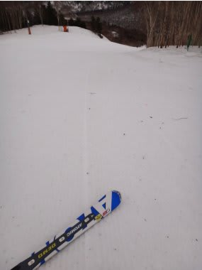

# 4月22日，日曜の志賀高原は…悲惨（涙)

📅 投稿日時: 2012-04-22 23:00:47

🏷️ カテゴリ: [2012スキー滑走日記](cca3a0e9524e0203150f790b1fc3c71ad.md)

って感じで．

土曜はよかったですねー．

この時期としてはかなり楽しめた土曜だったわけですが．

…土曜はよかったんですが．

あけて日曜ですね．

6時半からの早朝スキーに行こうとしてですね．

6時過ぎに起きるわけですよ．

「ひゅー．がたがた．ゴー」

…なんか，すごい音がしてるんですけど．

窓の外を見ると…

いろんなものが吹き飛んでますね．

…これは…かなりの強風ですね．

強風のため，第2高速の早朝営業は中止．

しかし．その代わり，風に強い第4ロマンスが早朝営業することに．

…こんな強風で大丈夫か？？

強風であおられるスリルを楽しみつつ（？）

超トロいリフトで上ってみると…

予想と違って，ゲレンデはいい感じで固いじゃないですか．

（アイスバーンがだめな人は厳しいと思うけど…)

しか～し．

強烈な向かい風．

風で止まるよ…

リフトはのろいし，緩斜面では強風で止まってしまうという．

あんまり楽しめない(涙)．

せめてもの救いは，雨が降らなかったことか？？

で．

早朝スキーが終わり．

普通のリフト営業時間になるわけだが．

…当然，焼額ゴンドラなど動くわけがない．第2高速も動かない．

奥志賀は全面運休．

一の瀬山の神とダイヤモンドは早々に終日営業しないことをアナウンス．

…結局，一の瀬～奥志賀エリアで動いたのは，

・一の瀬ファミリーのクワッド＆ペア

・高天ヶ原クワッド

という，わずか3本のリフトのみ．

…でも．一の瀬のペアも，10時過ぎには止まり．

高天ヶ原も，昼には息絶えました

まぁ，雨も降らず，一の瀬クワッドが動いていただけでも，もうけもんだったのかも知れない…．

ということで．

時折強風で揺られ，減速運転を繰り返す一の瀬クワッドを

ひたすら滑ってました．

動いているリフトが少ないので，人が集中して混むかなぁ？？

って思ったけど．

リフトはがらがらでした．

…普通の神経の人は，さすがにこの状況では滑らないのかな…？

＃自分は割と普通の神経の人のつもりでいるんですが

一の瀬メインバーンはそこそこ人がいましたが…

メインバーン以外は，ほとんど人がいませんでしたね～．

で．午前中はずっと曇りで，日が差さなかったので．

朝のうちの固いアイスバーンが，そのまま昼まで

まったく緩まなかったという…

固いバーンをひたすらひたすら繰り返し滑っていると．

12時過ぎからぽつぽつ降り始め．

1時ごろにはぱらぱらとした雨になってきました．

さすがの私も1時過ぎには切り上げ．

まぁ，午前中いっぱい，雨にならずにもっただけでも

よしとしておくべきかな．

うーん．

でも最近，週末のどっちかは雨とか強風とか，

悪天候に見舞われている気がするんですけど…

日ごろの行いが悪いのかなぁ…（涙)．

どうしたことだっ！

## 💬 コメント一覧

### 💬 コメント by (りり)
**タイトル**: 初めまして
**投稿日**: 2012-04-23 18:27:16

こんばんは

いつも楽しく読ませて頂いています

もう四月も半ばですが

まだ滑れるんですね～♩

私もスキー大好きですが三月にはいる頃には

もうシーズンも終わりだなぁ～なんて思いながら

片付けに入ってしまいます(^◇^;)

毎週志賀に行っているようですが

泊りがけでいつも行ってるんでしょうか？

### 💬 コメント by (Skier_S)
**タイトル**: りりさま
**投稿日**: 2012-04-24 01:02:38

まだまだスキーシーズンですよ～．

志賀高原はGWまで滑れますし，

かぐらは5月27日まで営業予定ですよ～．

まだまだ滑れますよ～

3月に滑り終わるなんて，もったいない…

ちなみに，関東在住の私が土日日帰り2回やったら死んじゃいます．

泊まりで行ってますよ～っ！

