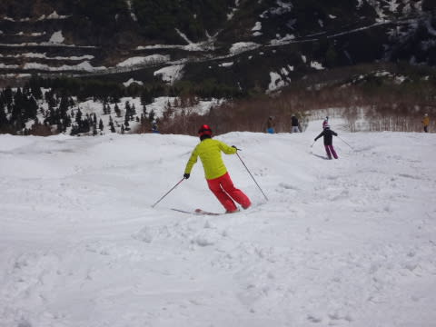

# 5月10日のかぐらレポート詳細…混んでたし，雪は例年より少ないけど…まだ楽しめるかな．

📅 投稿日時: 2015-05-12 01:47:35

🏷️ カテゴリ: [2015スキー滑走日記](c09ea645cfc085f86dfcd80f49599dd89.md)

ということで．

昨日速報した，日曜日のかぐらの詳細レポートをば…

えー．

まず．

朝7時半からのロープウェー営業開始，5分前の段階で

並んでいたのはこの程度の人数で，ロープウェーの2便に乗れたので．

うーむ．

いつもの激混みかぐらだと，この時点でロープウェー4便とか5便とかに

なっちゃって，かなり待つけど．

今日はまだ人が少ないほうかな？？

ってことで．

ロープウェー→みつまた高速リフト→ゴンドラと，30分近い旅を

経てやってきた，かぐらエリア．

朝イチなので，誰も滑ってませんね～！

天気は曇りですが…ぼつぼつ青空が見え始めてきたかな．

かぐらクワッドに乗ると…

風がかなり強く，減速運転でしたが．

圧雪かけたて，誰も滑ってないバーンが！

朝イチから結構柔らかい，ずぶずぶした雪でしたが…

大回りでかっ飛ばせます！

…しかし．

リフトが減速運転で，輸送能力が低いので．

朝9時には…

なんだか，すでに待ち時間が5分超えてきたんですが…

ただ，リフトが減速運転なので，ゲレンデに運ばれる人が

少ないため．

あまり荒れることなく，結構フラットなバーン状況が

続きます…

天気もすっきり晴れてきました！

天気も良く，雪も比較的フラットで．

なんだか，いいコンディションに見えるんですが…

10時近くには．

あうーーん．

リフト15分待ち…（涙）．

だもんで．

メインゲレンデには見切りをつけ．

この時期に動いているのは珍しい，かぐら第4ロマンスリフトに乗って，

パノラマコースをぐるぐるしてみました．

このリフトは，待ち時間が少なくて良かったかな～．

で．

11時ごろには，クワッドリフトも通常速度に復帰！

さらに，並行するペアも動き出したので，

クワッドリフトの待ちも，短くなったよ！

…ただ．

クワッドがフルスピードになり．

それに平行するペアリフトも動いて，

ゲレンデにフルスピードで大量に人が運ばれるようになると…

…そうです．

ゲレンデの人口密度が増えて．

そして，それに伴うメインバーンの全面コブ化が

進行していくのだ…

これだけの密度の人々が，休みなく掘削作業を

続けるおかげで．

メインバーンは一面のコブ祭り会場になっていきます…

で．

雪が薄いので．

コブ溝には，もうかなり土が出てくるんですが…（涙）．

テクニカルコースも，まだコース幅いっぱい白く見えるけど．

んでも，下半分はかなり土が出ちゃってるので．

うーむ．

テクニカルコース下半分，今週末まで滑れるかな…

少なくとも，今週末には，すべてのラインで，溝は

土だらけになってるでしょう…

テクニカルコース上半分は，まだもう少し大丈夫かな～．

ジャイアントコースも，まだ結構雪があるみたいに見えますが…

でも，一部コブ溝に土が出始めてます…（残念）

って感じで．

午後は，実は一番気持ちよくコブが滑れたのは，メインバーンだったかも…

でも，やっぱりメインバーンも，コブ溝は土が結構出てきていて．

…特に，最後の落ち込み部分．

夕方は，かなり土色の斜面になってきてました…

うーーーーむ．

もう少し雪の厚みがほしいところ…

って感じで．

雪の厚みが意外と薄く．

来週は，ほとんどのコブ溝で土が出ちゃうんじゃないか…？？

深く，まともに滑れるコブラインが残るのか…？

と，心配になったのでした…

そして，最後の下山コース．

まだ，ゴンドラ乗り場までは雪がありますが．

みつまたリフトを降りてから，ゴンドラに向かって

滑り降りる斜面が，ちょいとヤバそう…

うーん．

あと一週間，今週末まではもちそうだけど，

2週間は無理かな～．

来週はもうダメかな～．

みつまたゲレンデも．

一本道を硫安で固めて，今はしっかり滑れるようになってるけど．

ここも今週末まではもちそうだけど，来週はどうかな～．

ってことで．

これからの気温次第だけど．

リフト乗り継いでいけるのは，今週末までかな？？

来週末は，バス移動になりそうな気配…

うーん．

これから冷えて，1mくらい雪が積もってくれるように，

祈ってみようかな？？←絶対ありえないから
