# 2020/1/11(月)の志賀高原スキー場は…終日ほぼ晴天！ブッシュも無し．雪は冷え冷え，下地は多少硬いけど結構いいコンディション

📅 投稿日時: 2020-01-11 23:33:56

🏷️ カテゴリ: [2020スキー滑走日記](c282e9230de179e245c7334eabeb0a3b3.md)

ってな感じで．

3連休がスタートしたわけですが．

当然のごとく，志賀高原へやってきています～！

なので．

早速の，本日の志賀高原レポートです！！

まず．

朝イチ，志賀高原に登ってくる坂道．

8日の雨以降，積雪量は10㎝あるかないか…

という程度だったので．

上林チェーンベースを超えてしばらく．

「全く道路に雪ないね…」

と思いながら登ってきましたが．

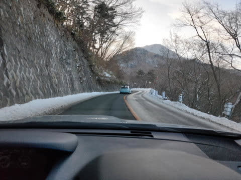

サンバレー付近で，完全本格雪道に

なります．

登れずに，坂道で必死にチェーンを

取り付けている，

迷惑な大変な思いをしている車が

何台かあったので，

志賀高原は本格雪道だと思って

上がってきてください…

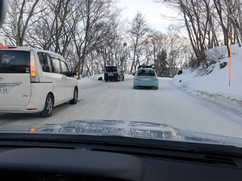

だもんで．

登り坂は，このような車が多数詰まっていて

結構時間がかかります．

3連休の2日目，3日目に来られる方は．

余裕をもって出てくることをおススメします…

で．

いつも通り，営業開始前に焼額第1ゴンドラに

並ぶわけですが．

今日，朝イチで並んでいたのはこのくらい．

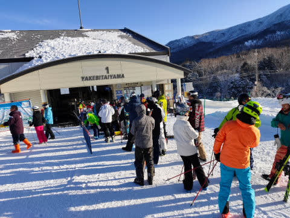

晴天の3連休にしては，人が少ないですね～…

そして．

山頂に登ってくると…

気温は-7℃．

　朝は-5～6℃

と予想した，昨日の予想気温とは1℃

ずれましたが．

でも，おおむね当たりの冷え冷え気温．

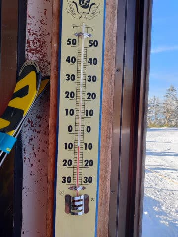

で．

昨日の予想で．

　あさイチは日が射しているかも．

と書きましたが．

日が射してるかも…どころか．

気持ちいい，ピカピカ快晴じゃないですか！！

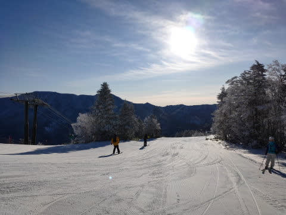

そして

雪は冷え冷えのいい雪の，最高

シマシマじゃないですか！

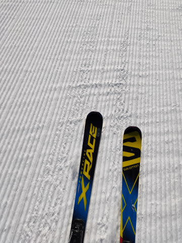

雨の8日から，雪はせいぜい10㎝しか

積もってないけど．

この10㎝が効いているのか…

トップシーズンの，いい感じのシマシマ！

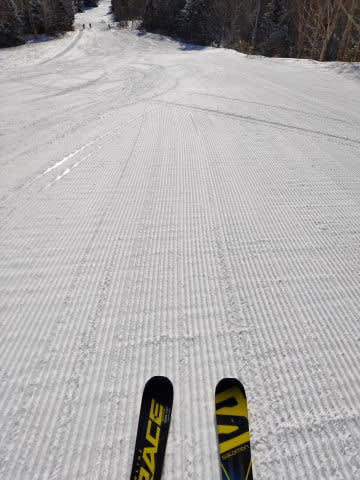

コースすべてブッシュの気配もなく．

アイスバーンが出ることもなく．

朝イチは，美味なるシマシマを

美味しくいただきました…っ！！

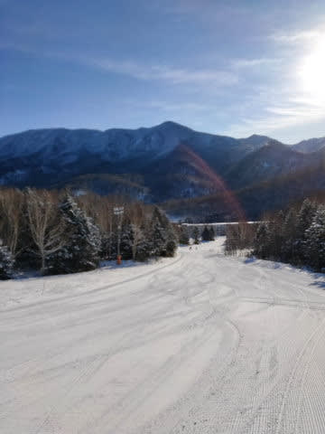

ただ．

しばらく滑ると．

GSコースはちょっとコロコロが

出てきてしまったのが惜しかった

ですが…(涙）

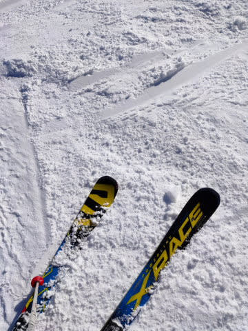

でも．

スキーヤーが死ぬほどのコロコロではなく．

雨が降った直後だから，それほど気持ちよく

ないだろうな…と考えていた予想よりも

100倍ほど結構快適なゲレンデコンディション！！

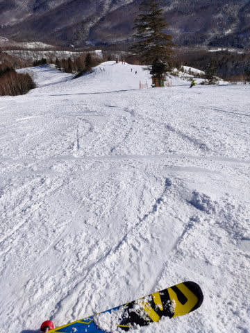

これは．トップシーズンだ．

他のスキー場は，雪不足で困ってる

みたいだけど．

志賀高原，少なくとも焼額の本日は．

コース上にブッシュもなく．

冷え冷え雪がコース上をすべて覆い尽くした，

トップシーズンのコンディションです！！

ところどころに現れた，多少の

コロコロさえ我慢すれば．

しっかり冷えて締まったいい雪を，

こんな晴天の下楽しめる，

シーズンでもそうそうない

当たりの一日なのでは！？？？

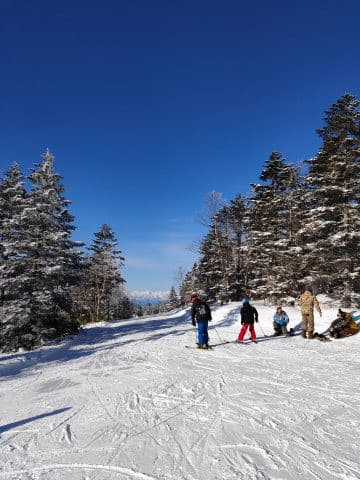

特に，オリンピックコースは．

柔らかすぎず，ちょいと硬めに締まり気味ながら

エッジがしっかり効く，スピード派には

たまらないフラットバーン！！

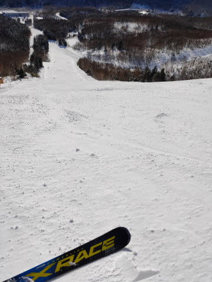

焼額は，そんないいコンディションにもかかわらず．

うむ？？

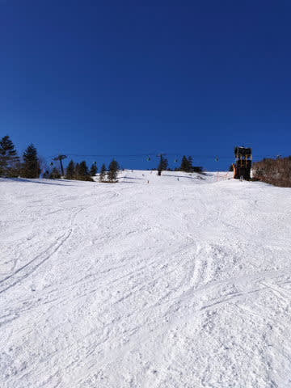

うむむむ？？

今日は人が少ないですよ！？？

コース上，ガラガラなのですが…？？？

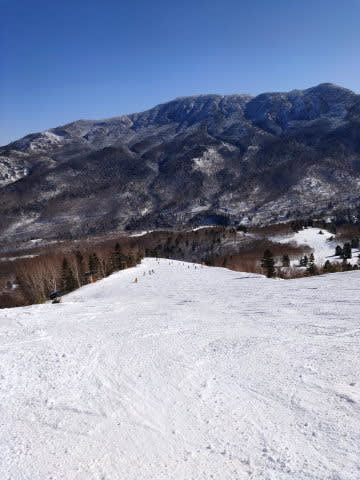

1ゴンのGSコースに比べると，

2ゴン側のパノラマコースは

ちょっと人が多めだったけど．

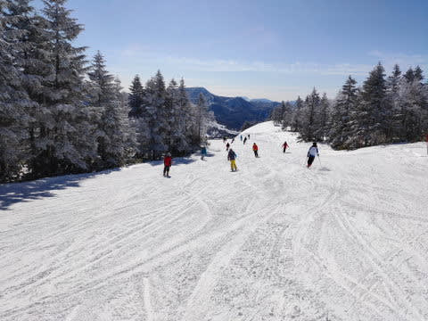

それでもこのくらい．

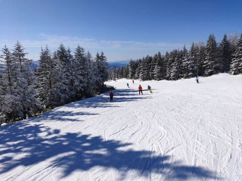

第1ゴンドラはピークの午前中でも

ゲートの外まで人が並ぶことはなく．

それどころか，午後になると結構

飛び乗り！！

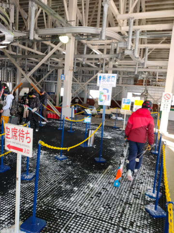

うーむ．

この正月休みは9連休とカレンダーの

並びが良く，みんな正月休みにお出かけしたので．

この3連休にお出かけしようという人は

少ないのかな？？

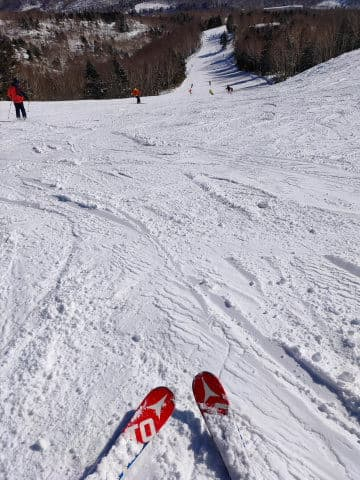

気温は，

　　昼間は0℃近くまで気温が上がりそう．

という予想通り，-2℃くらいまで上がったけど．

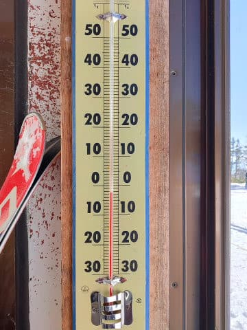

それでも，マイナスをキープしたので．

午後になっても雪質はいいまま！

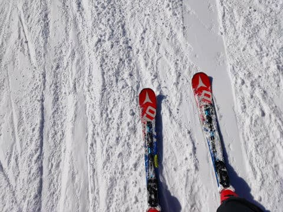

いや…

これ，いいの？

晴天ピカピカの，

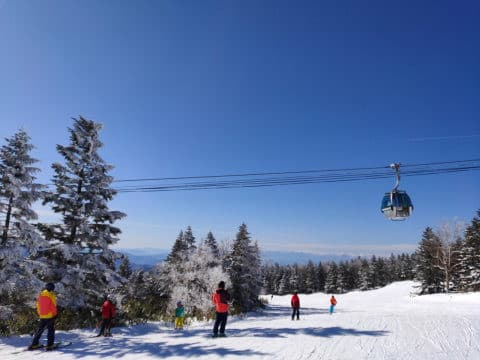

冷え冷え雪質のコンディションで．

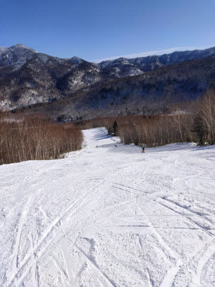

こんなガラガラで，いいの？？？

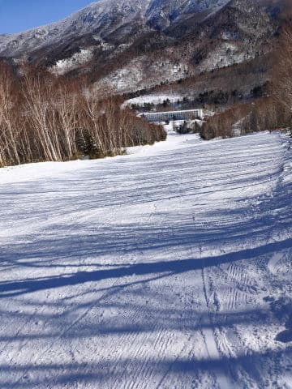

午後になっても．

人が少ないのもあり．

また，8日の雨で固まった下地が，

カリカリアイスバーンではなく，

適度に締まった感じの，

いい感じの雪質で固まっていた

というのもあり．

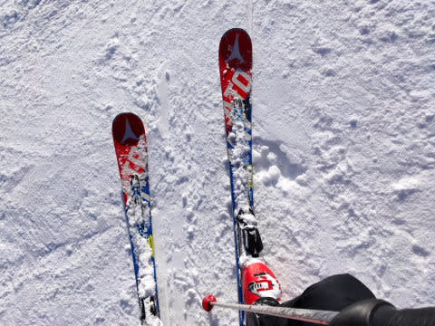

雪が掘れていくこともなく．

午後になっても，割とフラット目で，

快適に飛ばせます！！！

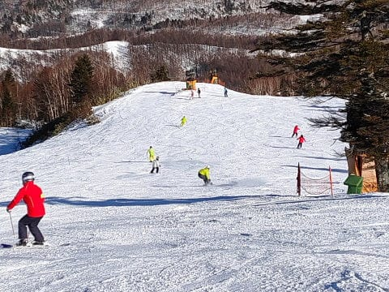

いつもは深いコブになるSGSコースも，

それ程深く掘れてなかったほど…

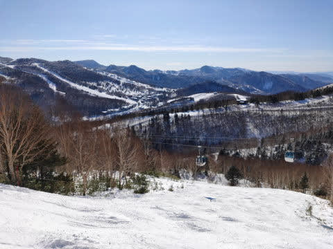

いや…

恵まれてる…

雨の後でダメだと思ってたけど．

今日は恵まれてるよ…

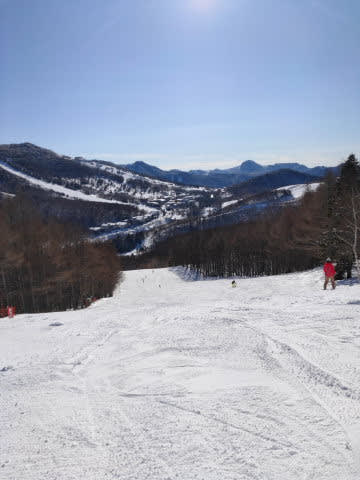

2ゴン側のパノラマ-サウスコースは，

ちょっと人口密度が高かったタイミングも

あったけど．

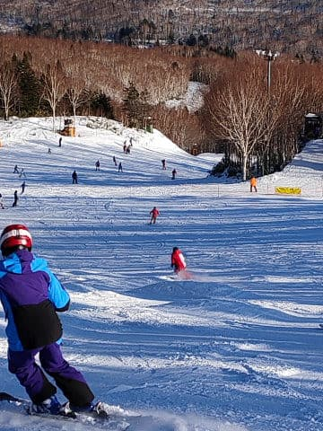

焼額のそれ以外のコースは，

終日ガラガラ！

夕方のオリンピックコースも，

それほど荒れず．

せいぜいこの程度のコブコブで

済みました…

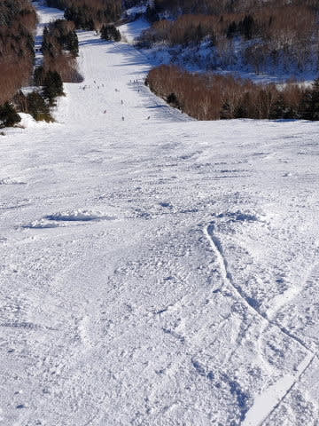

…ってな感じで．

雨で下地はガチガチアイスバーンに

なっちゃってると思っていたところ．

そんなガチガチに固まっておらず．

むしろいい感じでエッジが利くけど，

ぼこぼこに掘れちゃわない，

適度な硬さの下地になってくれたので．

コースがあれなくて滑りいいだけでなく．

掘れてブッシュが出てくることが

なくなったようで．

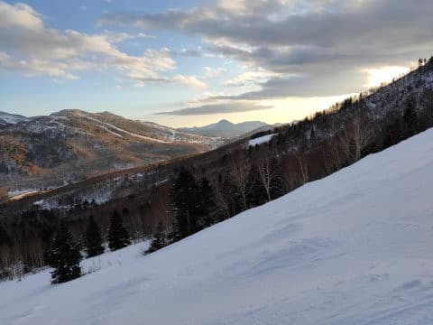

いや．

8日の雨，実は良かったのかも…？？？

と，都合のいいことを考えながら．

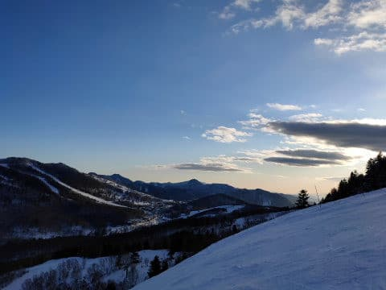

今日も日の暮れる，ラストゴンドラまで

滑り倒してきたのでした…

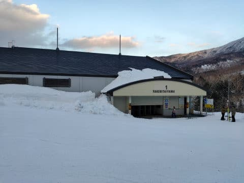

いやーーー．

良かった．

終日晴天で．←それは天気予想を外したということなのでは…？

心配だった，雨で解けたひどいブッシュや，

ガチガチアイスバーンもなく．

予想の100倍マシだった，3連休初日

だったのでした…

…

…だもんで．

当然行きます．

ナイターへ！！

今日はダイヤモンドナイター！！

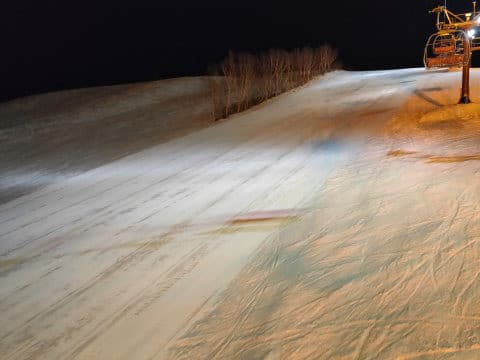

最初の1本は…

うひょーーーー！！！

シマシマっ！！！

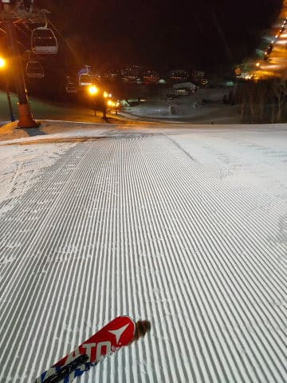

朝に続いて．

本日2度目の最高シマシマ，いいただきまーーす！！

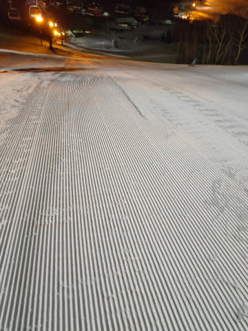

…と．

ナイターでもおいしくシマシマを

いただきましたが．

ちょっとコロコロ成分があり．

足元が崩れていく感じの圧雪で．

快感度Maxって感じじゃなかったのが

ちと惜しかったかな…

でも．

人もそんなに多くなかったナイター．

多少のコロコロは出たものの．

ラストまでたっぷり滑りました～！！

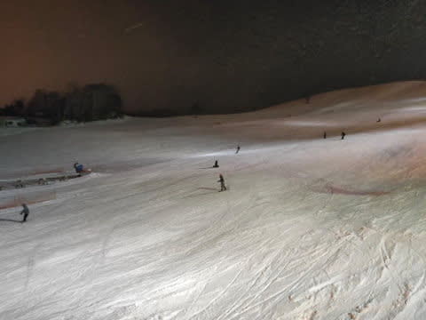

明日は曇り，夕方には雪がぱらつきそうで．

今日みたいに晴れってわけではなく．

さらに残念ながら，明日の朝までに

ドサドサ積雪はなさそうだけど．

この雪の状態なら，積雪がなくても

明日も楽しめるんじゃないかな～．

## 💬 コメント一覧

### 💬 コメント by (しんちゃん)
**タイトル**: Unknown
**投稿日**: 2020-01-11 23:55:28

３連休初日、いい天気に恵まれ、とても楽しかったです。

スタートが遅かったので、ヤケビナイターまで行ってしまいました。ヤケビナイターもシマシマで楽しめましたよ。

明日もよろしくお願い致しま～す😉✋

### 💬 コメント by (西館)
**タイトル**: Unknown
**投稿日**: 2020-01-12 02:20:25

綿密な天気予報と詳細なレポート、ありがとうございます。

１つ前の記事のコメントに記載していただいたとおり、11日の西館～一瀬の状態も良かったです。

12日以降も期待できるのではないでしょうか。

奥志賀では第6リフトの所のフリーラインパークの制作が始まっていました。

あそこでぴょんぴょん、結構楽しいんですよ。

以前は焼額にありましたね。

焼額はどちらでお昼を取っていらっしゃるのでしょうか。

偉大なるＰホテルはお値段が高い。

以前は第１ゴンドラ下のお蕎麦屋さんと懇意にしていたけれどカレー屋になってしまいました。

これからも更新楽しみにしてます～

### 💬 コメント by (とみ)
**タイトル**: Unknown
**投稿日**: 2020-01-12 06:24:32

初めまして。

私もこの三連休志賀高原です。絶好の晴天でしたので初日の土曜は横手山・渋峠に行きました。

雪質も良かったですが、景色が最高でした。

何度も横手山には登りましたが、大抵吹雪なのに、今回の晴天は本当にラッキーでした。

### 💬 コメント by (Northfox)
**タイトル**: Unknown
**投稿日**: 2020-01-12 07:27:53

昨日はありがとうございました。

お話しできて良かったです。

今日もコンディションは良さそうなので楽しみです。

今日は奥志賀から西舘辺りまでいろいろ回ろうと思います。焼額にも行きますのでまた遭遇しましたら宜しくお願いします。

### 💬 コメント by (新米パパさん)
**タイトル**: Unknown
**投稿日**: 2020-01-12 07:44:30

昨日板も積み込み、今日明日の志賀高原を楽しみにしてましたら娘が高熱、、、インフルエンザでした。

子供あるある　ですね。

このブログを1人、避難先の東横インで1人で読ませてもらってます、、、

早く志賀高原行きたいなー。

### 💬 コメント by (まーさん)
**タイトル**: Unknown
**投稿日**: 2020-01-12 10:57:08

昨日、ブナ平、西館はブッシュ出ていてダメでした。今日は横手山で頑張ります。

### 💬 コメント by (炎の北海道民)
**タイトル**: Unknown
**投稿日**: 2020-01-12 13:27:08

スキー場に夏タイヤで行く人がいることに驚愕です。年に数回ならスタッドレスは不要なのかな。北海道も恐ろしい小雪です。

### 💬 コメント by (m&t)
**タイトル**: Unknown
**投稿日**: 2020-01-12 14:22:27

予定通り奥志賀スタートなかなか良い雪質を3本程堪能しヤケビに移動。荒れる前にまずはオリンピックに行くとSさん、naoちゃん、ほか皆さんを発見するも追いつかず。

オリンピックをもう１本その後GSに行くと殺人コロコロ。

西館に移動して行くと衝撃の大好きな大壁にクレーターが

出来ていてコースクローズされていました。

仕方なく今高天原ホテルでお茶しています。残念!

### 💬 コメント by (musi)
**タイトル**: Unknown
**投稿日**: 2020-01-12 21:13:16

いや、三連休ともなるとコメントの書き込み情報が多いですね。私達家族も、11日は中央エリア、本日12日は横手山、熊の湯を楽しんでいます。雨の後なのに全体的にコンディション良くてラッキーですね。

本日は焼額山は殺人コロコロが出始めてるのですね、ホームと勝手に決めている奥志賀に明日は行こうと思っているのですが、楽しく滑れると良いのですが。

焼額山で、少しだけsさん探しもしてみようかと思います。

### 💬 コメント by (Skier_S)
**タイトル**: たくさんコメントありがとうございます
**投稿日**: 2020-01-13 02:01:20

＞しんちゃんさま

ヤケビナイター，良かったみたいですね…

サンバレーナイターはコロコロ地獄でした（涙）

また明日もよろしくお願いします～！

＞西館さま

12日は，11日と比べて全体的にゲレンデ状況悪化しましたね（涙）

ちなみに私は，時間がもったいないのでゲレンデレストランで

お昼を食べることはほとんどないです．

1ゴンの中で，カロリーメイトやらおにぎりやらを

食べて滑り続けてます（笑）．

＞とみさま

はじめまして！

コメントありがとうございます．

11日は天気がよく，横手山は最高だったのではないでしょうか．

今度は焼額にも滑りに来てください～！！

＞NorthFoxさま

今日は一瞬すれ違っただけでしたね．

ゲレンデ激混みで，雪質も悪化しちょっと残念な

感じでした…

またお会いしましょう！

＞新米パパさん

あら！！インフルエンザですか！！

せっかくのスキーに行けず，残念でしたね…

とりあえず，今は治療に専念して，治ったらまた

志賀高原にお越しください．

お待ちしています（笑）．

＞まーさんさま

あら．

ブナがブッシュだらけですか！

横手がどんなだったか，レポートくださるとありがたいです～！

＞炎の北海道民さま

さすがに志賀に夏タイヤで来る人はほとんどいませんが…

ちゃんとスタッドレスを履いているのに，志賀高原ではスタックして

チェーンを巻いている車がいっぱいいます．

志賀の登りは，スタッドレスを履いても2WDでは

厳しいです…

＞m&tさま

今日は帰りにご挨拶いただき，ありがとうございました～！

明日はぜひ一緒に滑りましょう！

（私が一方的に暴走したらゴメンナサイ）

＞musiさま

今日の奥志賀はコンディション結構良かったですよ！

明日もコンディション良いといいのですが…

焼額もぜひのぞきに来てください～！

