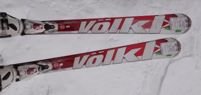
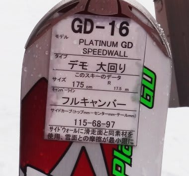
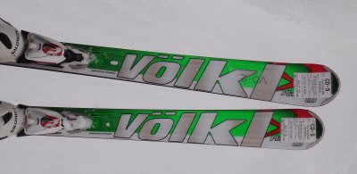
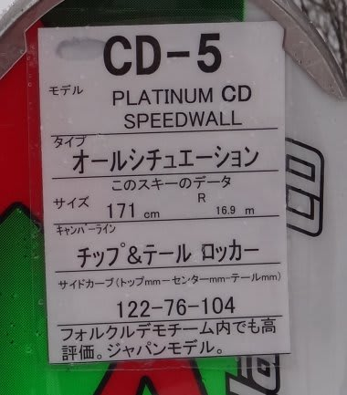

# まだまだ続く！　2012/2013シーズンモデルのスキー試乗レポート　VOLKL編

📅 投稿日時: 2012-03-23 01:07:30

という感じで．

まだまだ続く，2013シーズンモデルの試乗レポート．

今回はフォルクル編です．

では，どうぞ～

----

○VOLKL

VOLKL PLATINUM GD SpeedWall 175cm

大回り基礎板．

ロッカーではなく，フルキャンバーですね．

基礎板ですが…

かなり強い板です．

フレックスがかなり固めなので，トップとテールがしっかり利く感じです．

これでエッジグリップがどうしようもなく強ければ手ごわいですが，

エッジを外してある程度のコントロールも効きます．

キャンバー板なのに，角付けを始めた早い段階からトップが回り始めます．

あまりトップを押さえる必要もなく，切り替えからすっとトップが下に

落ち始めるイメージです．

とりあえず，体の軸を長めに取って左右に傾けていけば，ロングターンになります．

テールやトップを使う意識はいらないですね…

キャンバー板なのに，ロッカーチックな乗り味かも．

この板でコブにも入ってみましたが，フレックスが強いから

かなり手ごわかった…

ちょっと小回りは不得手かな．

でも，おそらく朝イチ焼額みたいな，ぴかぴかの整地では気持ちよさそう．

整地でかなりのスピードで飛ばしたときに，真価を発揮する板ですね．

ちょっと今日の雪質では正当な評価ができない板だなぁ…

＃要するに，荒れた雪は苦手ということですね．

VOLKL PLATINUM CD SpeedWall 171cm

オールラウンド基礎板

なんだー！これはーっ！

すごい板だっ！

今回一番のお気に入り．

欲しい．欲しいぞ．この板．

トップ＆テールロッカーで，ロッカーらしい乗り味だけど，

これまでのキャンバー板の乗り方でも乗れるし，自由度が高い．

かかとにしっかり重みをかけて，左右に傾けていけば，すいすい回ります．

ロッカー板っぽい感じで，単に軸を傾けるだけで，トップのエッジが食い込んでいる

感がないのに，サイドカーブに沿ってするすると回っていきます．

で，エッジグリップスペシャルかというと，そうでもなくて．

板を押しずらして，ズレに乗っていく形でのターンもできます．

しっかりズラして，きれいな小回りもできます．171cmと思えない

小回りができます．

谷回りで，体から板を遠く離していくような小回りもできます．

ズラしと切りの操作が自由自在．

高速安定性も問題なし．

で．

コブでの操作性も最高．

履いた感じが軽いし，エッジグリップも適切で，

トップが妙に引っかかるといったこともないので，

好きなところに板を運べます．

バンク的ラインも取れるし，まっすぐも落とせます．

今シーズンのPlatinumCDは履いたことないけど，

この板が売れたのも良くわかる…
