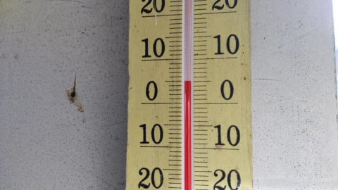
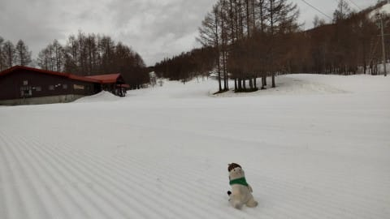
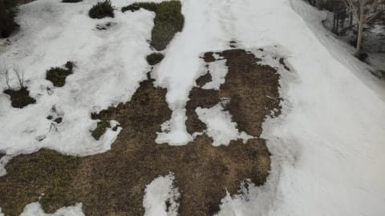
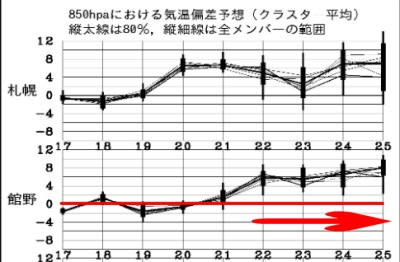
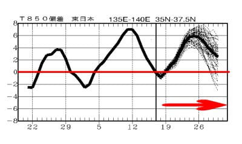

# やっぱり日曜スキーに行ってるどころじゃなかった…（涙）

📅 投稿日時: 2022-04-19 05:34:47

🏷️ カテゴリ: [日記](cc4b5682fb7b8b144980957a978653fb0.md)

ってなことで．

やはり日曜はスキーに行ってるどころじゃなかった

という状況で．

なんとかさっき，明日まで（というか，もう今日か？）

のレポート仕上げたけど．

なぜかこんな時間…（涙）

そのうえ，今週は一件講演依頼があって．

久しぶりにリモートじゃないリアル講演を

するんだけど…

まだ講演資料に全く手を付けてない

という恐ろしい状況．

果たして，本来の仕事をやりつつ，その合間に

進める講演資料の作成が間に合うのか？？

それともスライドほとんど無しで口八丁手八丁で

その場を乗り切る寒い講演になるのか？？

一体どっちだ！？？←他人事じゃないから

（そもそも講演時間が何分なのかすら確認していない…）

ってなことなので．

今日も，日曜の志賀高原の詳細レポートは書けず（涙）

まぁ，詳細レポートを楽しみにしている読者も

そんなにいないだろうし．

昨日の速報レポート以上の情報量は

ほとんどないので，良しとしよう．←あなたが決めることじゃないから

とりあえず，月曜の志賀高原情報が

いつものおこみん特派員から送られてきていますが…

今日も朝から気温が高かったみたい（涙）

日曜の夜は雨～みぞれが降ったみたいですが…

月曜は朝から曇り空で，雪は緩めだったようです．

そして，大変残念なことに，11時ごろから

ポツポツと雨になったようです（涙）

…結構雪が融けてきてます（泣）

今シーズン，1，2月の雪が多かったから

良かったものの…

そうじゃなきゃ，この異常高温の4月で

雪は壊滅的に消えてたな．

とりあえず，今週の志賀高原．

今日から木曜くらいまでは，平年並みの

気温の日が続きそうですが…

（と言っても，この時期は志賀高原では最高気温10度近くまで上がる）

22日から25日まで，赤矢印で示したように，

また平年より気温の高い日が続きそうです（涙）

2週間予想を見てみても…

赤矢印の20日ごろから月末にかけて．

平年比最高+6℃

という，ダメダメな感じの高温が続いてるん

ですが…（泣）

ってか，上の図から，4月に入ってこれまで，

平年より気温が低い日がほとんどなかった

ことが分かりますね…（激涙）

そして，17，18日がわずかに平年並みに

戻った程度で．

これからも4月末まで平年より気温が

高い日が続くって…（涙）

ダメだ．

今年の4月はダメだ…

いや．

1，2月の雪が多くて良かった．

これで1，2月の雪が少なかったら

死んでたな…

## 💬 コメント一覧

### 💬 コメント by (you160)
**タイトル**: Unknown
**投稿日**: 2022-04-19 23:49:12

やはり行かれましたか…

やっぱりなと思っちゃいましたw

講演、、、今話題の吉野家じゃないですが、失言ご注意下さいませ！

### 💬 コメント by (Skier_S)
**タイトル**: ＞you160さま
**投稿日**: 2022-04-21 00:38:21

コメント回答遅れました！

やっぱり行っちゃいました…

今週末もかなりヤバいので，行けるかな？？

講演はとりあえずしゃぶ漬けとかいう単語が出るような講演じゃないので大丈夫です…！（なんのこっちゃ）

