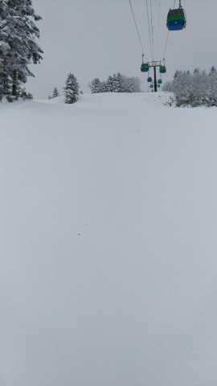

# 正月休み最終日，1月3日の志賀高原スキー場はちょっと雪が積もったみたい…そして8日朝はパウダーねらい目か？

📅 投稿日時: 2023-01-04 05:46:38

本日も家で悲しく一日仕事をしていた

Skier_Sです…

食事もゆっくり食べている間がなく，

PCの前で作業しながら3食とも食べてる

状況で．

正月休みってなんだっけ？

状態の今日この頃（涙）

…おかげで昨日はコメントの回答書き忘れました

すみません．

せっかく自宅の正月休み，ちょっとは

のんびり過ごしたいものだけど．

なぜこんな時間まで仕事してるんだ…（涙）

ってなことで．

世間一般では，今日が正月休みラスト

だったようですが（伝聞形）

今日も特派員から志賀高原の写真が

送られてきました～！

昨日の記事で，朝までに15～20cmと

書きましたが．

どうやら，あさイチは予想がピッタリ，

15～20cmくらい新雪が積もっていた

みたいです…

朝の気温は-11度と冷え冷えで．

寒い雪降り～曇りの一日だったようですが．

昼間はそれほど積もらず，11時ごろに

一瞬晴れ間が出るくらいだったみたいです…

正月休み最終日ということもあり，

混雑はそれほどではなく．

焼額第1ゴンドラもピークでもこの程度で，

相乗りレーンは待ちなしで乗れた

みたいですし．

コースもそれほど混んでおらず，

雪が積もったおかげで，多少はゲレンデ

状況が改善したみたいで．

寒いことを除けば，コンディションは

良かったみたいです…！

ただ，雪の薄い部分はまだ残って

いるみたいですね…（残念）

まぁ，滑りに行けなかった私の呪い

ですから，仕方ないですね←仕方なくないから

…でも．

これから風向きが北西になるので…

今から4日にかけて，降ります！！

4日は終日降りそう…

朝までに20～30cm，昼間も20cm

くらい積もるかも…！？？

4日は非圧雪コースはブーツ～脛パフ

になりそうですが…

正月休みが終わってから積もる，

このタイミングの悪さよ…

まぁ，私は正月休みも滑れなかったから

関係ないですが．

5日，6日もパラパラ降りそうですが，

積もるほどではない感じで．

…で．

7日から降ります．

特に7日の夕方から8日朝にかけては

結構積もりそう．

3連休中日の8日の朝は，膝パフくらい

いくかな？？？

…ちょいと重めの雪になりそうですが…

ってなことで．

…7日と8日，高速道路も積雪して，交通は

大変になりそうですが…

この3連休は，パウダーねらい目です！！！

## 💬 コメント一覧

### 💬 コメント by (けんた)
**タイトル**: Unknown
**投稿日**: 2023-01-04 23:33:55

こんばんは。

スキーに行ってきました。

徒然スキーヤーの言う通り、空いていました。

楽しくスキーができました。

ありがとうございました。

### 💬 コメント by (Skier_S)
**タイトル**: ＞けんたさま
**投稿日**: 2023-01-05 03:24:56

すいていたようで良かったですね！

雪も積もって，寒いけど楽しめたのではないでしょうか．

また志賀高原にお越しください…！

