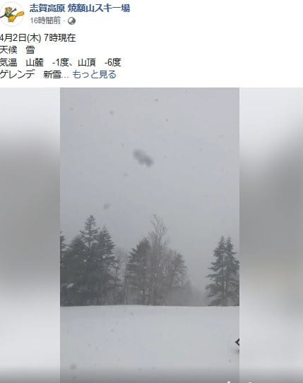
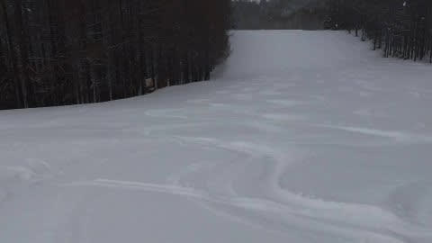
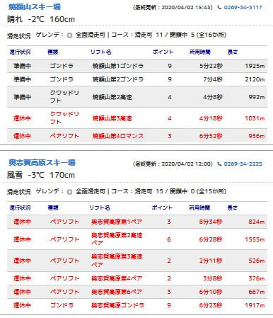
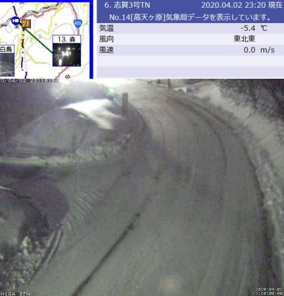
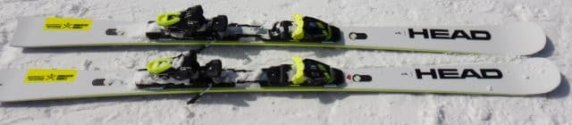
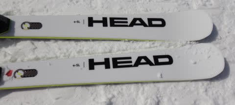
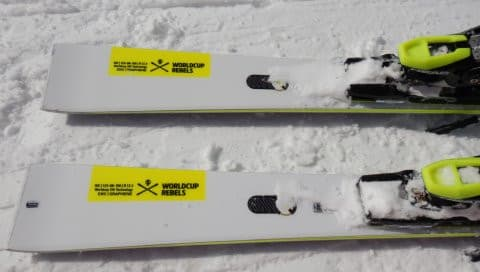
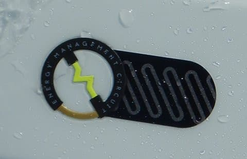
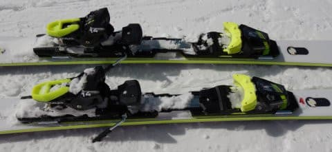

# 2021シーズンモデルのスキー板，試乗レポート…HEAD WC REBELS e-SL

📅 投稿日時: 2020-04-03 01:00:52

🏷️ カテゴリ: [スキー板試乗](c0bd8048615710cee890e403a36cc9a2b.md)

えー．

本日の志賀高原ですが．

どうやら，

2日(木)：明け方雨は雪に変わり，朝は重い雪が数cm

　積もっている．

　（略）

　朝から雪が降ったりやんだり．時折強く降る．

という予想が見事に当たり，朝は

重い雪が10cmほど積もっていたようですね！

（[焼額山Facebook](https://www.facebook.com/yakebitaiyama/?hc_ref=ARR9hBSGr4p4-p5cWRHYMhzWQxyIMD33rFCxbVBdolaYhjBsXmWXQ_Ir48VFv-SQcNc&fref=nf&__tn__=kC-R)より）

気温が結構冷えたので，下地は固かったようで．

その上に乗った重い雪が蹴散らされて，

硬いバーンの上にモサモサ雪が乗った，

かなり手ごわいバーンになり，

楽しめるというより，疲れる

ゲレンデ状況だったようですが…

でもこの時期，降ってくれただけありがたい！

で．

さらに．

　午前中は風が強そう…

　奥志賀ゴンドラはヤバいかな？

　焼額ゴンドラは止まらないと思う．

というところも予言レベルで当たり，

焼額は問題なく1ゴン，2ゴンが動いたものの

（すでに今シーズン営業が終了している3高，4ロマは運休）

奥志賀は終日全山運休だったようです…

ライブカメラを見ると，昼間も雪が

解けることが無い冷え冷え気温だったので，

嬉しいことに，深夜0時前でも

ちゃんと雪が残ってますね…！

（[北信建設事務所道路気象情報ページ](http://hokushin.pref-nagano-roadcamera.jp/)より）

明日の3日(金)は昼間の気温が+3℃程度まで

上がるので，多少雪が緩みそうですが．

でも，5日（日）は，数cm積雪があるかも…？

という予想だったところ．

最新の天気図では，

5日朝までに10cm以上の積雪がありそう

って感じの天気図に変わってきてます…！！！

いいぞ！

もっと積もれ！！

そして，GWまで雪が残りますようにっ！！！

…でも，GWまでにコロナウイルス騒動が

落ち着いているんだろうか…（心配）

ってなことで．

普通のBlogならこれだけで記事になりそうな

長さですが，

異常に記事が長いことで有名な，このBlog．←そうだったの？？そんなことで有名だったっけ？？

ここからが本題．

今日は，3月上旬の志賀で試乗したスキー板の

試乗レポート．

ヘッド編です．

では，どうぞ～！！

○HEAD Worldcup REBELS e-SL　165cm

SL競技用セカンドモデル，

基礎小回り．

来年はi-SLじゃなく，e-SLとなるらしい，

SL競技用セカンドモデルのこの板．

トップモデルは，今年のi-SL RDが

来年はe-SL RDとなるようです…

今年モデルまで，Intelligence technologyを

搭載していたので，i-SLという名前に

なっていたのと思っていたのですが．

来年は何かまた違うテクノロジーを使うのかな？

とりあえず．

今年モデルまで搭載されていたKERSは無くなったのか，

板にはこんな「Energy Management Circuit」なるものの

ラベルがくっついてます．

で．セカンドモデルのこの板は，

ごついプレートもついておらず．

比較的グリップもソフト目なこの板．

履いて滑ってみると．

谷回りで板を動かす自由度は高いけど，

そこから自動的にグリップしてクルンと

回ってくる感じの板じゃないですね…

角づけだけで回ってくるオートマチック

感は全く無く，

コア材の強めの張りがある板を，

自分で動かして板をたわませに行き，

そのたわみに乗って板を動かしていくという，

かなりマニュアル操作で，玄人好み

っぽい板．

しっかり板を動かしてたわみを作っていけば，

おぉ！？？

という感じで回っていくんだけど．

自分で動かして行かないと結構

まっすぐ進んで行き，

サイドカーブがR=12というよりも

ずっと大きく感じます．

ガッツリグリップして，角づけだけで

クルクル回るような，回りすぎる板では

ありません．

でも，

トップとテールがガッツリグリップして

クルクル回る板では無いので．

板をどうでも動かせる自由度があり，

山回りでも谷回りでも，板を自由に

ずらしていけます．

どうしようもなく切れ上がっていく

板ではないので，縦に落とすターンから

しっかり回しこむ小回りまで，

自由に乗り手が操作していけます．

コアの張りがまぁまぁ強いので，

スピードを出して行っても板が窒息するとか，

板が圧に負けて動かしにくくなるということは無く．

自分で板を動かして操作していく感覚は

かなりの高速域でも変わりません．

オートマチックで，脳内麻薬のまま

傾ける板ではありませんが．

自分でしっかり板を動かしていく，

マニュアル操作が好きな人に向く

板かな…

## 💬 コメント一覧

### 💬 コメント by (レインボー)
**タイトル**: Unknown
**投稿日**: 2020-04-03 17:41:19

金曜日の志賀高原情報(あわやパーフェクト)

今朝は昨日の新雪が圧雪され、そこそこの冷え込みもあって、私の100日目でベスト3に入る立ち上がり。1ゴンからパノラマ、カラマツ、しましまファースト。サウスもファースト。1ゴンへの連絡路もファースト。ＧＳは流石に無理だけど、1ゴンの上から奥志賀へ。第４もファースト、ダウンヒルもファースト、三高もファースト。エキスパートもか？

流石に3本ほど。それにしても滑りやすい。空いてるから大回りしか考えられない。そうこうするうちに、撮影してる上手い人が目につく。きくと、なんとリッチー　ベルガー！

私の100日目のお祝いみたい。3本ほど撮影の邪魔にならないように、追っかけてただ見。それにしても上手い。なんて幸せな日だ。日頃の悪行三昧を改めるように、神が心を豊かにしてくれているのか。

そんないい日も、少し荒れてきたので午前リタイア。レインボーは安全第一。今年は怪我した友人が多いなか、なんとか無事に帰れそう。皆様ありがとうございました。

### 💬 コメント by (Northfox)
**タイトル**: Unknown
**投稿日**: 2020-04-03 21:09:50

この板、アサマで試乗しました。

私的に結構好印象だったのですが、4月の志賀高原の試乗でじっくり滑ろうとサッサと試乗を切り上げたのを後悔してます。

> レインボー様

リッチー ベルガーと遭遇したのですか！

羨まし過ぎます．．．

### 💬 コメント by (Skier_S)
**タイトル**: 怪我なく，病気無く，健康第一で
**投稿日**: 2020-04-04 00:02:11

＞レインボーさま

えええ！！

今日はそんなに良かったんですね…

ほぼパーフェクトファーストトラック総なめじゃないですか(笑)．

そしてリッチーベルガ―の滑りも間近に見れるとは…うらやましすぎです…

＞Northfoxさま

この板が好印象だったとは，かなりマニュアル操作の板が

好きなのですね…

私はオートマチック系が好きなので，ちょっと私の候補には

上がらなかった感じです…

でも，しっかり操作すればよく曲がるし，高速安定性もそこそこ高いので，

ポテンシャルは高い板だと思いました…！

