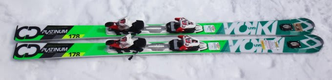
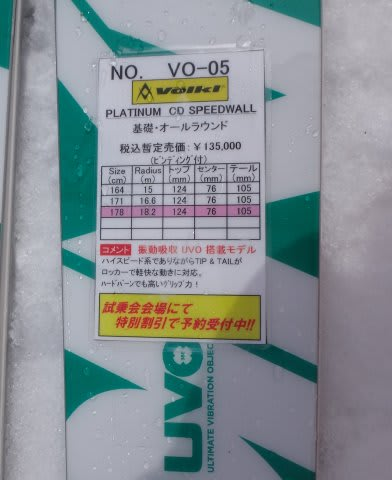
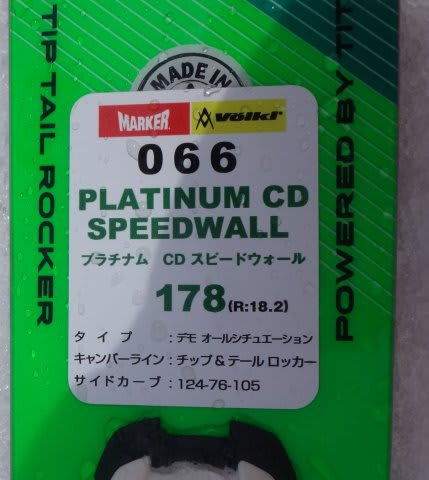
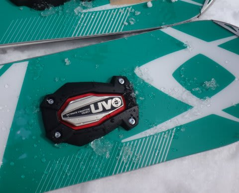

# 2015シーズンモデルのスキー試乗レポート第7回…VOLKL編

📅 投稿日時: 2014-03-28 22:37:50

えー．

今日の志賀高原．

春の一日で，以上に暖かく．

雪がかなりドボドボになったようですが…（涙）．

明日，土曜も気温がぐんぐん上がり．

予想通り，雪はザブザブになりそう（泣），

でも，すっかり晴れて，うららかな春スキーの

一日って感じかな…（過ぎ去った冬を懐かしむ遠い目）

で．日曜は．

予想通り，…雨，ですね．

それも，前日の夜から，終日雨が降り続けるかも…（激涙）

この週末は土曜に勝負をかけるべし！

ってことで．

今日も来シーズンモデルのスキー板の試乗インプレッションを．

今日はフォルクル編です．

あと4時間ちょいで出発なので，今日も1種類だけのレポートで…

---

VOLKL PLATINUM CD Speedwall 178cm

基礎オールラウンド．

来シーズンモデルから，振動吸収デバイスのUVOが，

標準でつくようですね～

UVOの重さがあるからか．

今シーズンまでの特徴だった，異常なほどの板の軽さがなくなりましたね…

ちょっと軽いかな？って程度の．

普通の重さの板になった感じ．

滑ってみた感じは…

うむ．

この板も．

今シーズンモデルに比べて，マイルドになったか？？

エッジグリップがちょっと優しくなり，かなり板をいろいろ

動かしやすくなりました．

逆に言うと，オートマチックにエッジでキーンと走っていく

感じは弱くなった感．

特に，今シーズンモデルの特徴だった，テールの張りの強さが

弱まった感じで．

この，テールの張りで切り替えから谷回りにきれいに板が

抜けていく感じが弱まり，

スーッと谷回りに抜けたあと，長い谷回りでターンが

つくられていくような．

そういう感じではなくなりました．

逆に言うと，切り替え直後，テールのエッジが粘らず．

かなり軽快に，自由に板を動かせるようになった感じ．

しかし，動かした後も，板がしっかりグリップして，

トップのエッジが食い込んでたわんで回ってくる感じは弱く．

比較的まっすぐ進んでいきます．

返りも弱めでゆったり返ってくる感じ．

振動吸収も，UVOがついている効果はわからず．

もともと，UVOがなくても異常なほどの振動吸収力を

もっていた板ですから…

むしろ，来シーズンモデルの方が，今シーズンモデルより

ちょっと荒れた雪面の振動を拾ってるかも？

うーーーむ．

なんだか．

今シーズンまでのモデルの方が好きだな～．
