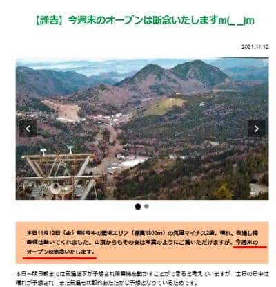
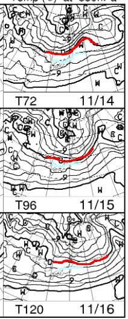
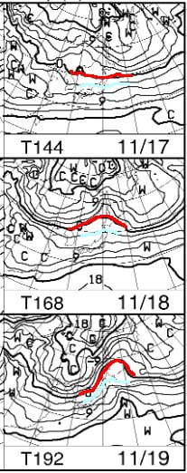

# 明日もYetiで滑ってます～！！…そして，天気図を見ると11/20オープンのスキー場が予定通りオープンできる可能性は低い…

📅 投稿日時: 2021-11-13 00:29:54

…今日も朝早くから仕事に駆り出され

大変眠いSkier_Sです．

ということで．

昨日お伝えしたように，熊の湯は明日の

オープンを諦めたわけですが．

本日．

やはり予想通り，横手山も13日の

オープンを諦めたようです…（涙）

（[横手山ホームページ](https://yokoteyama2307.com/news/16461/)より）

まぁ，もとから13日のオープンは無理

だろうなぁ…

とは思っていたものの．

ホントにオープンできないとなると，

やっぱり悲しい（泣）

…しかし．

これから1週間の850hpa気温を見ると…

残念ながら，14日から19日までで，

赤い0℃線が志賀より南まで下がって

くれる日はありませんね…（涙）

すなわち，ほとんど人工降雪機を

動かせないということですね（泣）

せめて水色の+3℃線が志賀より南まで

下がってくれれば．

…標高の高い横手山だったら，気温が

冷える朝晩には人工降雪が打てる

可能性があるんだけど…

水色の+3℃線ですら，志賀より南に

下がってくれる日はなさそう（泣）

ダメですね．

来週，人工降雪機が動かせるスキー場は

ほとんどなさそうなので．

20日オープン予定のかぐら，鹿沢，湯の丸，

アサマ2000もオープンは無理っぽいですね…

あぁ…来週もイエティになるのかな…（涙）

ただ．

…まだはっきりはわからないけど．

20日以降はちょっと冷えるかも！？？

とりあえず．

今週末は横手も熊の湯もオープン

しなかったので．

明日もYetiに行く予定です～！

…今晩は5時間は寝られそうなので，

いつもよりは睡眠時間が長いな…

## 💬 コメント一覧

### 💬 コメント by (Northfox)
**タイトル**: Unknown
**投稿日**: 2021-11-13 08:58:57

去年と同じようなパターンになりつつありますね。

ラニーニャが発生とのことなので、12月は強烈に冷えて降って”根性のないスキーヤー振るい落し装置”が発動するのでしょうか．．．

このところの温かさですっかり根性が抜けた私は振るい落とされそうです。

### 💬 コメント by (Skier_S)
**タイトル**: ＞Northfoxさま
**投稿日**: 2021-11-14 00:17:31

全く去年と同じパターンですね（涙）

やっぱり10月に冷えるとダメですね…

12月中旬以降は確実に冷えてくれると思います．

1，2月は根性の無いスキーヤーふるい落とし機能がフル稼働

するはずです…

…と，信じたい．

そして，パウダーどっさり降ってほしい！

