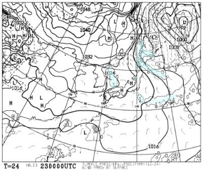

# 12月25，26日の週末の志賀高原スキー場の天気は…土日ともに激冷え吹雪で凍死するレベル．でも，土曜から積もり始めて日曜はパウダーデー！

📅 投稿日時: 2021-12-23 10:44:47

🏷️ カテゴリ: [スキー天気予想](c6554f5c3c106093b511a8daae23757e8.md)

すみません…記事投稿したつもりで投稿されてなかったので、

遅れて投稿！！

えー．

予想した通り．

昨日水曜の志賀高原は，

冷え冷えの雪降り

だったようで…

朝の積雪は3-5cm程度だったみたいですが，

気温は-10℃とかなり冷えていて…

終日パラパラと雪が降り．

時々強く降ったようです…！

レインボーさんのコメントを見ると，

寺小屋はイマイチだったようですが，

全体的に冷え冷えでいいコンディション

だったようですね…

ってことで．

このGoodコンディションがこの週末まで

続くのか？

週末の志賀高原の天気を，天気図から

読み解いてみましょう…

まずは[気象庁の数値予報天気図](https://www.jma.go.jp/bosai/numericmap/#type=nwp)から，

いつものFXFE5782で明日23日木曜の

850hpa気温図を見てみると…

ふむ．

志賀高原には水色の-6℃線がかかっている

くらいなので…

明日も一日冷えそうですね！

そして，FXFE502から，23日の地上天気図を

見てみると…

概ね高気圧に覆われるので．

晴れがベースの天気ですね…

ただ，日本海西側に水色の降水域が

かかっているので．

午後はこれが東に移動し，

雲が増えていくかも…

で．続く24日金曜日の850hpa気温図を

見てみると．

あら．

この日は赤い0℃線が志賀よりわずかに

南にある程度なので，

この日はちょっと気温が上がるかな…

昼間は，一の瀬の麓より下では，

プラスにまで上がるかな？

金曜の地上天気図は…

微妙．

水色の雪雲が新潟～東北の日本海沿岸に

かかってるけど．

志賀までは伸びてないようなので…

晴れ，時々雲がかかるくらいか…

あるいは曇りか…

非常に読みにくい…

で．

肝心な週末の土曜日，25日の

850hpa図を見てみると．

うーむ．

この日も志賀高原には，赤い0℃線が

ギリギリかかる程度なので…

朝はそんなに冷えずにスタートしそうだけど…

志賀のすぐ北に，水色の-12℃線が近づいて

いるくらい，寒気が目前まで迫ってます！

だもんで．午後に向かってグングン気温は

下がっていきそう…！

そして，土曜の地上天気図を見ると…

日本全域に降水域がかかっていて．

土曜は朝から雪が降り始めそう…

残念ながら，土曜朝までにドサドサ

積もるのではなく，朝から降り始める

感じなので．

土曜朝イチはそんなに積もってなさそう…

むしろ昼間に冷えて吹雪いていく

感じの天気ですね…

そして．

26日の日曜の850hpa気温をFXXN519から

見てみると…

な，なんだこれは！！

水色の-12℃線が志賀より南に下がってます…！！

これは，朝イチは-15℃以下まで冷える

可能性が！！激寒です！！

そして，日曜の地上天気図をFEFE19から

見てみると…

うほーーー！

見事な縦縞の，冬型の天気図！！

これは．

降る．積もります！

日曜は冷え冷えパウダーです！

…ってなことで．

まとめると．

23日(木)：朝は-9℃くらい．冷え冷え晴天の

　最高シマシマ！昼間も晴れるが，

　午後は雲が増えていくか…

　終日冷え冷え．

24日(金)：この日も朝は晴れるかな？

　昨晩からの積雪は0．朝はちょっと締まった

　いい感じのシマシマバーン．

　気温は高め，朝は-5℃くらいだけど，

　昼間は山頂で0℃近くまで上がる．

　一の瀬より下はプラスまで上がるかも？

　昼間は時折曇ったり晴れたり…

　くらいの天気か．

25日(土)：朝は意外と気温が高く，-3℃くらい．

　朝から雪がぱらつくが，朝イチゲレンデの

　積雪は数cm．朝イチは圧雪にうっすら

　1-2cmの積雪でスタート．

　時間が経つにつれ雪は強くなっていき，

　気温もグングン下がり，夕方にはガン降り．

　夜には-10℃を下回る吹雪に…

　午後はゲレンデにうっすら雪が

　積もっていく，ゲレンデ全面

　プチパウダー状態に．

　

26日(日)：昨晩からひたすら降り続け，

　朝は30cm以上のパウダーか？

　あさイチの気温も-13～14℃くらいまで

　冷えた，激冷え吹雪の一日！

　根性の無いスキーヤー振り落とし機能

　フルパワーの一日．

　ただ，ひたすら雪が降り続ける

　終日パウダー供給デーかも…

　昼ごろにはパウダーが散らされた

　モサモサに荒れ荒れバーンになって

　いきそうだけど

ってな感じで．

土日はどちらも太陽は全く拝めない，

吹雪が2日間続きそうです…

でも．

冷え冷え雪が降り続けるので．

ゲレンデ状況は，最高雪質の雪が

積もった，ものすごくよいものに

なりそう…！

あ，太い板をもっている人は，

この週末は絶対もっていきましょう！

で．

週末のあと，27，28日の850hpa

気温図も見てみると…

うほーーーーー！

なんだこりゃ！！

27日は志賀に水色の-12℃線が

かかり，-15℃線も近づくレベル！

そして，28日も，水色の-9℃線が

志賀にかかっているので．

27日ほどではないとはいえ，

かなりの冷え込み！！

そして，地上天気図は27，28日とも，

日本海側に降水域の網掛けがかかっている

冬型の予想図．

まぁ，28日は西風で志賀は積もらないけど．

27日も，かなり雪が積もるパウダーデーに

なりそう！！！

ということで．

パウダーを狙いたい人は，

25，26日の土日ではなく．

26，27日の日月の滞在が正解かな？？

あー．白馬方面とか新潟方面は，

おそらく28日も積もると思います…

ってなことで．

志賀高原ももう全面オープンできるほどの

雪が積もってくれたけど．

まだまだ来週にかけて，冷え冷え雪が

積もりそうです！

うーむ．

この12月は，例の踊りを全く踊らなくて

済みそうという，恵まれた12月になりそう…

## 💬 コメント一覧

### 💬 コメント by (レインボー74)
**タイトル**: Unknown
**投稿日**: 2021-12-23 17:29:09

木曜日の志賀高原情報

私事ですが、スキー人生おそらく何百日で、最も楽しかった日でした。

万年中級者の私が、初めていい感じで踏み込める感覚が、わかった気がしたのです。腿はパンパンですが、低温で、終日雪質もキープされました。

パノラマ、GS、寺子屋、ファミリー。もうどこもここも、きっ持ちいいー！

朝の上林-2℃　蓮池、うーん-8℃？？

(脳の記憶容量不足)

仲間は奥志賀へ行ったけど、下の連絡路がだめなので、往復漕ぐのが嫌で、ひたすらGSとオリンピックで基礎練習。

寺子屋も天気が良くて景色も良くて雪質も良くて、良くて良くて帰りたくなかった。

今は夕方五時半。宴もたけなわです。

### 💬 コメント by (アリス)
**タイトル**: 今日の予想も大当たり
**投稿日**: 2021-12-23 17:58:28

S様

今日の気温、天気、コンデイション予想は大当たりです♪

シマシマ、ガラガラ、青空どこもかしこも最高♪

私も帰りたくなかったのですが・・・

レインボーさんには内緒なんですが（怒られるから）

今回は一の瀬スタートで、

8:20のダイヤモンドリフトで上り

8:30一番のニ高で上がると

ゴンドラ一番乗車組がパノラマ滑走中に唐松コースを一番滑走

唐松はシュプールがバレないよう中央は避けて右側滑走

その後再度二高で上がり1ゴン乗り場へ

二日間コソっとやっちゃいました♪

### 💬 コメント by (かず)
**タイトル**: Unknown
**投稿日**: 2021-12-23 19:07:25

Sさん年末年始はいつでした？若杉さんは帰るんでしたよね？僕は28日から雪次第4か5まで至福の一週間です  Sさんパウダー多めお願いします！笑

### 💬 コメント by (Skier_S)
**タイトル**: 今週末も太板出動！
**投稿日**: 2021-12-24 01:46:02

＞レインボー74さま

すごい．スキー人生で最も楽しかった日って，それはすごいですね…

うらやましい…

明日はちょっと気温が上がって，曇が多めの天気になりそうです．

＞アリスさま

今日はコンディション良かったみたいですね！

私の最高シマシマ晴天予想が当たりましたね～．

そして，唐松ファーストGetされたんですね．

今日の朝イチ滑れたのはうらやましいです！！

＞かずさま

年末年始は，30日から4日まで滞在予定です．

28日は日帰り参戦するかも．

パウダー多めになるよう祈っておきます．

夜中にたっぷり積もって朝に晴れるのが最高なんだけどなぁ…

### 💬 コメント by (ロシアリクガメ)
**タイトル**: Unknown
**投稿日**: 2021-12-24 16:28:14

はじめまして！長野市内在住のかなりブランクのある中年親父スキーヤーです。今度の日曜日初滑り狙ってます。が、激寒の予報ですね。こちらのブログの記事がとても参考になりました！根性無しなので、吹雪の中のスキーは苦行でしかなく、正直行くか迷っております～。

### 💬 コメント by (Skier_S)
**タイトル**: ＞ロシアリクガメさま
**投稿日**: 2021-12-24 22:51:39

コメントありがとうございます～！！

今度の日曜ですか？？？

すごい吹雪で，激寒で新雪がコンコンと積もり続ける厳しいコンディションです…

パウダー好きならよだれが口からあふれ出て洪水で溺れそうなコンディションですが，

久しぶりに滑るにはあまりお勧めしかねる天気です…

29日なら天気は落ち着きますよ！

### 💬 コメント by (koi)
**タイトル**: Unknown
**投稿日**: 2021-12-24 23:17:28

いつも予報ありがとうございます！

予報図の名前を入れていただいて、私もググって見られるようになりました。さすがにこの縦縞、朝鮮半島から伸びる降水域は覚えました。大雪ですよね

年末年始は多少穏やかになりそうなので、白馬に行こうと思ってます！

### 💬 コメント by (Skier_S)
**タイトル**: ＞koiさま
**投稿日**: 2021-12-26 00:29:52

天気図を自分で読んでみようとは…すばらしい！

そういう方がいるかと思って，天気図の名前を書いてみました．

天気図上は大雪になりそうです．

ただ，志賀はまだそれほど降ってません…（ちょい涙）

