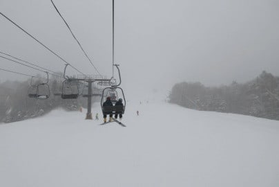
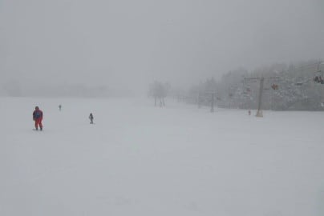
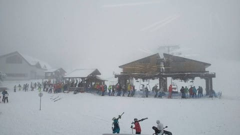
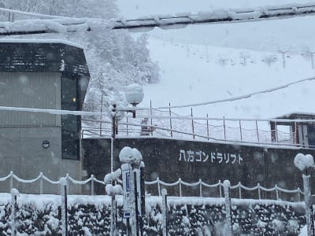
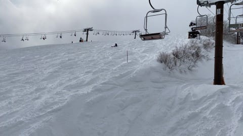
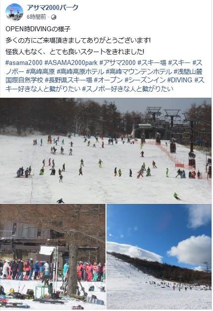
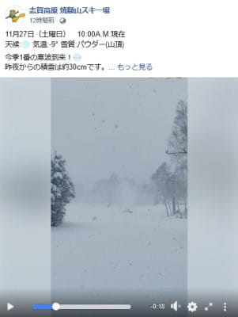
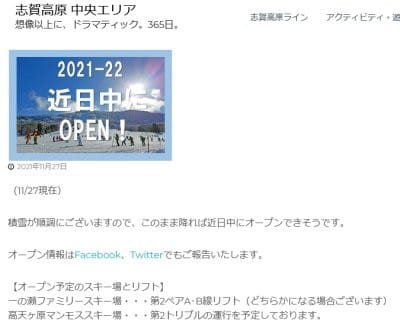

# 予想通り，27日は冷えて降ったようで，熊の湯・八方もパフパフ！…私は明日アサマ2000へ行ってきます！

📅 投稿日時: 2021-11-28 00:22:56

ということで．

すでに，[24日の夜の記事](ec80a5e28143e49b42a6a290f77ca1ef6.md)で，

11/27(土)は冷える．降る．積もる！

と予想していましたが．

ふはははは．

どうやら今日は，わたしの予想通りに，

志賀高原を含むいろんなスキー場で，

パフパフの雪が積もったようです…！

すばらしいぞ，私の予想！←だからあなたがすごいんじゃなく，

気象庁の予想天気図の精度がすごいんだってば…

熊の湯も，朝は視界が効かないほどの

吹雪で，30cmくらい積もっていたようで…

ゲレンデはほぼ幅いっぱい滑れる

ようですね！

朝はガラガラだったけど．

昼前にはちょっと混んだのかな？

でも，それほどひどい待ち時間じゃ

なさそうですね．

そして．

八方も麓のゴンドラ乗り場付近まで

真っ白になってるし…

パノラマコースは，ちょい重めの新雪

ってことでしたが．結構コンディション

良さそうですね！

で．アサマ2000は…Facebookを見ると，

ちょっと混んでるようですね

（[アサマ2000Facebook](https://www.facebook.com/asama2000park)より）

焼額も一晩で30cmほど積もったようで…

このままいけば，順調に予定どおり，

12月4日にオープンできそうですね！

でも…

これだけ積もったのに，一の瀬は予定の

27日オープンを諦めたようで…

近日中オープンとなっていますが，

水曜あたりにオープンするのかな．

（[志賀高原中央エリアホームページ](http://shigakogen.co.jp/archives/13050)より）

野沢も，27日オープンは諦めて．

火曜あたりのオープンを狙っているようです…

ってなことで．

この雪は明日の朝までには弱まっていき．

日本海側のスキー場は午前中まで雪が

ちらつくところもあるかもしれませんが．

志賀高原や白馬山麓はおそらく昼ごろには

晴れそうなので．

明日はコンディション最高だと思いますよ～！

私は明日はアサマ2000へ行ってきます～！

…またなぜか3時間半睡眠で出発だな…（涙）
