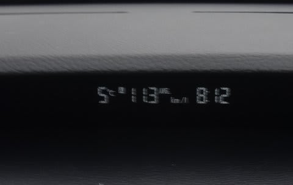
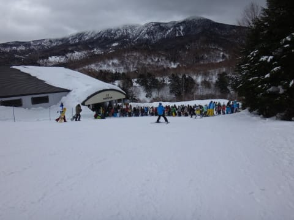
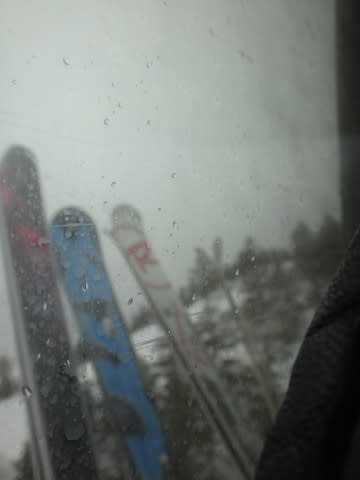
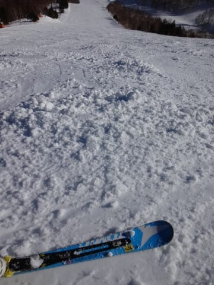

# おまたせ！2月2日(日)の志賀高原は…ほとんど雨は降らず！んで，午後は晴れ！

📅 投稿日時: 2014-02-05 02:13:59

🏷️ カテゴリ: [2014スキー滑走日記](c992167609b6415052179ee69ea1ea7d8.md)

あー．

昨日の夜に熱を出して寝込んでしまいましたが．

今朝は熱は無事下がっております…

ということで．

お待たせしました．

…待っていた人なんて，いないのかもしれませんが．

…お待たせしました(あえて強調)

待っていた人がいると信じて．

日曜の志賀高原詳細レポートです…

えー．

まず．

日曜の朝ですが．

朝だというのに，山麓での気温はプラス5度(涙)．

なんだー！この暖かさはっ！

…これが，2月の志賀高原の気温かっ！？？

で．天気は今にも雨が降りそうで(さらに涙)

そして，雪質は，しっかり重い3月末ごろの雪の感じ…(もっと涙)

朝のうちの，圧雪がきれいにかかっている間はまだマシでしたが…

さらに．悲劇はこれだけで終わってくれない．

なんと．第2ゴンドラと奥志賀ゴンドラ運休…(超涙)

ってことで．

スキーヤーは動いている第1ゴンドラに集中するわけだけど．

この第1ゴンドラも減速運転しているので，輸送力が落ちていて．

…なんだ，この待ち時間は…っ！！(どうしようもない涙)

いつもなら混まない9時半に，もうこれとは…

そして．

さらに，トドメ．

9時半ごろには．

ぽつぽつと雨が…(とめどない涙)

うがーーーっ！！！

だ，だれだ～っ！！！！！

日ごろの行いが悪いやつはっ！！！←自分でしょ

と，思っていたら．

どうやら私の祈りが通じたらしく．

雨は数分間，ほんの「ぽつぽつ」と降っただけで済んで．

なんと．その後．

うっすらと日が！

それどころか…

だんだんと明るくなっていき…

11時過ぎには晴れ上がっちゃいましたっ！！！

なんと偉大な，私の祈りパワーっ！！！←また，天気予想が外れたのをごまかしている

そして，11時前には第2ゴンドラの運転も始まり，第1ゴンドラも

通常速度になったので．

9時半から10時半までの1時間はこんなだった待ち時間も，

11時には…

こんな感じで，待ち時間がほとんど0に！

いやー．

まさか．

雨が降り続ける予想だった今日．

こんな日が射すゲレンデを滑れようとはっ！

直前の，この日の朝7時半まで，こんな感じの予想だったのに

この予想を覆し，ほとんど雨を降らせずに晴れさせるとは．

すばらしい，私の祈りパワーっ！←自分の天気予想が外れたのを，いろいろ正当化しようとしている

しかし．

日が射したおかげで…

気温はぐんぐん上がり．

山頂でも気温はプラスに…

で．気温がプラスで日差しがあると言うことは．

なんだか雪が溶けてきて…

ゲレンデは，雪のダマダマちゃんが大勢出現してきたのですが…(ちょっと涙)．

さらに，板に雪が張り付く…(泣)

…これは，もう．

4月の雪ですな(涙)

まぁ．

雨降りの一日のはずが．

晴れた中，人のいないガラガラゲレンデを滑れるだけよかったと

しておこう…

…ということで．

この日も午後3時にサービスされる無料のホットドリンクをありがたくいただき．

そして，日が傾いて…

大量発生したダマダマちゃんが全てカチカチに凍っていく，ヘビーな状況の中．

カリカリ状態のゲレンデを，リフトストップまで

滑り続けたのでした…

ということで．

この日は．

私の祈りの効果のすばらしさを実感した一日なのだった…←だから，違うってば
