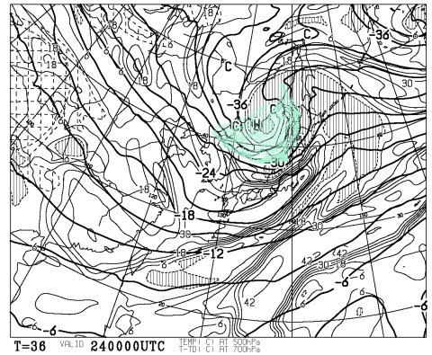
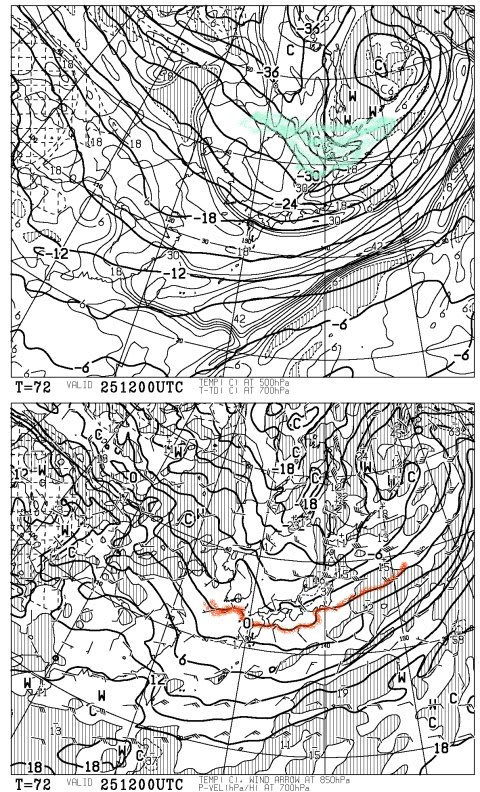
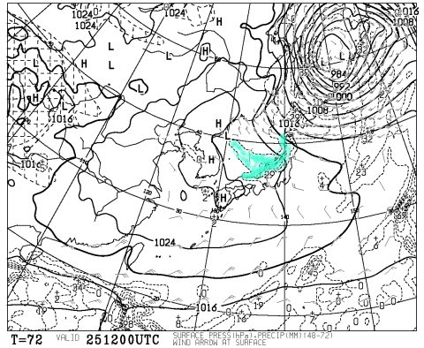
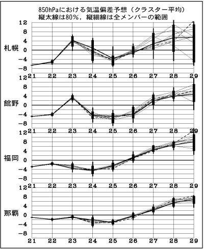
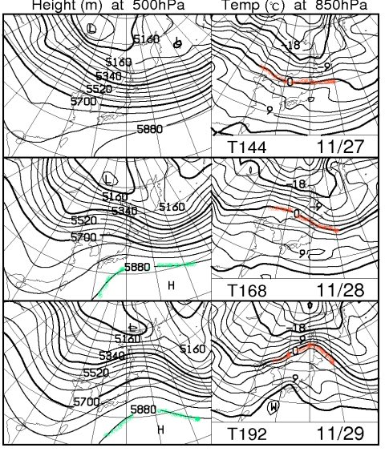

# 今週いっぱいは冷えるよっ！24，25日は一級の寒気が雪を呼ぶっ！

📅 投稿日時: 2011-11-23 01:58:06

🏷️ カテゴリ: [スキー天気予想](c6554f5c3c106093b511a8daae23757e8.md)

来たーーーーっ!!!!

来ました．

超一級の寒気が．

ここ2日間，かなりの寒気が入りましたが．

23日は，ちょいと雲が多め，気温も高めの一日になりそうで．

23日の夜には，山間でも一瞬雨が降るかも…

まぁ，低気圧は日本の北を外れて通りそうなので，降っても

それほどザーザーぶりにならないですが．

で．来ますよ．その後に．

本格的な寒気が．

これが24日の午前9時の500hpa予想図ですが．

いわゆる，「上空5000mのマイナス30度の寒気」ってやつが，

青く塗った部分．

これは，かなり強い寒気で，山沿いでは強い雪になる目安です．

日本かなり近いところまで近づいてきてますね～

そして，これが25日夜9時の予想図．

上の図の青い部分がー30度の寒気ですが．

この時点まで，しっかり日本近辺に居座っていてくれます．

下半分の赤い線は，850hpa（約1500m上空)の0度線，雪と雨の境目の

線ですが．

もう，日本の南まで下がってますので，この日は山沿いで降れば

間違いなく雪です．九州・四国まで山沿いは降れば雪になりそうですね．

で，こいつが25日夜9時の地上天気予想図．

青く塗った降水量のあるエリア，見事に日本海側だけにかかってます．

典型的な冬型の降水パターン．

それも，新潟近辺では24時間で29mmの降水…雪に直すと，29cmの積雪が

予想されてます．

いやー．積もりそうですね．

…ただし．

ちょっと気になるところが．

低気圧が北により過ぎて，風向きが，ちょいと西より過ぎるんですよね…

本州にかかっている等圧線が，縦じまじゃなくちょっと傾いた感じに

なっていて，間隔も広いし…

もう少し等圧線が縦じまになって北から風が入ってくれないと，

内陸側に雪が降ってくれないんだよな～．

海岸沿いは豪雪だけど，長野の山はそれほど積もらなかった…

というパターンになる可能性があるんですよね～．

まぁ，でもがんがん冷えるので人工降雪機は間違いなくフル稼働できますね．

この土日は，ゲレンデコンディションが良くなりそう．

…と．

いい感じの話をしてみたが．

しかし．

しかし．

27日からはあったかくなるのだ…(涙)

この下の図，右側の0度線の位置が，やる気を失わせるに十分ですね．

この図からはわかりませんが，29日は降水もありそうなので．

降れば山でも間違いなく雨です．

で，この図の左側．500hpa面の5880mって，夏の空気なんですが…

この時期，ここまで日本に近づくことはまずありえないんですけど．

うーむ．27日以降の予想は外れて欲しい…
