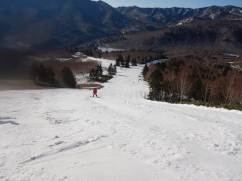

# 2022シーズン最後の志賀高原焼額山スキー場，どのくらい雪が残っていたのかな？

📅 投稿日時: 2022-05-15 04:05:28

🏷️ カテゴリ: [スキー雑談](c1f9d2cb7478308da16419928ea3945e9.md)

えー．

今週もSkier_Sはかぐらかどこかに

スキーに行っているとお思いでしょうが…

…GW遊びすぎた(涙)

大量の宿題がこなせず，土日ともPCの前に

張り付いています(泣）

また，GWの怒涛の10日間の疲れが

溜まってる感じもあって…

…あ，念のため言っておきますが．

一の瀬を滑っているスキー強化型

アンドロイドな皆さんと違って，

私は普通の人間で，無理をすると

疲れる肉体をもっているので←ここ強調しておくところ

この一週間，

次の週末はぐっすりしっかり寝ないと死ぬ！！

と思いながら仕事をしていたのもあり．

…金曜夜に仕事が終わったと同時に

倒れたように寝て，そのまま

12時間ほど眠り続けてました…

（だもんで，金曜夜に更新できなかった）

まぁ，今日は午前中はひどい雨だった

みたいだから，

スキーに行かなくて正解だったかな？

と思ってますが．

明日は天気は良さそうだなぁ…

…滑りに行きたいけど．

仕事も終わってないので．

今週は大人しく家で過ごしてます…

ってなことで，本題へ．

先週日曜の5月8日に，焼額の営業が

終わりましたが．

過去数年の実績を考えると，

人工降雪があるパノラマ-サウスはもっても，

人工降雪を打ってないGSコースは

もたないだろうなぁ…

と思っていたわけですが．

結果から見てみると，

GSコース最終日前の5月7日まで，

（無理して雪寄せすればあと1日はもった気が…）

パノラマ-サウス最終日の5月8日まで，

なんの問題もなく営業できました～！！

4月が鬼のように気温が高く，

驚い勢いで雪が減りましたが．

それでも人工雪が全くないGSコース，

最終日前日まで雪がもったので．

今年は雪が多かったんだなぁ…

ってなことで．

5月7日，GSコース最後の日の

コース状況の詳細です！！

最後の日も，朝までは

「まだまだ大丈夫だよね～」

って感じだったんですよね．

午前中の写真を見ると．

左端にちょっと土が出てきてるものの，

圧雪がかかっている右半分は

まだまだ雪があるように見えたし…

突き当たって右の落ち込み部分も…

まだまだ雪があるように見えます．

振り返って上の方を見ても…

とても雪不足でこの日で営業終了

するコースには見えませんね…

でも．

異常に気温が高かった5月7日．

昼間に，みるみる雪が融けて．

昼を過ぎると，突き当たって右の

落ち込んでいく部分，

一気に雪が薄くなり…

そこから下りた緩斜面部分も

ちょっと穴があきはじめ…

さらに旧ゴーゴーウェーブの

ゴンドラ連絡コースも，

穴が開き始めたと思ったら．

そのあとは一気に穴が広がりました…（泣）

突き当たって右の落ち込んでいく部分，

最後はこんな感じに…（涙）

そこから下りた緩斜面部分も，

穴の周りの雪が一気に薄くなり，

左側1/3くらいしか通れなくなって…

この最後のゴンドラ連絡コースは，

もうひどいことに…

横から見ると，完全に

切れちゃってます（涙）

さらにGSコースの真ん中にも…

土が出てきちゃいました（泣）

さらに一部，コースがかなり

狭くなっちゃったところも…（泣）

とはいえ．

それ以外の部分はまだ雪が残っていて．

山頂付近からこのあたりはまだ全然

土が出てくる気配もなく．

このあたりを見たら，まだまだ営業

出来そうな感じだったので．

まさかこの日終わるとは思わず…

ゴンドラ連絡コースへの分岐も，

その右手の緩斜面も，まだまだ雪が

あるし．

ゴンドラ連絡コースも，切れてた

1か所以外は穴も開いておらず

まだ普通に滑れたので．

雪を搔き集めればまだまだ穴は

十分埋められるな…と思ってたのに．

この日で営業が終わっちゃいました…

そして．

営業最終日，5月8日のパノラマ-サウス

コースですが．

こちらは最後までほぼコースいっぱい

雪が残ってくれました～！

人工雪がつけてない山頂付近もかなり

たっぷり雪が残ってたし…

パノラマの落ち込み部分も最終日の

ラストまで，見事に雪がついて

ましたね～！！

いつもは穴が開く第2高速降り場の

下の部分も大丈夫だったし…

人工雪が打ってあるサウスコースは

幅いっぱい真っ白でした！

とはいえ．サウスの下の方．

最終日の午後になって一部土が

出始めたところもあったから．

あと1週間は営業できなかったかも…？

とはいえ，サウスから1ゴンへ戻る

連絡路も途切れずにいてくれて．

一番ヤバい第3高速乗り場近辺．

ここはイーストコースから大量に

雪を下ろし続けてきたみたいで．

日々薄くなりながらも，最終日まで

雪付けしてもたせてくれました…

ホテル前も営業最終日の前日に

雪出しして，ゴンドラ前に廊下状に

雪の厚みをしっかりつけてくれたし．

いつもなら雪がかなりヤバくなる

ゴンドラ乗り場も，最終日の

最後まで，たっぷりの雪の厚みが

のこってました…！！

ってなことで．

2022シーズン，いつもよりちょっと

長めの営業をしてくれた焼額でしたが．

1，2月の大雪と，スタッフの必死の

雪出し作業によって．

無事，最終日まで第1ゴンドラを

グルグルし続けることができたのでした…

来シーズンも，最終日まで雪がちゃんと

残ってくれるといいな！
