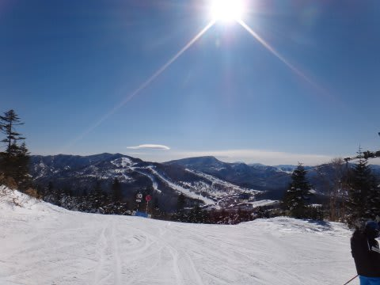
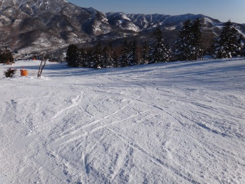
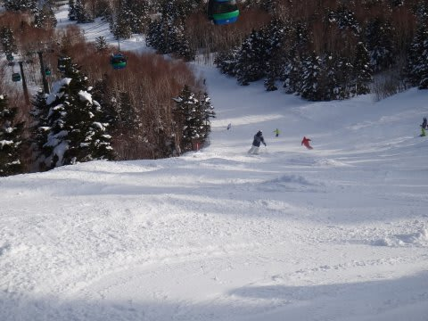

# 3連休初日の志賀高原は…

📅 投稿日時: 2013-01-12 23:38:30

えー．

今日はナイターに行って，もう遅いのでショートバージョンで．

今日は一日，いい天気！

太陽の下，気持ちよくスキーができました．

気温も暖かめだったけど，雪質は良いまま．

いい雪質で，いい天気の中滑れました～．

でも．

でも．

欠点は．

ゲレンデの人口密度がちょっと高かったのだ…

ゴンドラは最大5分待ちくらいで，そんなに待たなかったのに…

ゲレンデの人が多かったですね～．

夕方になると，多少下地のアイスバーンが出たところや，

コブになったところもありました…

でも，まぁトップシーズン．

雪もやわらかく，滑りよかったですよ～．

明日もいい天気だといいけど…

曇りっぽいなぁ．
