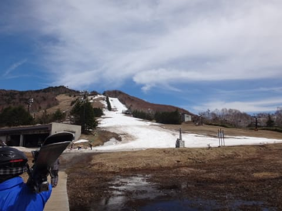
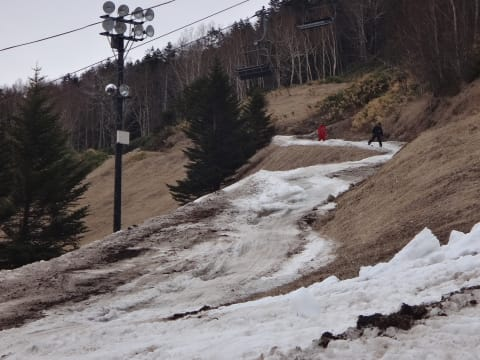

# 4月23日土曜日の志賀高原は…晴天なれど，悲惨なゲレンデ（涙）

📅 投稿日時: 2016-04-23 21:27:55

🏷️ カテゴリ: [2016スキー滑走日記](c70c67ed5248e9432b899dcd5747048bb.md)

ということで．

本日も志賀高原に来ているわけですが

…ゲレンデ状況は．

悲惨

の一言に尽きますね（泣）．

何か，神の怒りに触れたスキーヤーがいて，

罰として雪が消されているんじゃないか？？？

と思うくらいの勢いで，雪が消えてます…←そのスキーヤーは，自分なのでは？？

とりあえず，すっきり晴天で始まった朝ですが…

…ん？

雪が，すごく減ってないかい？？？？

リフトに乗って見てみると…

山頂もかなりやばいし…

下半部も，もう廊下状態？？？

山頂に出てみると…

あんだぁ～！？？こりゃーっ！！！

…もう，正面バーン上部は，

紐ゲレンデ状態ですね…（泣）

途中も雪が薄いし…

下側ゲレンデも廊下状態（涙）

一週間で，かなり雪が…

消えましたね（涙）

一の瀬山頂からのコースは，

朝イチは，かろうじてつながっていたものの．

2時間も経つと，もう，廊下部分の真ん中に穴が…（泣）．

それ以外にも，ところどころやばいところが…

ってことで．

一の瀬クワッド．

本日12時をもって，今シーズンの営業を終えました（涙）．

あぁ…こんなに早く終わっちゃうなんて…（衝撃）

そして，昼間の気温は+15度と，気温は極めて高く．

そして，容赦ない日差しのため…

なんだか，残された下半分も，かーーーなり

ヤバい状況になってきましたよ！？？

一の瀬は，もうだめか…

と，下から見たらまともそうな高天が原に

移動してみましたが

うむ．

下から見ると，一の瀬よりコース幅がありそうですね～！（期待）

じゃぁ，リフトに乗ろう…

って…えええ？？

リフトゲートから乗り場まで，すごいことになってますけど！？？

そして．

リフトを降りると…

ええええええ？？

なんだか，すごいところを通らないと

NHKバーンまで出れないんですけど？？？

NHKバーン上部へは，モーグルバーン側の

迂回路を通らないと行けない状態だったんですが．

これは…

もう，数か所切れてるんですけど？？

スタッフが一生懸命，雪を寺子屋方面から運んで

来てましたが…

焼け石に水なんですけど．

雪を入れるより速いスピードで，

雪が消えていってるんですけど…！？？？

とりあえず，苦労してNHKバーンに出てみますが…

…実際，近くで見てみると，

すごい荒れ荒れなんですけど…（涙）．

激重で，ぼこぼこで，かなり薄い感じの雪

なんですけど…

だめだ．

もう，残念だけど．

かなりダメだ…

おかげで，ほとんどほかのお客さんがいないのですが…

…というすごい状況で．

たまたまそろってしまった，20000mクラブ正会員4人…

そして．

この方々．午後の営業終了まで約2時間．

このひどい状態のゲレンデを，ひたすら休まず

正確に8分1本ペースでグルグル

し続けるのですがっ！！？？

やはり，20000mクラブの宿命として，休むことは許されないのか！？？

おかしい…

おかしいよ，この人たち…っ！！！←あなたもそのうちの一人でしょ

とりあえず．

やっぱり20000mクラブな人たちは，こんな状況でも休まずひたすら

リフトストップまで滑り続けるんだなぁ…

と，感動したSkier_Sなのだった…

営業終了までしっかり滑り，圧雪整備が入る

ゲレンデを眺めますが…

高天ヶ原も，おそらく明日で終わりだなぁ…

一の瀬も，おそらく明日で終わります．

少なくとも，一晩寝て起きたら50cmの積雪があったとか，

これからGWまで毎日，最高気温が⁻5度程度にしか上がらない

強烈寒気がやって来たとか，

そういう奇跡がない限り，GWまでは絶対持ちません．

…残念だ．

今シーズン，残念すぎる…（流れる涙）

## 💬 コメント一覧

### 💬 コメント by (Goku)
**タイトル**: Unknown
**投稿日**: 2016-04-24 01:20:44

えーと、この状況で滑っていることが凄すぎです！

私は今日、歓迎会で只今ご帰宅でブログを見て明日のスキーは諦めました。

て、事は今シーズン終了か？

悲しすぎる…

### 💬 コメント by (はじめてまして小林ともうします)
**タイトル**: 大変な１日のようですね
**投稿日**: 2016-04-24 05:47:30

M原さん

もう一方はy口さんですか？

遠くよりお疲れ様です。

渋峠はどうなんでしよう。

私は地元ですがりんごの仕事や地域の仕事でいけません。

来シーズンお会いできることを楽しみにしております。

### 💬 コメント by (Skier_S)
**タイトル**: 大変な１日のでした…
**投稿日**: 2016-04-24 08:24:12

>Gokuさま

いや…本当に「すべることができる」

という以上のゲレンデではないです(泣)

滑らないと死ぬ、という人以外来ない方が

正解だと思います…

>小林さま

始めまして！

完全に個人特定されてますね(^^;)

正解です(笑)

20000mな方々から、いろいろお噂は聞いて

おります…

また来シーズンお会いしましょう！

### 💬 コメント by (山さん)
**タイトル**: 2日間ありがとうございました。
**投稿日**: 2016-04-24 22:36:41

2日間ありがとうございました。そろそろ家に着いた頃でしょうか。1週間で雪があっという間に消える状態に呆然とさせられます。先週まで滑れたゲレンデがどうにも滑れない状態になっていくのが残念です。志賀高原も来週が最後になる可能性が高いので来週も行きたいと思います。また、来週（＾Q＾）／

### 💬 コメント by (Skier_S)
**タイトル**: 山さんへ
**投稿日**: 2016-04-24 23:34:07

2日間，お世話になりました～！！

運転全部やってもらった上に，

りんごまでもらってしまって…

ありがとうございます．

かなり助かりました！

来週は，金曜か土曜どちらか日帰りで

熊の湯に行こうと思っています．

そちらは1泊ですか？

また，一緒に行ける機会がありましたら

よろしくお願いします．

