# 2月18，19日の志賀高原の詳細レポート

📅 投稿日時: 2012-02-21 02:17:39

🏷️ カテゴリ: [2012スキー滑走日記](cca3a0e9524e0203150f790b1fc3c71ad.md)

ということで．

詳細レポートをば．

土曜は，朝からがんがん雪が降っていて．

信州中野のインターを降りた街中もかなりの積雪．

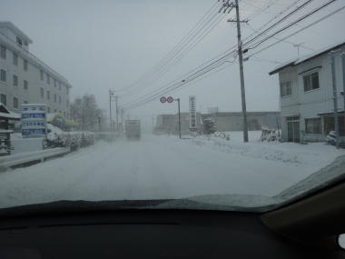

で，ゲレンデに到着するも…

…さ，寒い！

なんと，気温はマイナス20度…

これは…今シーズン一番の寒さですな．

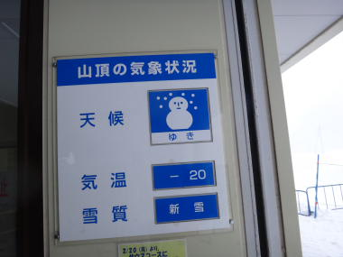

で，寒いだけならまだしも…

山頂はかなり風が強いんですけど．

吹雪いてるんですけど．

マイナス20度で風にさらされて，体感温度とんでもなく低いんですけど．

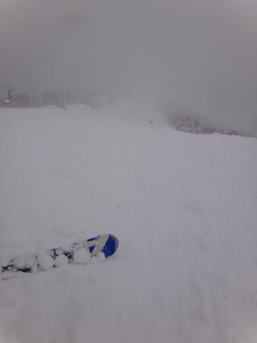

で，視界も悪いんですけど．

…

ゲレンデは，結構パウダーなんだけど．

まぁ，非圧雪コースで脛くらいかな．

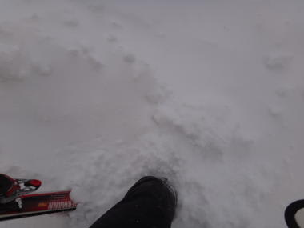

というより，圧雪コースでもブーツが埋もれるくらい

積もってるんですが．

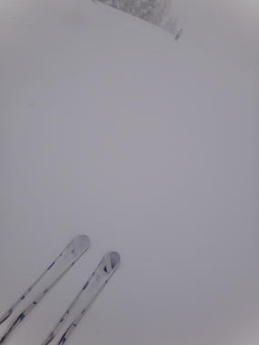

どこがどのくらいパウダーか見えないので，新雪に突っ込んで

つんのめったり，踏まれているコースにいきなり出て

加速したり…

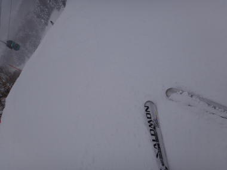

ぐおお！難しい…難しすぎるゲレンデコンディションだ（涙)

だのに．

だのに，第一ゴンドラが混んでるという…

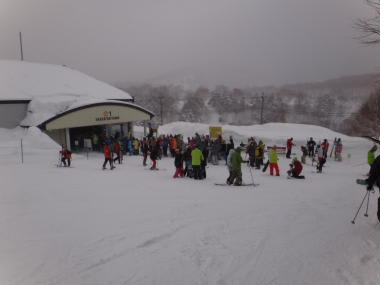

奥志賀の全リフト＆ゴンドラが止まった上に，

焼額第2ゴンドラも強風で停止…

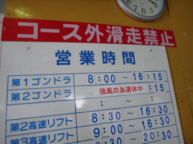

この日は最高気温もマイナス16度というすごい寒かったし．

さらに風が強いので，吹きさらしのリフトは非常にツラい．

リフトは寒さに耐える修行の場…

というより，冷凍スキーヤー大量生産ライン．

降りるまでに凍死しちゃいます…

だもんで，唯一動いている第1ゴンドラに人が集まっちゃったんですね…

うーん．

荒れてる，見えない，混んでるの3重苦．

さすがの私もあまり楽しめない一日でした…

まぁ，一日雪が結構積もったおかげで，先週の雨のアイスバーンが

隠れたのでよしとしよう，というポジティブシンキングでごまかす．

さて．

明けて日曜日．

この日は朝から太陽がっ！

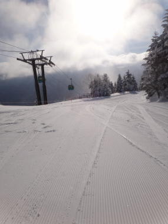

気温は昨日と同じマイナス20度．冷えてますよ～

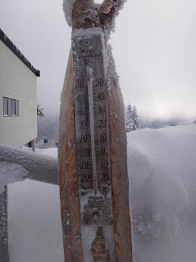

で．

ゲレンデはピカピカ圧雪！

しましまっ！

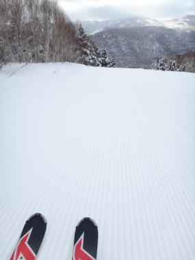

最高っ！

もう，これはもう．

今シーズン一番の最高コンディション．

ベスト．

シーズンに何度もない，絶好のスキー日和．

しあわせっ！

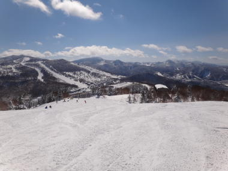

という感じで．

朝のうちは人も少なく，本能の赴くままにかっ飛ばせたんですが．

でも．

10時近くになると．

…ゴンドラ10分待ち．

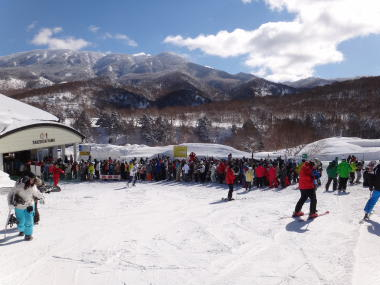

さすが，天気が良いので人が増えたか…

…でも，これって正月より人が多いんですけど．

せっかくの好コンディション，がしがし滑りたいのに

長いリフト待ちが気持ちを萎えさせる…

という感じで．午前は10時～11時半までゴンドラ5～10分待ち．

それ以降，だいたい5～3分待ちくらいが，営業終了時間近くまで

続いたでしょうか…

いつもなら，日曜の午後は人が減るのに

この日はさすがに遅くまで人がいましたね．

まぁ，せめてもの救いは，ゴンドラは待ったけどリフトは

ほぼ待ち0だったことかな．

ゲレンデコンディションは，午後まで最高なまま保たれましたねー．

あー．

でも，昨日積もった雪はちょっと柔らかかったので，

昼過ぎには圧雪バーンもところどころ凸凹してきましたし．

急斜面のオリンピックコースなんかは，コブとコブの

間には下地のアイスバーンがコンニチハしてましたが．

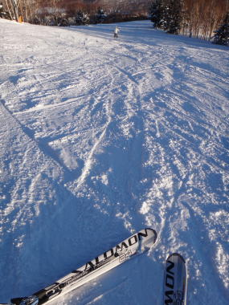

でも．

まぁ．

とりあえず．

土曜と違って，終日天気がよく．

サルのように「ウキー！ウキー！」

と，人間の言語を忘れて滑るほど，野生化できた

一日でした．

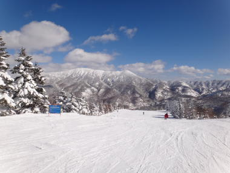

あーー．

こんないいコンディションが，今シーズンあと何日あるだろうか…

＃23日の木曜日は超どうしようもない雨がザーザー降るよ～！！（涙)

＃この週末は全面アイスバーンか（泣）
