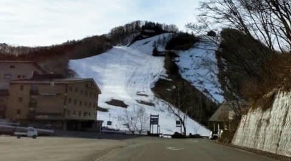
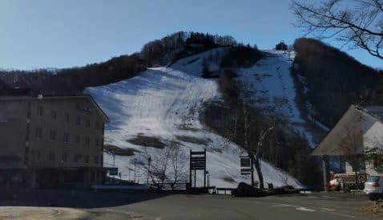
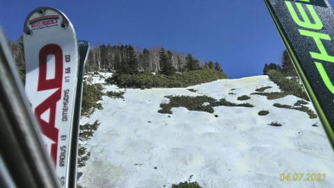

# 4月10，11日の週末の志賀高原スキー場の天気は？…土日とも晴れ！久々の雨が降らない週末で，そこそこ冷えそう！

📅 投稿日時: 2021-04-08 02:40:30

ということで．

本日も優秀な志賀高原特派員より，

写真が送られてきましたが…

今日も朝はすっきり晴れ！

きょうのおこみんは，あさイチの見事な

シマシマに満足そう！

ですが．

あさイチの奥志賀山麓は，すでに

プラス気温…

高温のために朝から雪は緩み気味ながらも．

数本は気持ちよく滑れたようです…！

雪は数本滑るとザクザクになってきた

ようですが，人が少ないので

荒れて来てませんね～…

しかし，今日は天気がよくて…

先週の+10℃を超えるほどの異常高温

ではなかったとはいえ．

気温も高めだったので．

雪はやはり，かなり重い雪になったようです…

でも，焼額も奥志賀も，どちらも今日も

貼りつき雪にはならなかったようですね！

そして．

人が少なかったので，ザブザブ雪でも

そんなに荒れなかったようです．

昼ごろでもこの程度の荒れ具合なら，

全然許容範囲ですね…

そして，誰も滑ってませんね…

…平日に滑りに行ける人がうらやましい…

…でも．この4月．

1ゴン側は滑れないし．

平日は奥志賀第4ペアが動いてないので．

奥志賀⇔焼額はスキーでは行き来できず…

さらに，例年ならまだやっている第2高速も

終わってしまっているのが残念…

ってな感じで．

今日も，そこそこ楽しめた晴天春スキーの

一日だったようですが．

晴天のおかげで，今日も1日でかなり

雪が解けましたね…(涙）

昨日のサンバレーはこんなだったのが，

今日はこんなになってますし．

すでにクローズになってる焼額の

SGSコース．

昨日はこんなだったのが…

今日はもうこんなになってます(涙）

…最近，一日で雪が解けすぎ！！！

…果たしてこれから，まだ雪が

解けていく毎日が続くのか．

それとも，週末までにまた

雪が降る日があるのか…？

いつも通り，天気図を見てみますが…

…今日も時間がないので，いつものように

じっくり天気図解析しませんが．

なんと．8，9，10日の3日間，

ずっと850hpa図の赤い0℃線が

志賀高原より南にあります！！

（8日の図）

それも，10日は…

赤い0℃線が志賀より南にあるだけ

じゃなく，水色の-6℃線が志賀高原に

近づいてます！

これは久しぶりに，志賀高原の朝は

-7～8℃に冷えそう…！！

たた，10日は高気圧に覆われるので，

雪は降らなさそうなのが惜しい…(涙)

これで降ってくれれば…

8，9日もそこそこ冷えるものの，

雪は積もるほど降ってくれなさそう(泣）

あぁ…暖かい日は雨がガンガン降るのに．

冷える日は降らないとは…

呪われてる…

とりあえず．

まとめると．

8日(木)：晴れ～曇り．

　朝は-3℃以下まで冷えるかな？

　あさイチはかなりガリガリの

　絶叫バーン．

　昼になっても日差しの悪い西側

　バーンはなかなか緩まず．

　雲が多いと，普段は日差しがいい

　南～西のバーンもなかなか

　緩まないかもしれないけど，

　昼間はわずかにプラス気温で，

　表面が緩んで滑りやすくなるかな？

　午後はわずかに雪がぱらつくかも．

9日(金)：終日曇り．時折雪．

　朝は-5℃以下まで冷えるか？

　この日もガチガチバーンでスタート．

　昼間も0℃をわずかに超える程度で，

　バーンは終日硬め．

　昼間にパラパラ雪が降り，もしかすると

　1-2cmくらい積もるかも？

10日(土)：朝のうちは雲が残るか

　もしれないけど，一日晴れ！！

　朝の気温は-7～8℃と，この時期

　としては激冷え．

　朝イチはガリガリだろうけど，

　運がよければ数cm積雪があり

　滑りいいかも…

　気温は昼間もマイナスをキープし，

　日当たりの悪いバーンは終日硬いまま．

　日当たりがいいバーンは日差しで

　緩んで滑り良くなる．

　でも，わずかに積雪があったら，

　積もりたての柔らかい雪が日差しで

　解け，滑りが悪くなるかも…

11日(日)：終日晴れ！！

　通常営業開始時は-3℃くらいかな？

　おそらく早朝は放射冷却で冷え，

　もっと寒い．

　朝は硬めに締まったバーン！

　昼間は日差しがいいところは

　緩み，午後はザクザクになりそう．

　日差しが悪いバーンは

　昼過ぎまで締まったままを

　キープしそうな，晴天の春スキー

　としては良さそうな一日！！

…ということで．

この週末は，これまでと比べると

冷えていい感じになりそう！

とりあえず．

6週間ぶりに雨が降らない週末

になりそうで．

それも土日とも晴れてくれそうという．

これまでのダメダメ週末に

比べれば，平和な春スキーを過ごせそうです！

## 💬 コメント一覧

### 💬 コメント by (ikkun)
**タイトル**: Unknown
**投稿日**: 2021-04-08 12:40:40

(^-^ゞ 明日は街にも雪がと天気予報です❗  お天気良ければ明日野沢温泉試乗会の予定(独り個人会社なので)なのですが…ノーマルに替えたtireがちいと心配ですが  少し雪になってもらえたらいいですね

### 💬 コメント by (レインボー73)
**タイトル**: Unknown
**投稿日**: 2021-04-08 16:18:14

木曜日の志賀高原情報

晴れわたった空。朝の上林３℃　蓮池２℃　山頂ー１℃。最近では一番の硬さ。気持ちがいい。

今日の課題は姿勢の矯正。

2時間経過しても山頂は２℃。10本を過ぎるとさすがに雪が悪くなって楽しさが加速度的に減少する。

パノラマの茶色い所は、妖怪の赤ちゃんが発生かな？せっかくホイホイで退治してもらったのに、こいつが大きくなると厄介。

12本目にストレスを感じたので終了。今日は14分/本で回せました。それにしても、どんな条件でもラスリフまで滑り続ける人種がこの世に存在することが驚きです（昔は私も）。

明日はさらに冷えそうですね。１号トンネル手前とトンネルは、特にお気をつけてお越しくださいませ。

### 💬 コメント by (m&t m)
**タイトル**: Unknown
**投稿日**: 2021-04-08 19:29:34

Sさんの予報を信じて、急遽10日参戦します!

朝イチには間に合わないのでゆっくり参戦です

奥志賀限定券なのでYASの皆様には挨拶出来ないかもしれません

おそらく今シーズン最後のスキーとなると思うので、楽しく滑りたいと思います(GWもあるかも・・・)

### 💬 コメント by (かず)
**タイトル**: Unknown
**投稿日**: 2021-04-08 21:28:35

レインボーさん今週末いるんですね！僕は今週の状況次第です！

来シーズンとうとうニューモデル板3枚買いです……そのうち一枚もう予約完売らしいです…最近お気に入りのSマーク

### 💬 コメント by (Skier_S)
**タイトル**: 金，土は冷えるよ！！
**投稿日**: 2021-04-09 01:31:22

＞ikkunさま

まぁ，野沢の麓でスタッドレスがいるほど積もらないと

思うのですが…

もし，積もっても朝早くを外せば解けて大丈夫になるはず（という予想です）

>レインボー73さま

え？

妖怪板掴み，出始めましたか…！？？

それはマズい…週末には出ないでおいて欲しいです（祈）

週末にしか滑れなくて，さらに2日間のために高い交通費と時間をかけて

来る人は，槍が降ろうがミサイルが降ろうが，ラスリフまで滑りますよ～！←全員がそうじゃないから

＞m&t mさま

10日，コンディションいいと思いますよ！

積もった柔らかい雪が日差しで解けると，ちょっと粘りつく雪に

なっちゃうかもしれませんが…

今シーズン最後と言わず，GWもありますし，月山もありますから，

まだまだ滑りましょう！

＞かずさま

ニューモデル3枚買い…

業界の活性化に貢献していますね！すばらしい…！！

