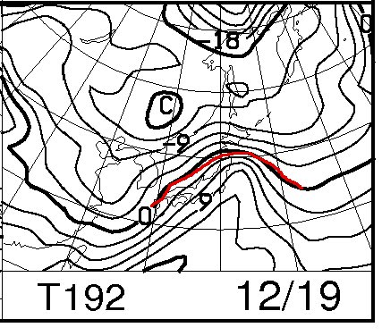
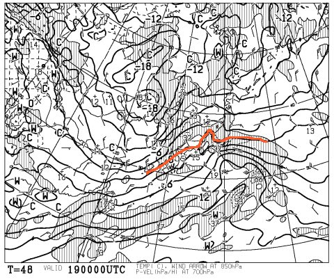
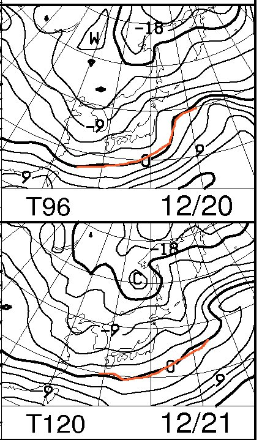
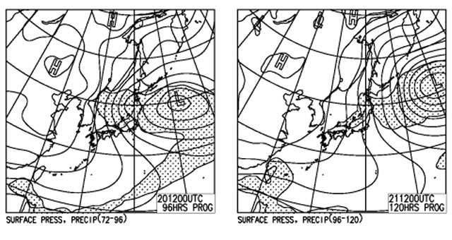

# ふむ．12月20，21日はまた降りそうだな…

📅 投稿日時: 2013-12-18 01:06:07

🏷️ カテゴリ: [スキー天気予想](c6554f5c3c106093b511a8daae23757e8.md)

えー．

以前．

[今週水，木あたり，雨か](e637ebc2b81ec9bb31eb6d54b2ed67de3.md)？？

…と，予告しましたが．

そのときの19日の850hpa気温予想はこんな感じでしたが…

本日の予想では，19日の850hpa気温はこんな感じで．

…ぎりぎり志賀高原は，0度線がかかるかどうか．

うーむ．

うまくいけば，雨にならずにすみそうな感じ…．

19日，朝の気温が低いうちは雪ですが…

昼間はどうかな～．山頂付近は間違いなく雪．

志賀の蓮池・丸池あたりは，昼間は一瞬だけ霙っぽい

感じになっちゃうかも．

…ニュースでは，18日夜から19日，関東でも雪か？？

とか言ってますが．

＃北関東は雪だけど，都内は夜中に霙になる程度かな？？

志賀高原は，逆に19日昼間がちょっと危険です．

でも．

その後，20，21日は．

こんな感じで，0度線はかなり日本の南まで下がり，

地上天気図も…

こんな感じで，縦じまの冬型なので．

20日から21日にかけて，降ります！

19日にちょっと悪くなった雪質も完全に回復し，

21日は朝から新雪が楽しめそう．

21日夜まで降りそうだから，22日の朝も

新雪行けるかな？？

22日～23日は，かなり冷え込むものの，

積雪はほとんどないです．

曇り，時々晴れるかな？

ということで．

この3連休．

前日から初日は雪．

2，3日目は曇り，時々日が射すかな．

3日とも，結構冷えて，いい雪になるでしょう！

とりあえず，焼額の第1ゴンドラも動き出しそうなので．

私は第1ゴンドラぐるぐるする予定！
