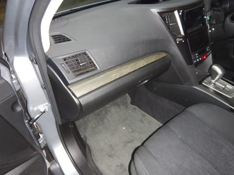

# BRレガシィのエアコンフィルタを交換してみたけど…これって，ユーザが交換する前提の部品ですから～！

📅 投稿日時: 2017-07-29 02:50:53

えー．

スキーシーズンが終わったら．

ダイビングネタの合間に，

かなり高頻度に車ネタが出てきますが…

＃何度も言うようですが，車のBlogは世の中にいっぱいあるので．

＃このBlogは自動車Blogではないつもりでいるのですが．

とりあえず．今回．

昨年6月の車検から，1年以上交換していないエアコンフィルタ．

こいつを交換したので，

エアコンフィルタの交換なんて，いまさらネタにも

ならんなぁ…

と，思いながらも．

とりあえず記事にしてみました…

…そもそも，エアコンフィルタの交換方法は，

[キーレスエントリの電池の換え方](e87e6a3bcdadc493c98245a1632f25fff.md)同様，

こんな感じでマニュアルにやり方が詳しく書いてある

くらいなので．

…基本的に，ユーザが交換することを前提に

している部品ですから．

すごく簡単に交換できます．

エアコンフィルタはこーゆー感じで．

この箱の右上に書いてあるように，

1年，あるいは1万km毎の交換が推奨のようです…

＃私は4万kmくらい使ったけど

で．

最近のエアコンフィルタ．

脱臭活性炭が効いていて，かなりの脱臭効果もあるので．

変な消臭剤を買うよりも，エアコンフィルタ変えた方が，

車内の脱臭効果が強いです…．

新しいエアコンフィルタだと，外の排ガスのにおいとかも

かなり気にならなくなるので．

「長らくエアコンフィルタ，換えてないなぁ…」

という方は．

こういう3000円ほどのエアコンフィルタを買って，

交換することをおススメします…．

スバル純正パーツもDENSO製だし，DENSO製が

活性炭脱臭が効いてる中で，一番安くてコストパフォーマンス

イイかな～．

ということで．

エアコンフィルタ交換ですが．

エアコンフィルタは，大体ほとんどの車で

助手席側のグローブボックスの奥にあります．

だもんで，グローブボックスを開けて…

グローブボックス横の，ダンパを外します．

折れそうに感じるけど，この棒に指をかけて…

引っ張ると，パコンと外れます．

後は，グローブボックスの両脇の壁を，

内側に押し込むようにして引っ張ると…

グローブボックスが，こんな感じで垂れ下がるほど

開いちゃいます．

…ちょっとわかりにくいのですが．

グローブボックスの，この指をさしている部分が

引っ掛かって，グローブボックスのふたが

途中で止まるようになっているので，

赤矢印のように両側から挟んでたわませる感じで，

この引っ掛かりを外して引き出しせばOK．

これで，グローブボックス奥を覗くと…

こんな感じで，エアコンフィルタのふたが見えるので．

この蓋の爪を4か所外してやって…

蓋を引っ張ると，エアコンフィルタとご対面です．

あとはフィルタをまっすぐ引っ張れば…

フィルタは外れますが…

うげげげげ！！

さすが4万km酷使したエアコンフィルタ…

むっちゃ汚れてるよ…

新品と並べると，一目瞭然．

ってことで．

今度は，新品フィルタを差し込みます．

…って，このフィルタ．上面は緑色なんだ！

この，UPのプリントがある側が手前になるように，

かつ，UPの文字が正しく読める方向で，

フィルタが刺さっていたところに差し込みます…

こんな感じで，フィルタが元通りになったら．

後は，蓋をして

グローブボックスを元通りに押し込んで．

そして，ダンパーを元あったようにハメれば…

ほい，完成．

作業時間，わずか5分．

ディーラーに頼むと工賃取られちゃうので．

非常に簡単なエアコンフィルタ交換，ぜひご自分で

チャレンジしてみてください…

＃って偉そうに記事にしたけど．

＃ほとんどの人は，この程度のことは知ってる気がする…
