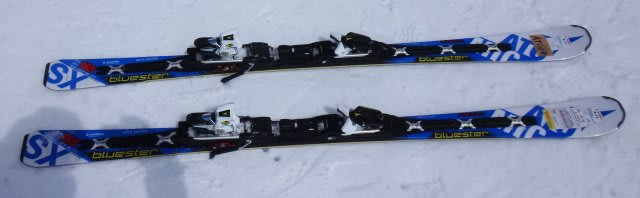
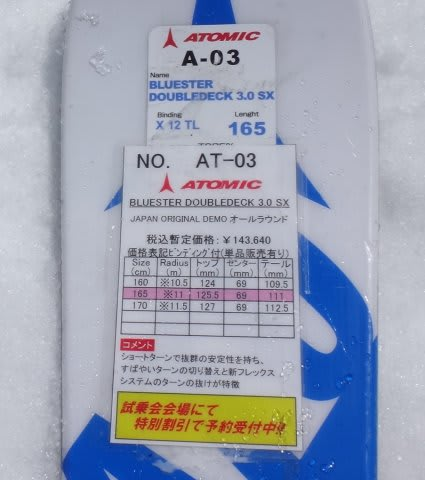
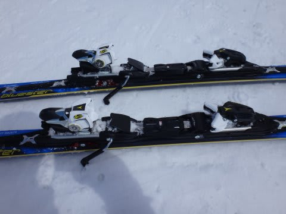
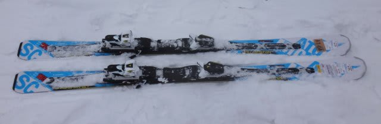
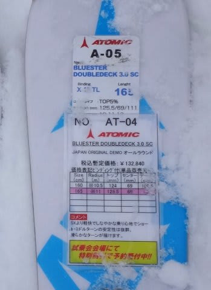

# まだまだ続く！2015シーズンモデルのスキー試乗レポート15…ATOMIC編その2

📅 投稿日時: 2014-04-25 01:39:57

ってことで．

アトミックブーツにチェンジして，板の印象は変わるのか？

…ってことを検証する，今回の試乗．

SXは，前回に引き続いての2度目の試乗です．

さて．

ブーツを履きかえて，印象は変わるのか？？

では，2015シーズンモデルのアトミック試乗インプレッションです．

どうぞ～！

----

ATOMIC BLUESTER DOUBLEDECK 3.0 SX X12TL 165cm

基礎小回り用.

今回の試乗板も，前回と引き続き．

標準のTLビンディングの板で，強いVARビンディングでは

ありません…

で．

この板を，ATOMICブーツとあわせると…

あれ？

なんだか，前回より，ちょっとフレックスがやわらかく感じる…

特に，これまでのSXのガッツりしたテールの張りが

かなりマイルドに感じます．

テールをしっかり押せるようになるアトミックブーツでは，

硬いテールをしっかりたわませられるので．

板が以前履いた時より柔らかく感じて．

板のテールがものすごく粘っこくしなって，

このたわみに乗ってターンしていくように感じられます．

返りも，板の元気な反発ってより，

テールのたわみで板が回っていき，

反対側に板が抜けていく感じ．

まぁ，これはマイルド版SXに近めで，結構操作性は

いいんだけど．

板に圧がためられる，返りの早い現行SXに近づけるには，

やっぱりXビンディング(VARビンディング)がいいのかな？？

でも．

ブーツを替えて，板が柔らかくなったように感じたけど．

やはりテールコントロールのATOMICブーツに合わせてある

板なんだなぁ…と，痛感．

ATOMIC BLUESTER DOUBLEDECK 3.0 SC 165cm

基礎小回り用．

SXとサイドカーブは同じらしく．

SXと性格は全く同じです．

テールで曲がっていく板です．

トップを抑えても，トップのグリップは弱めなので，

ちょっとキョロキョロするように感じてしまうかもしれません．

テールを抑えて行くと，ねっとり，というより

ねっちょりした感じのフレックスでたわんでいきます．

グリップがSXほど強くないので，エッジグリップを外して

どこにでも板を動かせる自由度があり．

動かした後，かかとの後ろに荷重すれば，かなりしっかり

エッジグリップします．

返りの速さ，たわみの出しやすさがわずかにSXより下なだけで，

履いた性格はホントにSXと同じ．

今年のSC,SXは，板のたわみのバランスが違って，

SCはセンター付近にたわみが集中する感じの板でしたが．

来期モデルは，両者に性格の違いは感じないですね～．

## 💬 コメント一覧

### 💬 コメント by (komu)
**タイトル**: じつは…
**投稿日**: 2016-02-23 08:11:45

この間SX買った時、アトミックブーツ型落ちですが130PROが0.9諭吉だったので勢いで買ってしまっだのですよ

現在の組み合わせはサーキット9.2STとダルベロですがそれとまったく違うポジションでかなーり戸惑いました。

おかげで身体より頭が、疲れた1日でした。

ま、慣れもあるでしょうね

まだまだ楽しめそうです。

### 💬 コメント by (Skier_S)
**タイトル**: komuさま
**投稿日**: 2016-02-23 23:52:32

あららら！！！

ATOMIC板だけじゃなく，ブーツもいっちゃいましたか…

おわってますね（笑）．

ダルベロとは全く違うブーツだともいます…

ポジションは後ろだし，低い姿勢を強要されるし…

でも，それに慣れちゃうともうやめられない組み合わせですよ．

ATOMICブーツ&板は…

一緒に滑る機会があれば，アブナイATOMICの世界へ

お誘いします（笑）．

ダルベロより10cm後ろのポジションです．

また，志賀高原にお越しの際はぜひ…

