# スマートウォッチ，Amazfit GTRをスキーでしばらく使ってみて…標高差はちょい少な目に出るかな．GPSも精度はすごい高くないけど，まぁスキーなら使えるか．

📅 投稿日時: 2020-04-15 01:51:37

えー．

本日の志賀高原．

なんと．

昨日からの積雪が25cmを超えたようです…！！

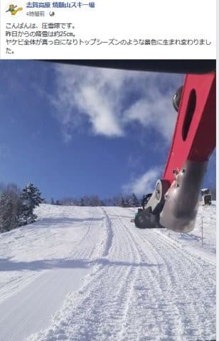

（[焼額山Facebook](https://www.facebook.com/yakebitaiyama/?hc_ref=ARQV6N2JsXevdxBMl7598Zlgsn57bPY9YJo03eX2sNf78R2JPGauQzCn9888DdePRRg&fref=nf&__tn__=kC-R)より）

4月中旬に，こんなに雪が積もるとは…っ！！

だけど．

やっぱり朝は予想通り風が強く．

奥志賀，横手，熊の湯は終日全面運休に

なったようです(涙）

朝イチは焼額もイチゴンが運休

したものの…

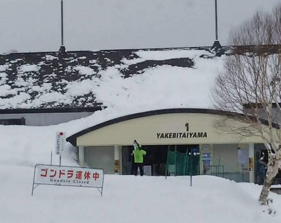

第4ロマンスが営業してくれて．

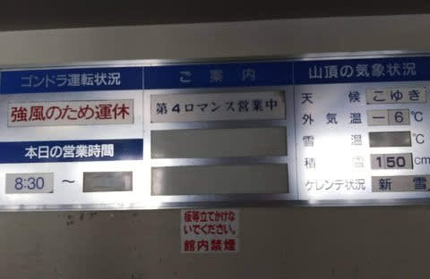

そして，朝10時過ぎには，無事1ゴンも

営業開始してくれました…！

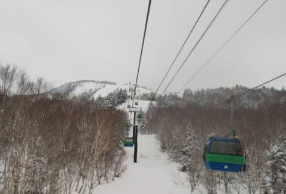

…で．

ゲレンデ状況はというと．

圧雪の上に数cmの新雪のバーンコンディション！！

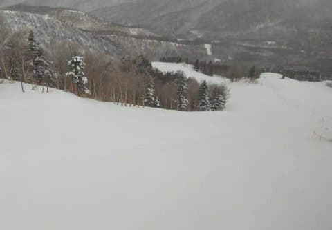

コース脇は，10~20cmのパフパフ

だったようですが…

朝の気温が-6℃とガンガンに冷えたので，

圧雪コースは，残念ながらちょいと

下地が結構固かったようですが．

…でも，今日一日，終日冷え冷えの

真冬のような一日で．

超高温で雪が解けていくのに比べれば，

100億倍くらいましかなっ！！

ってなことで．

　強めの北風でスタート．

　奥志賀ゴンドラはヤバそうな感じ．

　運がよければ朝の積雪は10cm近くあるかも？

　あさイチの気温は-5℃と冷え冷え．

　ガリガリの下地に新雪が乗ったバーン

　コンディション．

という予想．

積雪が予想より多かったけど，

気温，雪質，

かなりの精度で正解でした~！！

すごいぞ，自分っ！←あなたが偉いんじゃなく，気象庁の予想天気図が正確なのが偉いんだよ

ってなことで，本題へ．

これまで，スキー用に購入した

スマートウォッチ，Amazfit GTR．

その1．[購入レポート，](e07b216ec3b426f7a5a1462a3b6fd1c02.md)

その2．[開封＆試してみた感じ，](edd1205f6bd9cd6dadb50e4fc6316b747.md)

その3．[アクティビティーログ](ecd7317c7980728b41dae1a21fe835803.md)

その4．[スマホアプリのインストール＆設定](eb88e9293dae421d12f27fe8b5b363344.md)

その5．[スマホアプリを使ってみた](e031a6cc94592b655560de20fc58cacf1.md)

番外．[常時点灯機能追加！](ec221351f854b20de445e565d66acdf55.md)

その6．[GPS精度が低いのが欠点](eef49f5206ed798087941af71eebf0dee.md)

その7．[GPS精度，ちょっと改善したかも](e9f927972612f60570f5a704fb48030f8.md)

その8．[スキーモードを使ってみた](e29f3f0e50c4f1facc44bbff6d4859de6.md)

その9．[スマホアプリでログを見る](e759b2c876cb9c8b604ea08e152e39c20.md)

その10．[Auto pauseを切ったらどうだったのか？](e6095de159b336f431785b0cbbad1f6ab.md)

今シーズンから，スキーをする時は．

こいつをずっと着けて滑っていた

わけですが．

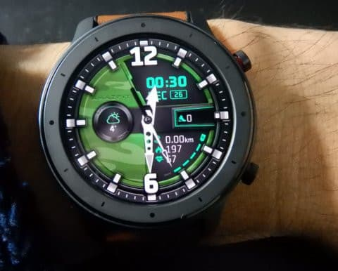

そろそろ長く使ってみたので．

実際にスキーで使ってみるとこんな感じだという

レポートをしてみましょう…！

これまでのレポートにも書いてきましたが．

Amazfit GTR．

運動モードで…

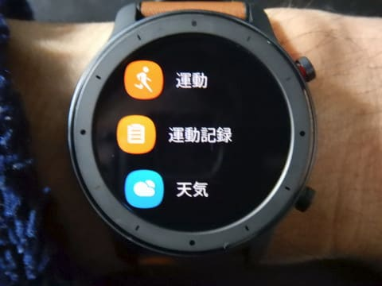

スキーを選ぶと．

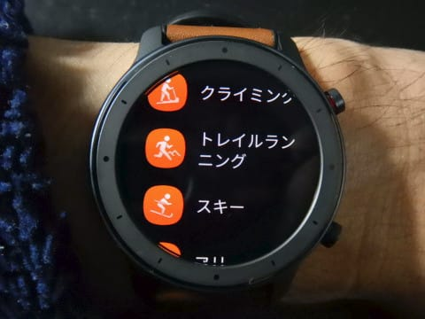

スキーのログ記録モードになり．

ログ記録中は，こんな感じで，

記録開始からの時間，

ログ記録中の最高時速，

この1本の滑走距離（下り続けている間の距離．登り始めるとリセットされる），

ログ記録中のトータル滑走距離（下りの距離トータル．登り距離は含まれず）

が表示されます…

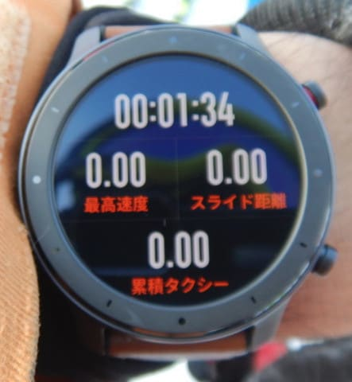

ボタンを押すか，画面をスワイプ

すると画面が切り替わり．

スライド本数（滑走本数），

累積ドロップ（積算滑走標高差），

滑っている時の最大勾配と…

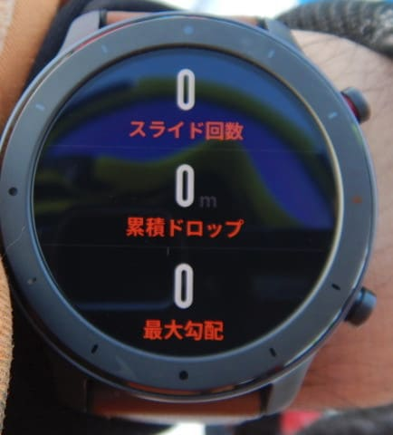

さらに切り替えると．

現在の心拍数，標高，消費カロリーが

表示され．

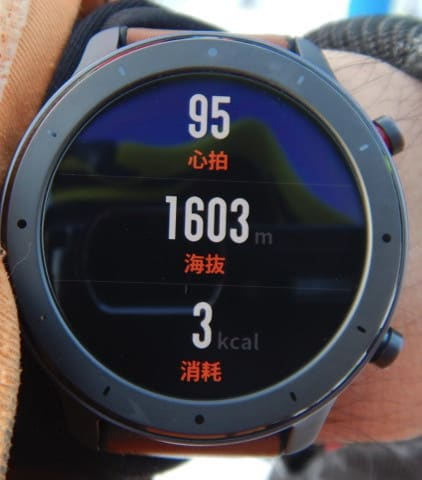

さらに切り替えると，

直近30分ほどの滑走速度グラフが

表示されます．

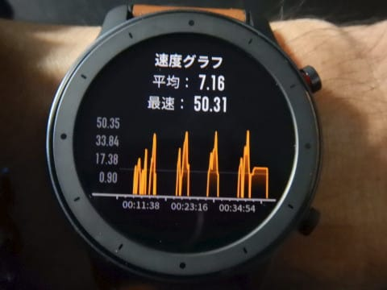

有機EL画面はかなり明るいので，

太陽光の下でも画面は良く見えます！

で．

タッチ画面を使わず，ボタンで大体

操作できるので，グローブをしていても

操作OKなのがいいですね．

ただ，

運動記録モードにして，スキーログの記録を

開始すると，他のモードが使えなくなり．

LINEやメールの着信通知時に，着信画面が

一定時間表示される以外は，ログ記録

画面しか確認できないのがちょっと惜しい…

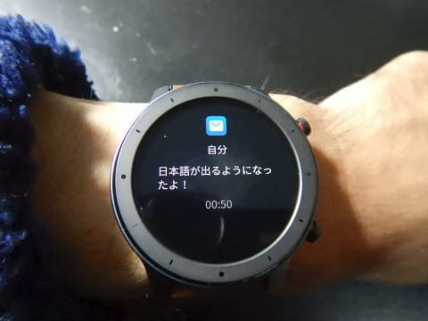

さらに，ログ記録画面では

時間が表示されないという最大の

欠点があり．

別にもう一つ時計がいるってのも，

惜しい感じ…

でも．

滑ってる途中でも，時計を見れば

消費カロリーが確認できたり，

最高速度や最大傾斜が分かったりってのは，

結構楽しいですね～！

また，ログ記録完了後，スマホと同期させれば．

スマホアプリでGPS軌跡や平均心拍，最大速度や

合計標高差…

そして，滑走速度，心拍，標高の

時間経緯などが確認できるので，これもまた

いろいろ楽しめます．

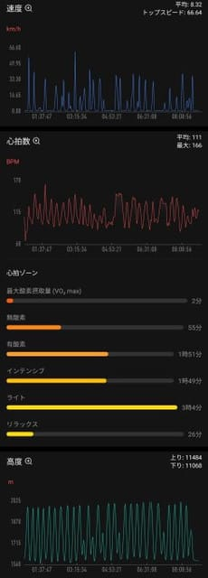

時計のGPSで現在位置を記録するので．

電池を食うスマホのGPSを入れておかなくても，

どこを滑ったのか分かるのがいいですね…

ただ，腕時計側のログ記録を終了させた後

じゃないとスマホにデータを飛ばせず，

滑り終わって，ログ取得を止めた後

じゃないとスマホで記録が見れない

というのはちょっと痛い…

で．

ここでAmazfit GTRの最大の残念なところが．

GPSトラッキング精度があまり高くない

というところ．

GPS電波の強いところでは，コースの

どの部分を滑ってるかまで分かる

レベルで記録してくれますが…

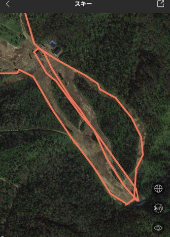

GPS電波が弱い場所では，ちょくちょく

GPSを見失います．

電波の弱いところでは，

赤丸：軌跡が途中で途切れた（涙）

水色：森の中を滑ってる（泣）

緑色：こんなぐちゃぐちゃ移動していない（残念）

と言った感じになります…

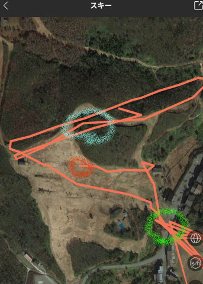

GPSソフトのアップデートがこれまでに

何度かかかったのですが．

残念ながら，GPS精度は上がりませんでした（涙）

このあたり，GPS精度がどのくらいか

というのは，また別途記事にする予定です．

また，20000mクラブゴールドな方々は，

同じリフトを50本とかの単位で

乗るような方々ばっかりなので．

そういう人は，軌跡は線だらけでなにが

なんだか分からなくなりますが…（笑）．

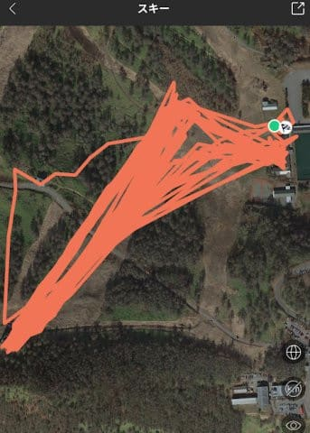

（試乗会でアサマ2000のリフト1本だけをグルグルした日の記録）

で．

スマホアプリで滑走標高差の記録を見てみると．

滑り降りた標高差と登った標高差．

赤丸で記したところを見ると，

登った標高差が多くなってますが．

なぜか毎回，必ず登った標高差の方が

多くなります．

うーん．

なんでだ？？

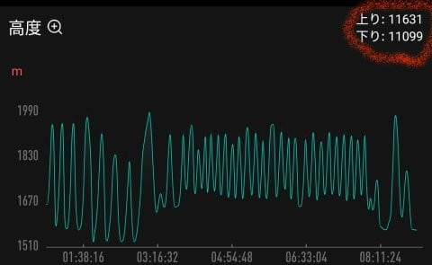

この日のリフト乗車本数から滑走標高差を

計算すると，大体12800mくらいだったので．

10%ほど少な目に出てます…

大体毎回，実際よりこのくらい

少な目に計測されます．

標高差を正しく知りたいという目的では

ちょっと精度が低い気もしますが．

まぁ，これまで使っていた[Suuntoの
Altimax](e764f37b2c20923a0b722f930137c0e5e.md)も，10%ほど多めに出たので．

まぁ，こんなもんなのかな～．

ただ，スマホアプリだと，何本滑ったかの

滑走本数が表示されないのがちょっと残念．

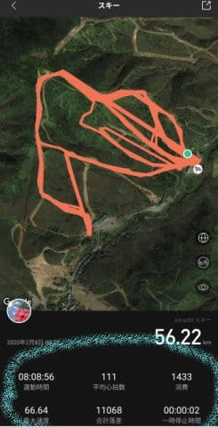

水色の部分に，滑走本数の表示が無い！（涙）

…まぁ，この標高グラフから数えることも

できますし．

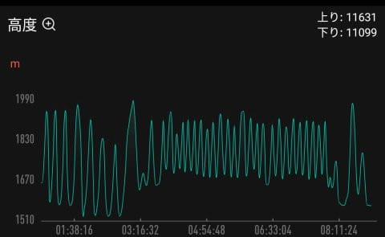

時計本体では見れるからいいんですけど…

消費カロリーは目安かな．

赤くマークした部分を見ると，

1500kcal近く消費しているようで…

私は大体1日滑るとそのくらいの表示に

なるんですが，そんなに消費してるのかな？？

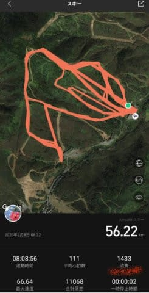

…まぁ，こんな感じで．

いろんなデータを見れるので．

私のような記録マニアにはいいかも．

そして，何よりもいいのは，

滑っている途中で．

LINEの着信があった時．

スマホを取りださなくても，

メッセージが確認できること

ですね…

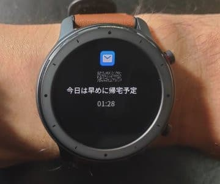

（この写真はメール受信時の画面ですが）

腕時計のバイブレーションはかなり強く，

滑っていても着信に気づくくらいなので．

LINEやメール，電話の着信に気づかない

ってことが減りました．

これが一番便利かも！？？

ってな感じで．

滑走標高差やGPS，滑走本数には多少の誤差が

ありますが．

厳密な正確さを求めず，大体何本，

何mぐらい…という目安に使うと割り切れば，

滑ってる途中に腕時計で滑走本数や

標高差，最高速度や消費カロリーが

確認でき．

LINEや電話の着信も確認できるので．

スキーの時に身に着けておくには，

かなり便利なデバイスですね…

まぁ，これが1.5万円くらいで買えるので．

コストパフォーマンスは高いと

思います～！

## 💬 コメント一覧

### 💬 コメント by (地元民(ほぼ麓))
**タイトル**: Unknown
**投稿日**: 2020-04-15 21:04:35

横手山はさらにすごくて50cm 。深いとこは100cmの新雪があったらしいですよ。里はすごい雨でしたからね、あれが雪なら100cmいくと思います。

４月に入ってから低温傾向で、桜、開花して10日になるのに、まだ満開になりません。郊外の話。もちろん長野市内は満開ですよ。

長野市内でコロナのクラスターが発生(キャバレーだそうな)し、大騒ぎに。濃厚接触者は70人。そう考えると、スキーって、実に健全な娯楽ですね❗

### 💬 コメント by (Skier_S)
**タイトル**: ＞地元民さま
**投稿日**: 2020-04-16 01:16:05

え！！50cm以上積もったんですか…

今年は昨シーズン同様，奇跡の4月再来ですね．

とりあえず，今は早く事態が収束して，安心してスキーに

行けるようになるのを祈るばかりですが…

GW明けもダメっぽいし，今シーズンはもうダメか…

せめて月山が滑れるうちに収束してほしいです…

