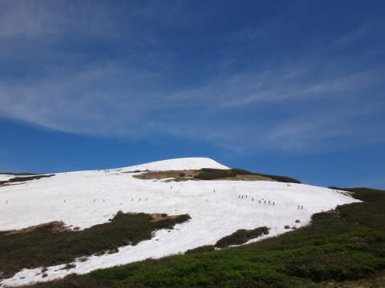
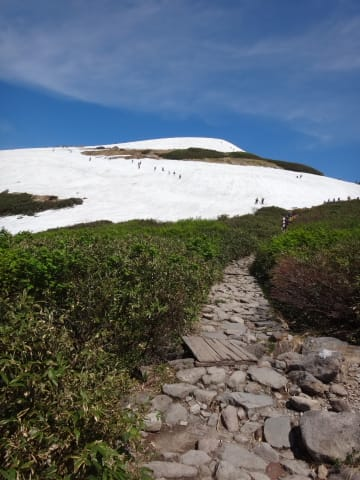
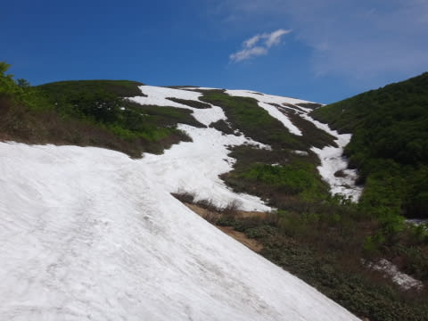
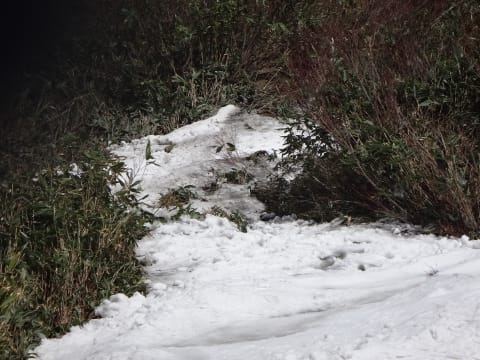
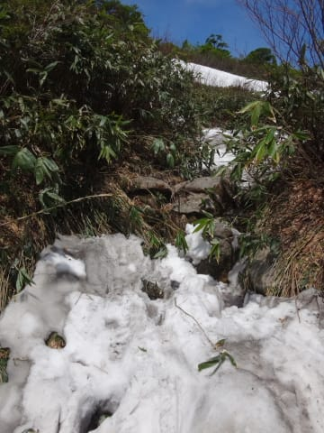
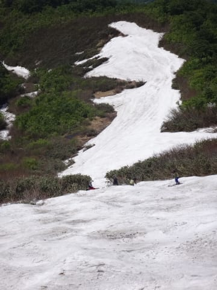

# 6月11日の月山速報…リフトを滑ろうと思えばぎりぎり滑れるか…

📅 投稿日時: 2016-06-11 22:40:44

🏷️ カテゴリ: [2016スキー滑走日記](c70c67ed5248e9432b899dcd5747048bb.md)

えー．

今朝2時間睡眠で月山に向かい．

滑り終わった後も300㎞運転して，

現在なぜか新潟県にいるSkier_Sです．

ついさっき，宿に到着しましたが…

眠くて死にそうなので，速報モードにて…←いや，普通なら絶対起きてられないから．ってか，この状態で月山に行かないから

えー．

すっきり晴天，夏の陽気で始まった月山の本日．

リフト上，Tバーエリアは…

うげげ．

真ん中部分，右からかなり雪の融けた島が広がってきてるよ！！

で．

Tバーは2本とも，この雪のない部分の上側にかかっているので…

リフトを降りて登山道を歩き，そのあと，

さらに島の上まで歩いていかなくてはなりません…(涙）

一応，リフトの大斜面コースは公式にはクローズとなってますけど．

リフト降りてから，しばらく登ってからトラバースすれば，大斜面に

たどりつけます．

大斜面そのものはぎりぎりつながっていましたね～．

やばいのは，大斜面が終わってから，リフト乗り場に向かう急斜面．

こんな感じの，水がほとばしる岩場を数m乗り越えていく

必要があります…

けど，ここさえ乗り越えれば，あとはまだ何とか滑れます．

…でも．

大斜面も一か所，ボトルネックで切れそうなところがあったので．

…うーむ．

大斜面が無事滑れるのも，明日が最後かな～，

って感じです…

また後程，詳細レポートします…

今日は．

今日はもう限界です…

おやすみなさい…zzz
