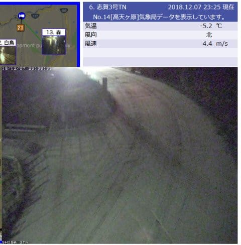
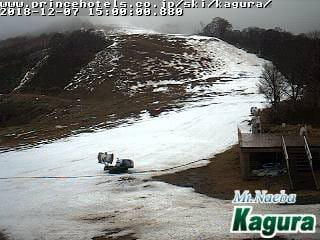
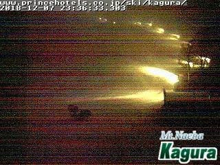
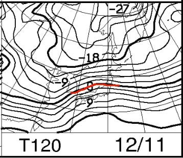
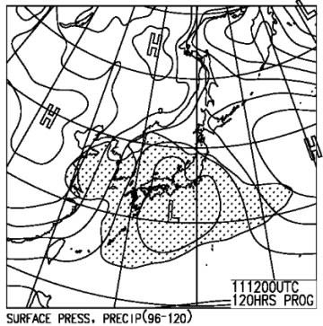

# そして明日も志賀高原だけど…西風すぎる（涙）．冷えるけど，志賀はやっぱり積もらない

📅 投稿日時: 2018-12-08 00:38:16

🏷️ カテゴリ: [日記](cc4b5682fb7b8b144980957a978653fb0.md)

ってな感じで．

志賀高原．

夜になって，ようやく雪が降り始めました…

（[北信建設事務所HP](http://www.q0.ws302.smilestart.ne.jp/index.htm)より）

ただ．

やっぱり，西風すぎる…

冷たい空気は降りてきてくれたけど．

寒気の中心が北すぎます（涙）．

まだ日本付近の空気の流れはゾーナルな感じ…

寒気がもう少し降りてきて，東谷の場に

なってくれればドサドサ積雪も期待できるけど．

この週末．

冷えるけど，志賀は積もらない西風パターン（涙）

まぁ，明日土曜の朝までに最大10cm．

そして，日曜にも10cm程度の積雪がありそうで．

結構冷えるので．

人工降雪バーンは回復するかな…

でも，滑走エリアが広がるほどではなさそう（泣）

なんだか，激烈に雪が少なかった3年前より，

今年の方がひどい気がするのは気のせいか…

しかし．

水曜から営業中断していた，かぐら．

本日午後でこんな状況だったのに．

（[かぐらライブカメラ](https://live.monitorbox.jp/site/kagura/90/)より）

明日はクワッドを営業するとアナウンスしてます…

夜になってから，かぐらメインゲレンデは必死に人工雪を

打っていますが．

これでホントに明日クワッド動かせるのかな…？

とりあえず．

私は明日も焼額へ行きます．

滑れる限り，焼額へ行くのだ！

…で．

この週末の天気は，ほぼ水曜の予想通り．

ただ，土曜は晴れ間の時間が伸びそうかな？

とりあえず，土曜朝は結構冷え込み，積雪は最大10cmほど．

これに人工雪が混ざって，朝イチは意外とよさげ．

…ただ，午後は固い下地が出てくるか…

日曜も，朝は積雪最大10cm．

日曜は一日雪が降ったりやんだり．

昼間も-10℃程度の冷え冷えで，

うっすら積もるほどの積雪があるかも…

ただ，新たにコースがオープンできるほどは

降らなさそう（泣）

でも．

この週末は-10℃以下と，結構冷えそうで．

いいんじゃないかな～．

なんてったって．

10日までの冷え込みの後の，11日．

ええええ！！！？？？

…え！

ええ！？？

また，雨か…（涙）

でも．

そのあとは，12，13，14日と．

今週末ほどではないにしろ冷え込んでくれそうなので．

そこは積雪が期待できるかも…？？

## 💬 コメント一覧

### 💬 コメント by (mamiko)
**タイトル**: 今年も読みます！
**投稿日**: 2018-12-08 12:05:05

家を買って、車を買って、ブーツも買って、何物だ！

今年もblogについていきます。

### 💬 コメント by (Skier_S)
**タイトル**: mamikoさま
**投稿日**: 2018-12-09 07:49:49

コメントありがとうございます！

今シーズンもついてきてください！

(ときどき振り切ってしまうかもしれませんが (笑))

