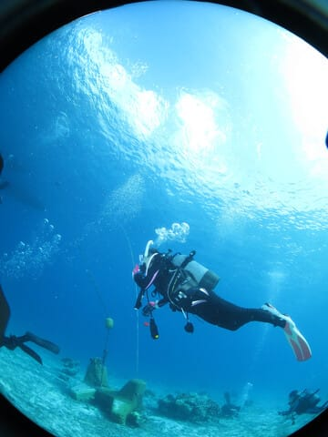
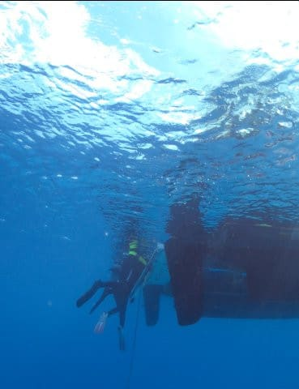

# 2024年8月，今年も座間味で親子ダイビング！その12…ダイビング2日目の1本目終了，2本目へ！

📅 投稿日時: 2024-09-06 01:36:52

🏷️ カテゴリ: [ダイビング日記](ce3a7a8d424d112fce83ee85c81a0e344.md)

そういや，昨日のスマートウォッチの記事で．

私がFenix7Xを外すのは，ダイビング中と

お風呂の時だけ…と書きましたが．

実は1回だけ間違えて，Fenix7X君を

着けたまま潜っちゃったことがありました～！

一応10気圧防水なので，水深100m

相当の耐圧性はあるはずなのですが．

マニュアルには「スキューバダイビング

などの潜水を行うアクティビティは

行わないでください」と書いてあるので，

律儀に潜るたびに毎回外していたのですが，

この時はダイビングコンピュータに付け

替えるのをすっかり忘れたままエントリー

しちゃいました…

ただ，潜るときにダイビングコンピュータを

忘れないために，いつも外したダイビング

コンピュータはカメラに取り付けていて

置いてあるので．

エントリー時にカメラにつけっぱなしのまま

だったダイコンを外して腕につけて．

バカみたいに見える，時計ダブル装着で

潜ってました…

でも．

10気圧防水ですから，20m程度のダイビング

では全く問題なく．

健気に動き続けて，水中でも途切れずに心拍

計測が続いてました…！！

ダイビング中の心拍数って初めて見たけど．

思ったより心拍数低いな…

（この写真では心拍数82を示してる）

でも．

やっぱりダイビングの時にいちいち時計を

付け替える必要がないのが，やっぱり

一番楽だな…

心拍やストレス，運動量の計測が途切れないっ

てのもあるし…

うーん．

でも，Fenix8は高すぎて買えないな（涙）

ってなことで，本題へ．

今日はまた，座間味のダイビング旅行記です…！

…ちなみにこのダイビングは，Fenix7を着けたまま

潜ったダイビングではありません（笑）．

ーーーー

（[前回はこちら](e1dd38d6dea338bc05a7071cf800fad02.md)）

という感じで，ダイビング1本目も終盤．

浅瀬をボートに向かって戻っていきますが…

エダサンゴについているデバスズメダイなどの

癒し系を眺めながら…

ボートの下の浅瀬に戻ってきました！

浅瀬でしばし安全停止したら，

本日のダイビング1本目，終了です．

しかし…

この透明度の良さ！

海の中から雲が見えて，空を飛んでるよう

です…

ってなことで．

満足の1本目を終えて，エグジット！

後続のチームも次々ボートに上がって

きて…

タンクを付けかえたら，ボートは移動を

開始します…

こんなに天気が良くて．

海況も最高の中．

娘は特等席で過ごしてますね…

今日も午前1本，午後1本で潜る人が

いるようで，午前の1本目が終わったら

一旦港に戻り，新しいゲストをピック

アップするようです…

港で待っていたゲストをピックアップしたら，

すぐに出港！

港の中で，沖縄の歴史的な小舟，

サバニ体験の人たちとすれ違いましたが…

うーん．あれ，結構楽しそうだな…

で．

港を出てしばらく走りますが．

2本目のポイントは，ちょっと遠めのところに

行くようですね…

港から出て，15分以上ボートを走らせます．

やってきたのは，阿嘉島の東側．

阿嘉島のニシバマビーチが見えるところに

やってきましたよ…！

どうやら今日の2本目は，このニシバマ

ビーチの前で潜るようですが…

いやーーー

ここから深さ5m程度の海の底が

くっきり見える！

ここも透明度がよさそう…！！

準備が終わったら…

いざ，2本目へエントリー！

…いや．

ムチャクチャ透明度いいよ！！！

天気が良くて，日が射す中．

キラキラとスズメダイやグルクン若魚

なんかが舞い踊るという．

私の大好きな癒しポイントですね…！！

大物ガンガンでもなく．

マニアックなマクロでもなく．

なんとなく南国っぽい写真が撮れる，

ダイビングをしたことがない人が

「潜ってみたい…」と思うような．

こういう感じの海が大好きなんです…

いや．

この写真も悪くないけど．

フタスジリュウキュウスズメダイとか

ミツボシクロスズメとか，黒っぽい魚は

写真映えしない…（ちょっと惜しい）

いや．でも，空に雲が見えるほど

透明度が良くて．

こういう海，いいですね～！

仕事を忘れて癒しを求めるには

最高の海じゃないですか！！！

（[続く](edf815086b663ef68069fe514777b709c.md)）
