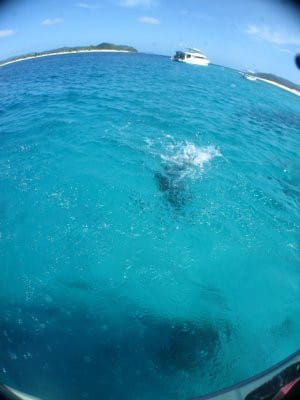

# 2010年7月，2歳の子連れで座間味でダイビング！その6…午前中は娘とのんびり

📅 投稿日時: 2021-09-28 06:17:43

🏷️ カテゴリ: [ダイビング日記](ce3a7a8d424d112fce83ee85c81a0e344.md)

9月の月末が迫っていて，仕事がいろいろ

クリティカルなSkier_Sです．

またとんでもない時間に更新してますが．

それでも更新する自分．偉い！！←みんなに褒めてほしい

しかし…昨日の記事は読者の皆さんを

置き去りにしてしまったようですね…

ちょっとマニアックすぎたか…

そして．

今日はまた，人気の無いダイビング旅行記が

続きます…

でも，この状況で更新しているだけ偉いのだ！←開き直り

ーー

ってなことで．

阿真ビーチで，娘を浮き輪に突っ込んで

海にドボン．

泳ぐのが好きな娘は，大喜びで

1時間以上浮き輪で浮かんでました…

なんと楽な子供よ…！！

（防水カメラは潜りに行った妻が

　もっていっているので，海に浸かってる

　写真は無し）

ひたすら楽しそうに海に浸かり続けて，

全く海から出たがる気配はなかったけど．

あまりにも長く海に漬かっていると

体が冷えるのが心配で，

1時間少々で強引に引っ張りあげるほど…

んで，あとはのんびり，ビーチで

珊瑚のかけらなんかを拾っていると．

あっという間にお昼．

妻が2本目から帰ってくる時間です．

また，ビーチをとぼとぼとぼとぼ

子供を肩車して歩きます．

昼近いので，日差しがきつく，暑い…

と，思ったら．

この暑い中，娘は肩車されている上で

寝るという，

凡人には想像がつかないハイレベルな

技を繰り出していました．

頭がぐでーーっと横向けに垂れていくので，

変だなぁと思ってたんですが…

いやー．肩車されて寝られるものか？普通？

とりあえず，肩車しつつ，頭を支えて

あげつつ歩きましたが，

腕と肩が，かなりつらい…（涙）

港の前を通過すると，ダイビングボートが

もう戻ってきていました．

妻はもう戻ってきているな，と宿に

戻ると…

妻「なにそれ？寝ちゃったの？そんな格好で…」

肩車されたまま寝てる娘を見て爆笑．

あのー．

ずっと支えてきた私はかなり腕が

つらかったんですが…

ということで，昼食は後回しにして，

娘を昼寝させます．

両親も一緒にしばしお昼寝した後…

午後のダイビングは午後2時45分

集合だったので，

2時ごろには娘を起こし，宿から徒歩すぐの

パーラー座間味で軽く昼食．

いつも，お昼ご飯は手軽なこの

パーラー座間味を愛用していたけど．

数年前に営業をやめて．

今はもう，この店やってません．

懐かしい…

昼食の後，午後は私がダイビングの

番です！

今度は娘を妻に預けて．

娘に見送られてボートに乗りこみます．

ポイントまで，ボートで5分程度．

向かったポイントは，嘉比前．

ポイントは，嘉比島の砂浜沖で，

砂地が広がるところに根が点在する，

座間味らしいところです．

今回は，昨日の反省を元に，

多少カメラの撮影方法を検討し．

ワイドのときにいくつかの小技を

使ってみようかと策略を練って

きました…

で，今回のポイントは，

きれいな砂地が続く海底砂漠と

呼ばれるところと，

その中にいくつか散在する小さな

珊瑚や根が見所なので．

…これは，ワイドの実力を測れる

ダイビングですな！！

いざ！昨日のリベンジへ！！

## 💬 コメント一覧

### 💬 コメント by (northfox)
**タイトル**: Unknown
**投稿日**: 2021-09-30 08:51:44

黄色に赤文字の「沖縄そば」の幟。

そろそろ沖縄に行きたいなぁ。

あののんびりした空気が懐かしく感じます。

### 💬 コメント by (Skier_S)
**タイトル**: ＞Northfoxさま
**投稿日**: 2021-10-02 05:19:32

そうですよねぇ…

沖縄行きたいです…

ここ2年沖縄に行っておらず，ダイバーになって以来の沖縄県訪問記録が

途絶えてしまって，寂しい限りです…

あぁ．

また波照間とか与那国とかにも行きたいなぁ…

