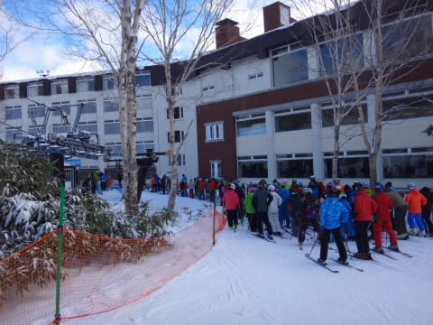

# 12月6日，日曜志賀高原詳細レポート…焼額は晴天！

📅 投稿日時: 2015-12-08 01:37:29

ということで．

昨日は速報モードでお伝えした，

日曜の志賀高原レポート．

本日は，詳細モードにてお送りします…

まず．

うっすら日が射す天気で始まった，日曜の朝は…

うむ．

それほど積雪は無かったようですね…

一晩での積雪は，1cm弱ってところでしょうか…（残念）．

んでも．

朝の気温は-9℃と，結構冷え込んだようで．

いざゲレンデへっ！

…って，なんじゃこりゃ．

朝イチリフトは，5分程度の待ちが…

今日も第4ロマンスと第2高速の2本のリフトの

運転なのですが．

今日は第2高速側のリフト券売り場＆駐車場を開けて

くれず，4ロマ側駐車場のみオープンだったので．

朝イチはこちらに集中したようで…

うーむ．

第2高速側の駐車場もオープンしてほしかった…

で．

リフトに乗って上に上がると．

ふむ！

…をを！

うはーーーっ！！

いや，新雪が積もってないわりに，

結構いいコンディションじゃないですかっ！？？

そして…

天気もすっきり晴れてきましたよっ！

…でも．

4ロマ側，サウスコースは雪はいいけど．

2高側，唐松コースは…

ふむ…

ふがーーーーっ！

固いよ…

そして，殺人兵器の氷のコロコロが大量に…（涙）．

なぜ．

4ロマ側はこんなに雪がいいのに…

…ってことで．

4ロマ側と2高側で，全く雪のコンディションが違うので．

4ロマ側は，時折リフト待ちが3分くらいになることも…

これは一番長くなった時の写真で，

大体平均1分待ち程度だったかな～．

それに比べて，殺人ジャガイモ畑状態の第2高速は…

こんな感じで，ほぼ待ち0でしたね．

コース上は時折人口密度が高くなることもあったけど…

でも，基本的には結構空いていて，

自分の好きなラインで滑りたい放題！

午後になると，柔らかかった4ロマ側も，

柔らかい雪が剥げて，固い下地が出てきたけど…

でも，基本的に結構すべりいい雪だったかな！

昼間は晴天で，気温は上がり気味とはいえ．

向かいの一の瀬は終日人工降雪機を打っているくらい

冷え込んでたし…

＃そろそろ下半分はいいから，上半分に雪をつけてほしい…

そして，午後になるといつも通りゴーストタウン化して．

誰もいないのですが…！

ゲレンデは，貸し切り状態ですね…

って感じで，夕方ごろには，さすがにコース全面，

結構固い下地がむき出しになってきたものの…

他のスキー場から比べれば，1km近い高速リフトも滑れて，

2コース滑ることができるという，恵まれたコンディションで．

結局，この日も16時のリフトストップまで，

たっぷり滑ったのでした…

うむ．満足だったぞよ…

しかし．

今週末．

どうやら，これより状況が悪化しそうな予感…（涙）．

ヘタすると，今週土曜，雨かも…

## 💬 コメント一覧

### 💬 コメント by (いか)
**タイトル**: Unknown
**投稿日**: 2015-12-08 11:57:24

やはり週末はどこもいいコンディションでしたね！八方もご多分にもれず日曜日はなんでもできるトップシーズンの雪でした(´▽｀)

が、パノラマは長い時で15分待ち、輸送用ゴンドラは動き出して45分経ってもまだあと15分は待ちという人の多さでした…わたしはゴンドラは先頭付近だったのでセーフでした…

今週末はオープンするところが少なそうなので、この状態が続きそうですね。

### 💬 コメント by (Goku)
**タイトル**: スキーバブル
**投稿日**: 2015-12-08 12:31:36

うわー!八方はまるでスキーバブル時代に戻ったようですね。

私は昔、栂池でゴンドラ2時間待ちというのを経験しました(T_T)

### 💬 コメント by (shino)
**タイトル**: はじめまして
**投稿日**: 2015-12-08 19:52:30

いつもブログ拝見しています。shinoといいます。土曜、焼額で初滑りしました。娘さん、ご一緒でしたか？６歳♂の息子と滑ってましたが、初滑りの一本目の間に２回追い越されました、多分(笑)

次回お目にかかれたら挨拶させてもらいます(*^^*)

### 💬 コメント by (Skier_S)
**タイトル**: この週末は…
**投稿日**: 2015-12-09 00:15:23

＞いかさま

八方も良かったみたいですね～！

しかし，ゴンドラ1時間待ちですか…

今の時代にはありえない待ち時間ですね（＾＾；

＞Gokuさま

私も，野沢で2時間半待ちってのが

あります…

ってか，昭和の時代には短いリフトでも30分待ち

とか平気でありましたよね…

＞shinoさま

はじめまして！！！

初コメントありがとうございます…

土曜，焼額にいらっしゃいましたか！

そうです．

この週末は，娘と一緒に爆走していました…

2回抜いちゃいましたか（笑）．

第2高速側ですか？

シーズンに何度も志賀高原にいらっしゃるのでしょうか…

また今度見かけたら，声をかけてみてください．

ただ，私はウェアや板が何種類かあるので，

毎回違う格好をしてたりしますので，

見つけにくいかと思いますが（＾＾

今後ともご愛読のほど，よろしくお願いします～！

### 💬 コメント by (shino)
**タイトル**: Unknown
**投稿日**: 2015-12-09 21:39:48

ここ数年はずっと志賀のシーズン券です。熊の湯が多くて、ヤケビはあまり行かないのですが。でも今年は熊もボード解禁になっちゃったので、熊に行く回数も減りそうです。。。

というわけで天気予報はいつも当てにしてます(*^^*)今後ともよろしくお願いしますm(._.)m

### 💬 コメント by (Skier_S)
**タイトル**: shinoさま
**投稿日**: 2015-12-09 22:59:42

あ，シーズン券ってことは…

かなりの頻度で志賀にいらっしゃるのですね．

またお会いした時はよろしくお願いします…

これからGWまで，毎週志賀の天気予想が続きます．

この週末も，大体当たったと思いますが…

今後も参考にしてやってください．

