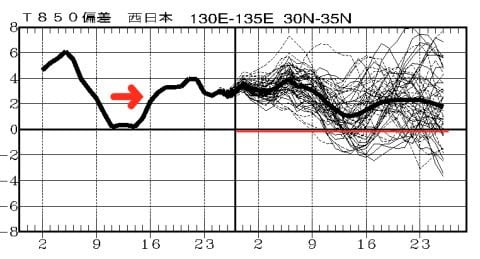

# 3月のスキー場は冷えるのか？？定番の一か月予想図を読み解いてみたけれども…ダメだ．なんだか，ダメな感じ（涙）

📅 投稿日時: 2019-03-01 02:04:54

🏷️ カテゴリ: [スキー天気予想](c6554f5c3c106093b511a8daae23757e8.md)

なんということか！！！

信じられないことに，もう2月も

終わっちゃいましたよっ！

まだ信じられませんが．

3月と言えば．

…トップシーズンも終わり．

もう，世間一般では春スキーと呼ばれる

時期に突入しつつあります…（涙）

…ってか．

今シーズン，トップシーズンって

ありましたっけ？

いや，1月は確かに，結構冷えた

気がするけど．

…でも，2月に入ってから一度も太い板を

出動させてないんですけど？？？

普通，一番冷えるはずの2月に．

一度もパウダーに当たらなかったとは，

どういうこと？？？

それどころか…

2月5日に雨が降って以降．

まともに積雪が無くて，

さらに18日にも雨が降り．

ゲレンデが硬い日が多かった

という．

とても志賀高原の2月らしくない

2月だった気が…（涙）

そして．

本日，28日の木曜日も．

焼額常駐（？）のH特派員によれば，

今日の焼額はほぼ私の予想通り．

あさイチは雪降りだったものの．

それ以降，

限りなく液体に近い微妙なものが降り続けたようで…

…夕方4時過ぎの段階で．

志賀高原の蓮池はプラス気温で，

雨だったようです…

（[北信建設事務所HP](http://hokushin-camera.org/)より）

なんだか．この2月．

雪が降るより，雨が降った方が

多かったのでは？？？（涙）

って感じで．

とても，志賀高原の2月と思えない

2月でした…（泣）

ということで．

早くも2月が終わってしまった

わけですが．

…果たして，この3月は．

2月と違って，冷え冷え最高の

3月になるのか？？？

あるいは…2月と同じような，

悲しい3月になるのか？

定番の一か月予想図読み解いて．

みなさまに神からのお告げを

下しましょう…←だんだん宗教化しているな

まずは，3月2日から8日までの1週間平均の

850hpa気温をみてみると…

…

…

…なんじゃ，こりゃ～！！！！！（涙）

水色で塗った，平年比+3℃の線が

志賀高原にかかってます…（泣）

これは…志賀高原では，

週間の平均気温が平年比+3℃という．

気象庁が異常高温として注意を

喚起するレベルの気温の高さ（泣）．

3月上旬なのに，赤く書いた850hpaの

0℃線がギリギリ志賀高原の南にいる

レベルって…

3月はじめではありえないレベル

ですね（泣）．

降れば雨になる確率が極めて高い

一週間です（絶望）．

いや．

その次の一週間．

3月9日から，15日までは冷えてくれる！！！

と．

9日から15日までの，850hpa気温予想をみてみると…

…

…

…ダメだ（あふれる涙）

この時期も，水色で描いた平年比+3℃の

線が，志賀高原にかかってます…

2週間連続で，平年比+3℃って．

いろいろ記録に残る水準の

高温かも…（止まらない涙）

赤く書いた0℃線も，引き続き

志賀高原のそばにとどまるので．

この時期も，降れば雨になる

危険性が高いよ…（泣）．

いやいやいや．

この2週間が高温でも．

それ以降はその反動で冷えるはずっ！

俺は信じてるよ！！

…3月16日から29日の2週間の

平均850hpa気温を見てみると…

…

…あう（屍）．

さすがに，引き続き平年比+3℃と

までは行かないものの．

水色で描いた，平年比+2℃の線と，

+1℃の線に志賀高原は挟まれているので．

…平年より1.5℃ほど高い気温に

なりますね…（泣）．

そして，赤い0℃線も志賀高原の北まで

上がっているように見えるので．

…雪が降る可能性が，だんだん

下がっていってます…（激烈な涙）．

ダメだ…

この3月，ダメだ…

850hpa気温推移を見てみると．

2月は，赤矢印で示した10日～15日くらいに

平年並みだった以外は．

ずっと平年より高い気温が続いていて．

気温が高かったことが読み取れます…

そして，3月は．

気温推移予想が，平年並みの赤線より

ずっと上にあり続けているので．

この3月は，平年より低い気温に

落ちることがほとんどなさそう

です…（激泣）．

これは，スキーヤー殺しだ（涙）．

白馬や新潟の標高の低いところは．

3月早々にヤバい状況になりそうな

天気図です…（泣）．

…いや．

でも．

まだわからない．

まだ，分からないのだっ！！

実は，気象庁のコンピューターが

狂っていて．冷え冷え3月になる

はずなのに，予想が全然ずれてるだけ

かもしれないし←その可能性は低いから

周りは平年比+3℃だけど，実は

志賀高原だけなぜか平年比-3℃になり，

毎日冷え冷えパウダーになる可能性も

否定しきれないし←いや，それは明らかに否定できるから

いきなり明日から氷河期がやってきて，

地球全体の平均気温が3℃落ちるかも

しれないし←ありえないから

日本国民がみんな休まず止まらず

飲まず食わず眠らずで，全身全霊を

込めて冷え冷え踊りを踊り続けることで，

神様が憐れんでスキー場の気温を

下げてくれるかもしれないし←全国民が休まず踊ったら，日本の全産業活動が停止するから

まだ，冷え冷えになる可能性が

ゼロとは言えないのだっ！！

とりあえず．

激しく情熱的な冷え冷え踊りを，

天気の神に．

スキーの神に．

そして，私のスキー板に，←だから，あなたのスキー板はご神体じゃないから

捧げ続けるのだ！！！

## 💬 コメント一覧

### 💬 コメント by (naoちゃんねる)
**タイトル**: Unknown
**投稿日**: 2019-03-01 09:06:11

昨日、地元の天気予報でアナウンサーが笑顔で「この先３月上旬、下旬はあたたかくなるでしょう♥️」と言っているのを聞いて殺意を覚えました。

でも、Sさんの自己突っ込み満載の記事は面白かったです(笑)

夏に貯めた有給を３月に絶賛解放中なのですが…

今年はシーズンインも雪が降らず微妙でしたので、２年前のように春スキーに期待してたのですが…何だかダメですねぇ…

### 💬 コメント by (若杉勲71)
**タイトル**: Unknown
**投稿日**: 2019-03-01 10:10:59

nao様のアナウンサーへの殺意、まさに同感です。今も桜開花予報が早まるニュースをやってますが、悲しくなります。きっと気象庁の発表ミスですよね。

50日以上もずっと滑り続けていたので、心に穴があいて廃人のように何もする気が起きません。あとはエスさんの希望的予報だけが心の支えになります。お願いしますよ。

個人情報なので実名は明かせませんが、プリンスホテルのプラチナ10（10泊券）を4セットも購入済みの某H多ご夫妻が、果たして券を使い切ることができるかが、今後の焦点になってきましたよ。私は使いきれないに一万両！

### 💬 コメント by (かずみ)
**タイトル**: Unknown
**投稿日**: 2019-03-01 18:31:45

3/1 18時現在軽く雪降ってますよ。

### 💬 コメント by (ホンダ)
**タイトル**: Unknown
**投稿日**: 2019-03-01 18:47:48

臨時の焼額特派員からの報告です？本日は昨日の液体の影響も全くなく極上のバーンでした。k夫妻とppを取らせていただきました。

gsもさらに極上です。奥志賀エキスパート、一ノ瀬パーフェクターもちょうどよい硬いバーンでした。天候は出だしは、雲が多かったですが、11時ごろからは青空が続きました。寺子屋では、キラキラの樹氷とブルースカイに歓迎され思わず、s様に変わり、久々に焼額ラストまで完走しました。夜になり雪が舞ってきました。素晴らしい明日を期待しましょう。ちなみに、40泊はなんとか這いつくばってクリア予定です。

### 💬 コメント by (musi)
**タイトル**: Unknown
**投稿日**: 2019-03-01 21:21:14

アナウンサーの配慮に欠けた笑顔への殺意。同意。

でも、今日はそんなに悪くなかったのですね。

羨ましいです、全力で。

明日は、子供の野球団の仕事で東京から離れられません。せめて、皆様に良いコンディションが訪れます様に

冷え冷え踊りでもしながら週末を迎えたいと思います。くそ〜。

### 💬 コメント by (地元民)
**タイトル**: Unknown
**投稿日**: 2019-03-01 21:30:22

ほんとに２月20日頃から異様に暖かくて(正解には２月10日～16日くらい以外)、里は朝でも氷点下にさえならない日が続いてます。

去年の３月も暖かかったけど、その比じゃないです。２月上旬の高温の時は、屋根から滝のように雪解け水が落ちてきて、１日20cmくらい融けたと思う。

４月の天候ですね。これは。

ということは、４月半ばで完全に消雪すりかも。白馬はただでさえ雪が少いので、下手すりゃあと１週間かも。行く人は、早めに行った方がいいかもしれないですね。下部はやばそう。

### 💬 コメント by (地元民)
**タイトル**: Unknown
**投稿日**: 2019-03-01 21:34:29

追伸、今年、冬型の降雪も少なかったですが、南岸低気圧の、いわゆる上雪が１回もありませんでした。これも異常だと思います。

### 💬 コメント by (Skier_S)
**タイトル**: 木曜の影響はそんなになかったんですね！
**投稿日**: 2019-03-01 22:28:27

＞naoちゃんねるさま

そうなんですよ…

私も「春らしい暖かい陽気に…」

と言われると，殺意を感じないまでも，かなり落ち込みます（涙）

あぁ…冷えてほしい…

＞若杉さま

今年は桜開花が早いだけじゃなく，花粉も多そうで，

かなり凹んでます…

ホントにこの3月の予想は外れてほしいです（切望）

しかし，某Hさん40泊使い切るとおっしゃってますが．

すごい．すごすぎる…

＞かずみさま

レポートありがとうございます～！

ほとんどつもらなかったんでしょうか．

やっぱり…

あぁ…明日までに1m位積もってくれないかな…←無理だから

＞ホンダさま

ええ！！

今日はゲレンデ良かったんですか…！！

硬かったり，ゴロゴロ出てたりしなかったんですね！

それは予想外…

だとすると，今週もよさそうですね．

…しかし，40泊，使い切るんですね…

凄すぎます．…

＞musiさま

今週末も用事で志賀高原に来れないのですか…

野球団の仕事頑張ってください．

冷え冷え踊り，よろしくお願いします～！

＞地元民さま

去年は3月から異常に気温が上がりましたが，

今年は2月からすでに気温が高かったですから…

これは，ヤバいです．

先週なんか，とても2月の雪と思えませんでしたから…

ここ4年で3回もGWが滑れないってことになると…

ホントに地球温暖化の影響で，今後もこういう気候が

続くんでしょうか．

それは避けたい．

まだ，志賀は今のところマシですけど．

白馬や中央道沿線は，もう結構ひどいみたいですから…（涙）

### 💬 コメント by (大阪のS)
**タイトル**: Unknown
**投稿日**: 2019-03-02 08:01:12

最近暖かいとは思っていましたが、３月もこの傾向が続くのですね。困ったものです。私の早割券ですが、あと野麦峠、ブランシュ、エコーバレー、白馬さのさかが各１枚、志賀高原が２枚残っており、３月の土日に使い切る予定ですが、私が行く時に雪が残ってるか怪しいですね。。。

### 💬 コメント by (Skier_S)
**タイトル**: 大阪のSさま
**投稿日**: 2019-03-02 23:46:19

いや…この予想が外れることを強く祈っているのですが…

とりあえず，標高の低いスキー場はそろそろやばいと

思うので．

早めに早割権を使い切ることをお勧めします…

