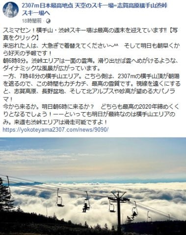
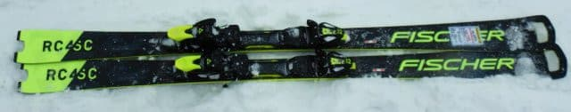
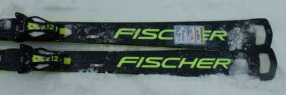
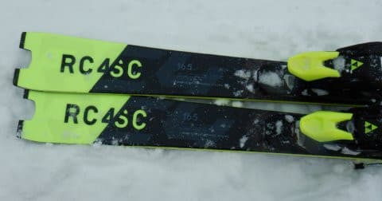
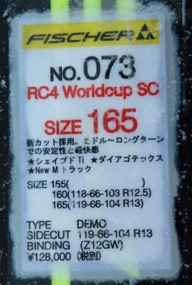
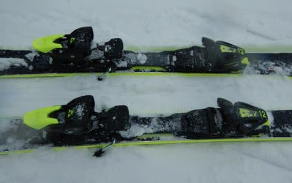
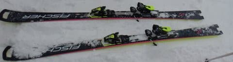

# 2021シーズンモデルのスキー板，試乗レポート…FISCHER RC4 WC SC　最終回と言ったな，あれは嘘だ．

📅 投稿日時: 2020-05-24 06:29:47

🏷️ カテゴリ: [スキー板試乗](c0bd8048615710cee890e403a36cc9a2b.md)

えー．

この週末の土曜日，

横手山は天気が良かったようですね…

そして，渋峠はまだ営業が続きますが，

この日曜が横手山の営業最終日．

（[横手山スキー場Facebook](https://www.facebook.com/yokoteyama2305/posts/2573734672726426?__tn__=-R)より）

日曜の今日も，天気は良さそうですが．

この時期，天気がいいと板が滑らないので．

曇り空の方がいいんじゃないかな～…

ってなことで．

前回のHEADの板の試乗レポートで，

「スキー試乗レポート　最終回」とか間違えて

書いた気がするのですが．

…実はまだ，3月上旬の志賀高原で試乗して，

レポートを書いてない板がいくつかあることに

気づいてしまいました…

というわけなので．

もう少し続く，2021シーズンモデルのスキー板の

試乗レポート．

今回から数回，フィッシャー編が続きます．

では，どうぞ～！

○FISCHER RC4 WC SC M-TRACK 165cm

基礎小回り用

以前，[FISCHER RC4 WC SC Pro](e144bf34ce6db0167c7e68677fbbaf901.md)に乗りましたが．

前回の「PRO」は，ガッチリしたプレート

（M/Oプレートと言うらしい…）と，

Z13Freeflexビンディングが着いたもので．

今回試乗したモデルは，プレートが優し目の

M-TRACKというやつになり，ビンディングも

優し目のZ12 GWに変更したモデルです…

板自体のサイドカーブなどは両者同じで，

ビンディング・プレートが異なります．

ちなみに，FISCHER RC4 WC SC PROの方は，

アクセントカラーがイエローの板だけじゃなく，

ピンク色バージョンも出るようです…

ってな感じで．

実際に履いてみたところ…

…いい感じでたわむ板ですね～．

谷回りに入ったすぐから，自然に板に

たわみが出て，たわみに沿って自動的に

板が回り始めます．

板を動かしたり，外板に圧を自分から

加えることなく，すっとたわんで

谷回りから斜面の上向きに遠心力を

もらっていける感じで，よく回ります！

力を入れなくても，板がよく切れて

よく回っていく気持ちよさがあります．

切り替えの時は，すっといい感じの返りが

来るけど，返りの強さ，早さはやはり

PROの方が強いので，スピードが上がって

いった時のターンの鋭さはPROの方が

上回る感じですかね…．

あと，トップとテールのグリップもPROよりは

優しく感じます．

逆に，グリップが優しい分，ずらしのコントロール性が

PROよりは楽です．

ずらしても回るし，切っても回る．

ずれ，切れを一つのターンの中でも自由に

混ぜながらコントロールして行けます．

ずらした際も，トップの抵抗がテールの抵抗より

大きめに受けるようになっているので，

ずらして行っても自然に旋回力が出ます．

ずらしても，切ってもよく回る！

…ただ，良く回りすぎるので，

コースの端から端まで使うような，

ターンを長めに引っ張る大回りには

ちょっと向かないかな～．

とはいえ，普通のゲレンデで滑るような

ロングっぽいターンまでは十分行けます．

板を抑える量で，自由にターン弧を楽に

変えられます．

試乗したのは，3月上旬の柔らかい新雪が

積もったコンディションだったんだけど．

新雪に近い柔らかい雪なら，PROより

こっちの方がコントロール性が高くて

楽かも…

PROにしろこれにしろ，FISCHERのSCは，

ポテンシャルが高い板だと思いました…

よっぽどガンガン高速に飛ばさないし，

柔らかい雪でのコントロール性も…

と考えたら，PROじゃなくこっちの方が

おススメです．

## 💬 コメント一覧

### 💬 コメント by (ゆーき)
**タイトル**: Unknown
**投稿日**: 2020-05-25 07:43:09

解除になるんで、次の日曜は、

渋峠にいけるんじゃないですかね！

### 💬 コメント by (Skier_S)
**タイトル**: ＞ゆーきさま
**投稿日**: 2020-05-25 23:27:06

もし，解除になったら県間移動が許されそうな感じなら

行ってみたいですが…

すごい混みそうですよね…やっぱり．

### 💬 コメント by (西館)
**タイトル**: Unknown
**投稿日**: 2020-05-26 06:10:32

書きたいことは数多あるのですが、先週末、実家に泊まったら喉が痛くなり、内蔵の状態も悪くなり、それに伴って背中が痛くなり。

まさかまさか((((;ﾟ;Д;ﾟ;))))ｶﾀｶﾀｶﾀｶﾀｶﾀｶﾀｶﾀ と慌てて葛根湯を飲んで床に入ったのですが、相棒くんがバルサンの毒にやられたのでは、と。

冷静に過去を振り返ると、そう言えば以前にも何回か有りましたこんなこと。

可愛い孫がくるからと気合を入れてバルサンを焚いたのですが、エアコンをビニールでくるまなかったので、冷風に乗せて私たちに毒を盛っていたのでした。

相棒くんは若いのであっという間に排出できましたが、お年頃の私は1日以上掛かってしまいました。

はよ書きたいこと書いてすっきりしたいわ。

そうそう、県越えは6月19日解禁見込みのようですね。筍は厳しいかもですが、蛍は行けそうです。

### 💬 コメント by (ゆーき)
**タイトル**: Unknown
**投稿日**: 2020-05-26 13:43:04

西館さん

逆流性食道炎ではないですか？

私もそうですが。

sさん

渋峠、クソ遅いですからね、、、

### 💬 コメント by (西館)
**タイトル**: Unknown
**投稿日**: 2020-05-26 16:12:39

>ゆーきさま、ありがとうございます。

胃が悪くなると背中が痛くなるんですよね(´･_･`)

じじばばは耐性ができているのか苦痛に慣れているのか平気そうなのが腹立たしいです。

タケ○ロン(胃潰瘍の薬)飲んでストレッチして、とにかく体力を快復させねば。

ゆーき様もお大事になさってくださいませ。元気に志賀高原へ通わねばなりません。

### 💬 コメント by (Skier_S)
**タイトル**: 緊急事態宣言，解除！
**投稿日**: 2020-05-27 07:02:59

＞西館さま

あら．バルサンにやられましたか…

身体には気を付けてください．

県境越えは，まだ明確な指針が出てないのですが，

首都圏からはもうしばらく移動自粛を求められるかも…

志賀高原のタケノコ狩りは，今年は一般客には開放しないようです（涙）

＞ゆーきさま

渋峠，クワッドリフトを復活させてほしかったです…

