# 2024年8月，5度目の子連れモアルボアル，コロナ後初の海外へ！その9…2本目はイワシの群れを5年ぶりに満喫！満足…！！

📅 投稿日時: 2024-10-19 01:52:48

🏷️ カテゴリ: [ダイビング日記](ce3a7a8d424d112fce83ee85c81a0e344.md)

ってなわけで．

イエティのオープン日が今から1週間後に

決まったわけですが…

そのニュースを追いかけるように，

アイスクラッシュを準備したスキー場，

最新のゲレンデ状況がいろいろSNSなんかで

公開されてますよ～！！

まずは11/1オープンの軽井沢．

これは，Yetiよりも本格的に雪づくりが進んでる

感じですね…！

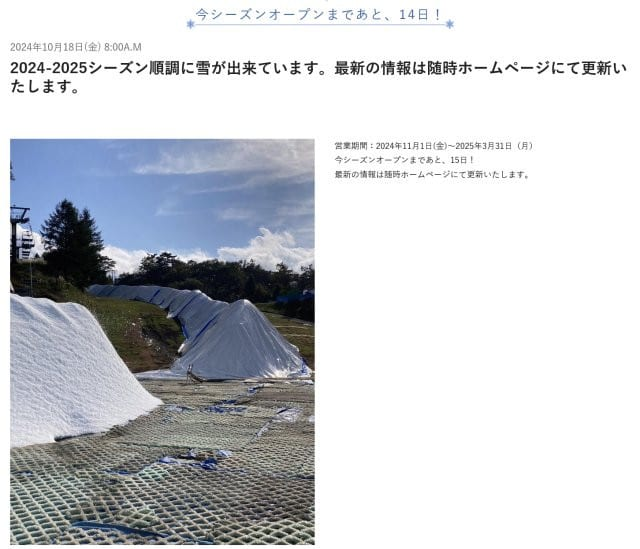

（[軽井沢プリンスホテルスキー場ホームページ](https://www.princehotels.co.jp/ski/karuizawa/winter/)より）

同じく11月1日オープンの狭山も，結構順調に

造雪できてるように見えますね～！

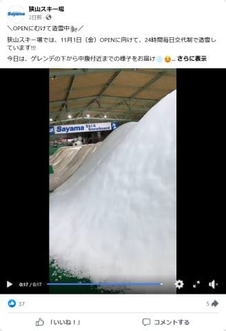

（[狭山スキー場Facebook](https://www.facebook.com/sayamaski/?locale=ja_JP)より）

さらに…昨年は造雪機の故障で泣いた菅平．

今年はまだ暑い中，かなり早い段階から雪を

作り続けていて，結構雪山ができてきている

みたいですが…

まだオープン日は未定．

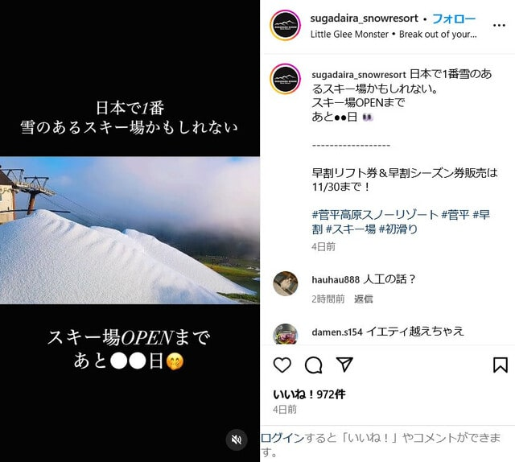

（[菅平高原スノーリゾート インスタグラム](https://www.instagram.com/reel/DBGUwUGydAv/?utm_source=ig_web_button_share_sheet&igsh=MDQwZDY1YmMyMg%3D%3D)より）

で．

今年から本格的にアイスクラッシュシステムを

稼働する奥伊吹も造雪開始してますね…！

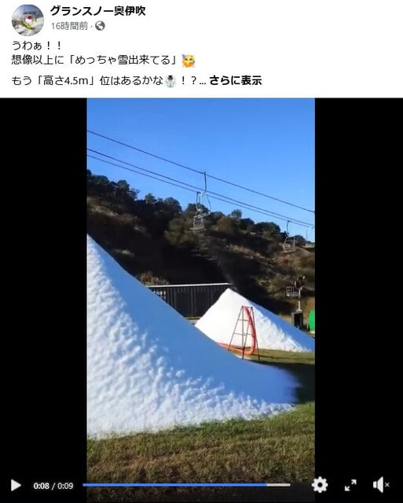

（[グランスノー奥伊吹Facebook](https://www.facebook.com/okuibuki/?locale=ja_JP)より）

…まだ都内は，明日の土曜の最高気温が30℃に

なりそうという，恐ろしい状態ですが．

こんな高温の中でも雪が作れるアイスクラッシュって，

やっぱりすごい…

しかし．

こんな感じで雪山を見ると（アイスクラッシュの

氷だけど），シーズンに向かってテンションが

上がってきますね～！！

と，これまで雪の写真を載せてきたというのに．

ここまでの流れをぶち破って，続きは夏の海の

写真です…

いつものモアルボアル旅行記へ，Go!

ーーー

（[前回はこちら](ee6506ef8241b7b5c8472bd9e536133f4.md)）

ということで，

コロナ期間中，もう一度見に行きたい…！

と強く願っていた，モアルボアルのイワシの群れに

無事再開して…

このイワシの群れ．遠景でもすごい見事

なんだけど…

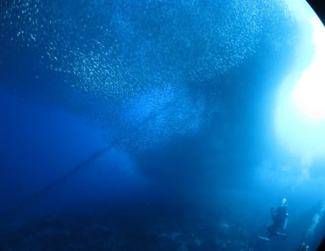

群れの中に突っ込んでいって，

向こうが見えないほどの魚の壁に囲まれて，

目の前で群れがドドドドっと動く様子とか．

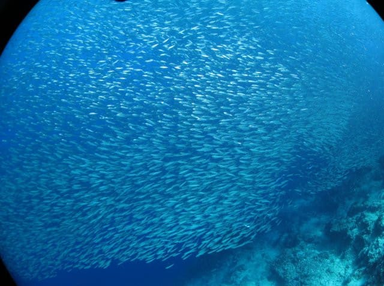

カスミアジかなにかのアジ系の魚にアタック

されて，それを避けるために群れが一瞬で

形を変える様子とか．

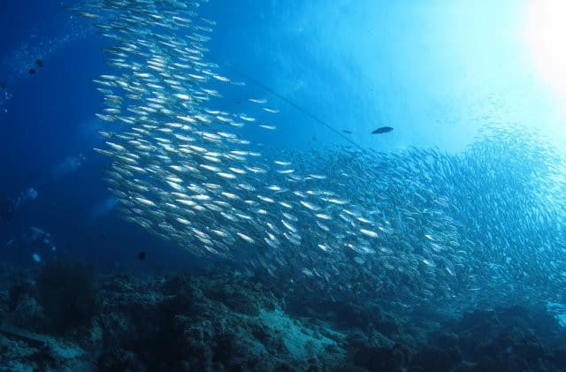

いや…

いつまで見ていても飽きない！！

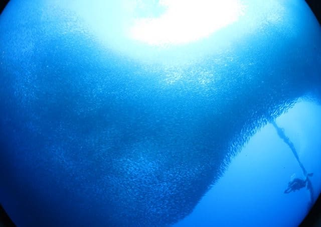

そして，このハウスリーフのドロップオフ．

実は，この目の前のイワシの群れだけじゃなく…

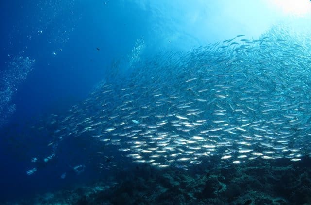

ドロップオフの壁にも，結構面白い

魚がいっぱいいて．

…イワシをしばらく見たら，ちょっと

口直し（？）に，こんなヤマブキハゼとか…

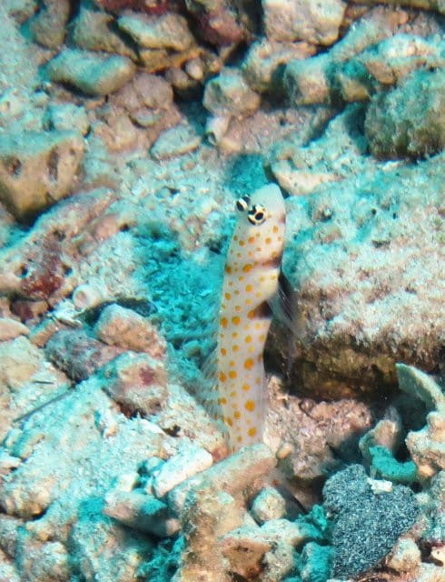

ハウスリーフでダイバー慣れしてるらしく，

ダイバーが近づいても逃げないどころか，

背びれ全開で「写真撮って」と言わんばかりに

アピールしてくれるニチリンダテハゼとかを

眺めて，

ちょっと気分転換をして…

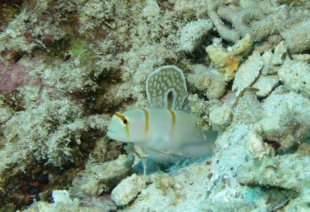

そして，ドロップオフから振り返ると，

また目の前にイワシの群れが広がっています…

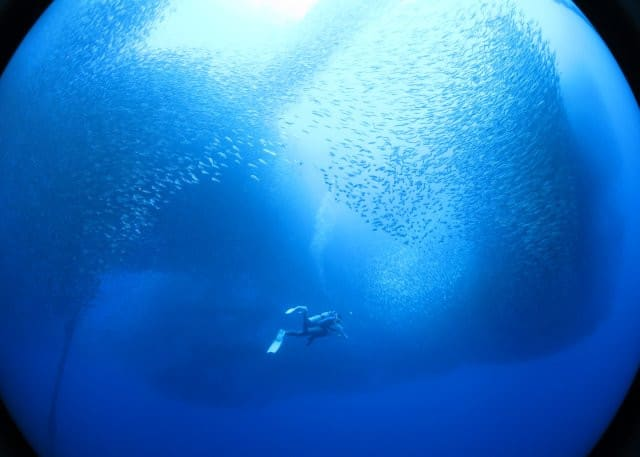

果てしなく，どこまで続くかわからないこの

群れも，このあたりで終わりなのか…

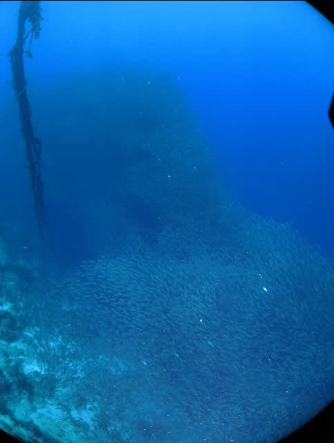

だんだん，群れの濃さが薄まってきました…

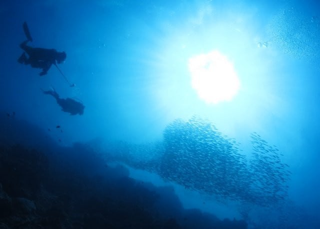

ってなところで，ちょうどショップの前に

戻ってきたようで．

停泊場所に戻って係留されているボートに

向かってリーフの上を泳いで行き…

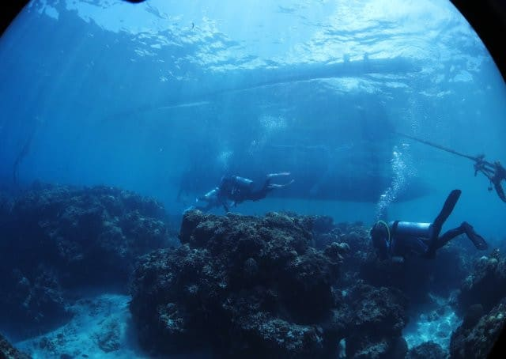

そして，ボート係留場所の，水深1mちょいの

所でボートに上がってエグジット！

ガイドさんが娘のBCからフィンから外しに

かかっています…

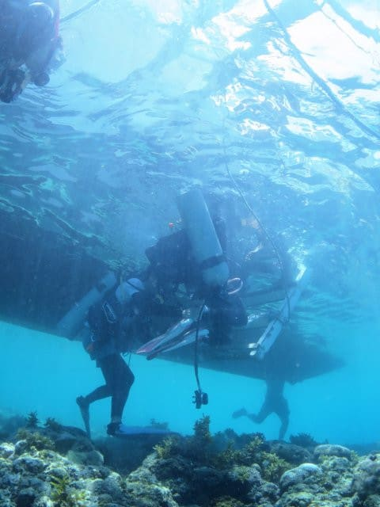

ってな感じで．

今日の午前の2本のダイビング，終了！！

いやーーーー．

ホントに大満足の2本だったよ！！！

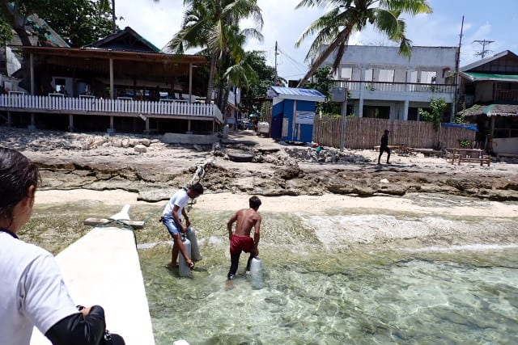

（[続く](e018c766db5b744d8599885e8d07a3bec.md)）

## 💬 コメント一覧

### 💬 コメント by (ひゃくりん)
**タイトル**: Unknown
**投稿日**: 2024-10-19 07:21:43

どうもお久しぶりでございます。

Skier_S//さんの記事を見て、

私もついにガーミンvenu3を買ってしまいました。

メインは睡眠状態の確認と歩行時の心拍数の確認です。

さて、焼額山スキー場のB1パノラマコース上部で、

移動用人工降雪機の給水・電源口の追加工事？みたいなことをやっていました。

焼額山スキー場の主であるSkier_S//さんならすでにご存じだったかもしれませんが、ブログに写真をのせてますので、余裕があればご確認をお願いいたします。

### 💬 コメント by (ひゃくりん)
**タイトル**: Unknown
**投稿日**: 2024-10-19 07:24:05

貼り付けたリンクを間違えた感じがするので、

再度、リンク先を修正して投稿させていただきます。

### 💬 コメント by (Skier_S)
**タイトル**: ＞ひゃくりんさま
**投稿日**: 2024-10-20 13:30:04

情報ありがとうございます～！

すでに焼額工事情報は話は聞いていましたが，詳細な写真は初めて見ました…

なかなかいい場所に人工降雪設備を設置していますね…

これで2ゴンオープンが早くなると嬉しいですね！

この情報，また私のブログネタに使わせてください…！

そして，Garmin購入されましたか！

Garminさんののあり無しで，山歩きの便利さが変わります！

心拍数を見ながら歩くようになると，休憩なしで歩ける心拍で歩けば，

1時間でも2時間でも休憩なく歩けるようになり，登山ペースがつかみやすくなります…

### 💬 コメント by (ひゃくりん)
**タイトル**: Unknown
**投稿日**: 2024-10-20 18:03:27

さすがSkier_S さん、すでに焼額山工事情報をご存じだったんですね。さすがです。

ぜひ、ブログのネタに使ってくださいというか、

使っていただき、ありがとうございます。

中の人によると、

送水につかうハイドラントはGとPの2系統あるらしく、下から上へ急斜を押し上げるのは限界があるみたいです。

既存の送水能力の高そうな1ゴン側上部まで水を上げてから、

2ゴン上部側に給水していくパターンもあるのかなと勝手に妄想しております。

ガーミンは、やっと必要な部分は使いこなせた感じがします。

山登りで心拍数が確認できるのはとても便利ですね！

スノーボードモードもあるみたいなので、

シーズイン予定日まで残り1週間、楽しみにしております。

### 💬 コメント by (Skier_S)
**タイトル**: ＞ひゃくりんさま
**投稿日**: 2024-10-21 01:58:01

記事にさせていただきました～！ありがとうございます！

焼額の人工降雪はオリンピックコースとGSコース側，そしてサウスと唐松側の2系統

あるんだろうなぁ…と，なんとなく思ってましたが…

どちらもさすがにゴンドラ山頂から標高が100mほど下がったところまでしか水を引いておらず，

山頂までもっていくには，もう1段階ポンプが要るんじゃないか…

とか考えていたんですが．

うーん．どうなんでしょう…

Venuのスキー（スノーボード）モードは，Fenixとほぼ変わらないと思うので，

滑走標高差やら滑走本数，1本ごとの滑走時間に最高・平均速度，滑走距離などがわかるので，結構面白いですよ！

