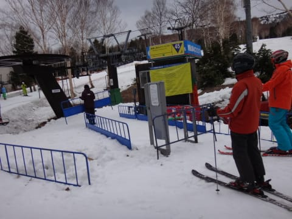
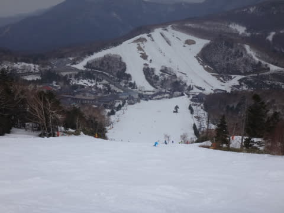

# GW4連休も3日目，5月5日の志賀は…曇り～小雨．ひどい降りにならなかったのが救いだが…

📅 投稿日時: 2014-05-05 21:24:50

🏷️ カテゴリ: [2014スキー滑走日記](c992167609b6415052179ee69ea1ea7d8.md)

えー．

本日．

かなりのショックを受けているSkier_Sです．

何があったかというと．

昨日の午後3時ごろに故障した，焼額第2ゴンドラ．

なんと．

連休中で修理部品が手に入らず．

修理不能なため，[今シーズンの営業はもう
不可能](http://blog.princehotels.co.jp/yakebi/2014/05/post_1245.html)ということで…

残り2日間，ゴンドラは動かないことになってしまいました(涙)

って感じで．

きわめて悲しい状況のため．

早朝営業でゴンドラは動かず…

今朝は，第4ロマンスでの早朝営業となりました．

雪はシマシマで…

結構硬く締まっていて，

天気は曇りで，日も射さないので，

8時の一般営業まで緩まず．

雪もたっぷりあって，悪くないんだけど．

…ゆるいし遅いペアリフトじゃなぁ…(涙)

せめて早朝，第2高速を動かしてくれれば…（懇願）．

でも，午前9時ごろには，結構雪が緩み始めてきて…

で．

朝のうちから広がっていた雲の中から．

怪しげな雲が近づいてきて…

午前中から時折，ぽつ，ぽつと．

気づくか気づかないか…って位の雨が降ったり

止んだりしてました．

まぁ，ほとんど気にならないレベルの雨でしたけどね～．

しかし．

今年．

雪の量はたっぷりですね～

いつもはもう雪がない，一の瀬の林間コースも

まだまだコースいっぱい雪があるし．

一の瀬正面バーンも，まだぜんぜん土が出てくる

気配はなく．下半分も，コース全面OK!

ぽつぽつとときおり降っている雨のおかげか，雪はそこそこ

滑る雪でしたね～．

そして．

午後はヤケビに戻りましたが．

焼額も，まだぜんぜんコース幅いっぱい

OKです！

…ゴンドラが終わって，滑れなくなったコースに

まだこんなに雪があるのが恨めしい…

うーん．

来週まで，営業して欲しいな！

…と，思っていたところ．

…来ちゃいましたよ．

来なくていいものが．

昼過ぎに，雨が降りそうです…(涙)．

それも，一瞬，強く降るタイミングもあるかも…

と，昨日から予告していた，午後の雨が．

2時前から30分ほど，ぱらぱらという感じで

降り続け．

かなりの熟成を重ねて，抜群の吸湿性を

誇るようになった私のウェアは，見事に

吸水性を発揮しています(涙）

…うーん．

ゴンドラが動かず，雨も降ってきて…

踏んだりけったり(涙)．

誰だ～！

日ごろの行いが悪いのは！←だ・か・ら，それは自分でしょ

とりあえず．

この間は．

プリンス西館で無料の豚汁やデザートのサービスがあったので

一休みして…

3時前には雨が止んだので，再び出動！

雨が降ったせいで，人も少なく雪も荒れず．

さらに雨のおかげで，雪も良く滑って．

今日もリフトストップまで，この時期としては

結構いい感じのコンディションで過ごせたのでした…

明日は4連休最終日．

天気は曇り．時々晴れ間もあるかも．

最終日はガラガラだろうな～．

## 💬 コメント一覧

### 💬 コメント by (れお)
**タイトル**: 今日の雨
**投稿日**: 2014-05-05 21:52:29

高天ヶ原では、ほんとポツポツでした。

Sさんをはじめとするスキーヤーの祈りが、かろうじて通じたと思ってました～(笑)

今、志賀では、結構な雨が降ってるんですが、奇跡で雪になったりしないですかね～。

2ゴン運休涙もんですね…。

明日は、志賀シーズン最終日、思い残すことなく滑りましょう～。

### 💬 コメント by (いか)
**タイトル**: Unknown
**投稿日**: 2014-05-05 22:59:02

本日もおつかれさまでございます。

私は、今日の八方をもってシーズン終了でした。

Tシャツで滑っていたバカは私だけでした、笑（寒くて、1時間でカッパ装着）

こちらは午前中から雨がパラパラ、コブは滑りがよくなりました。それでも、朝イチはある程度締まって、気持ちよく飛ばしておりました。最後に写真も撮ってもらえて満足！

明日は晴れるみたいなので、楽しんでくださいませ！

### 💬 コメント by (komu)
**タイトル**: 一足先に
**投稿日**: 2014-05-06 01:36:04

鹿沢も小雨でした

志賀高原と比べるのは酷ですが雪と土の混合物の上を滑っているようなコンディションで、自分の板では滑りたくないなぁと思うほど…

明日はしっかりワックスして次回に備えます。

上信越道は軽井沢IC手前の工事車線規制で混みますので道中気を付けてお帰り下さい。

### 💬 コメント by (Skier_S)
**タイトル**: 帰ってきました…
**投稿日**: 2014-05-07 01:21:08

＞れおさま

最終日も，満喫してきましたよ～．

でも，昨日の高天ヶ原は

そんなに降らなかったんですね…

でも本来．今日はどしゃ降りになっても

不思議じゃないところ．

全体的に小雨で済んだのは．

やっぱり，私の祈りでしょうか…（＾＾；

＞いかさま

ええ？昨日は雨ですよね…

で，Tシャツ？？

うーむ．信じられない．

八方は混んでませんでした？

ゲレンデレポート見る限りはガラガラに

見えますね～．

また，来シーズンまでスキーはお預けですか．

私はまだまだシーズンが続きますよ～

＞komuさま

あら．鹿沢はやっぱり雪が悪かったですか…

この時期は，志賀に限りますよ～！

帰宅は草津越えでしたので，極めて順調に

帰れました…

来週からは，かぐら通いです！

