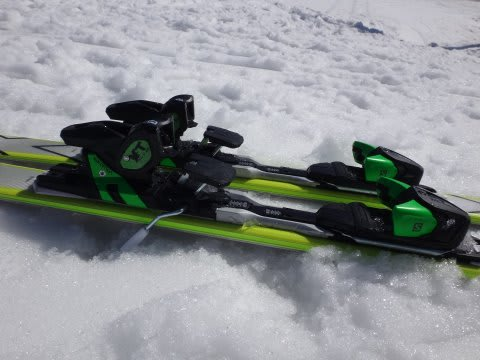

# 復活！2016シーズンモデル，スキー試乗レポート第16回…SALOMON編その3

📅 投稿日時: 2015-05-15 02:21:02

えー．

どうやら，土曜の雨は．

比較的朝の早いうちにやんでくれそうな感じになってきた

今日この頃．

皆様いかがお過ごしでしょうか．

ってことで．

4月25日以降，先週末まで．

16日間で，11日間滑る

というシアワセなGW期間を過ごしていたため．

ひたすらスキー場のレポートが続いてしまい，しばらく中断状態だった，

来シーズンモデルのスキー試乗インプレッション．

お待たせしました．

…待っていた人がいるはずですので．

繰り返します．

お待たせしました．

…念のため，もう一度．

お待たせしました．

＃待っていた人，いたはずだよね…と，信じたい

ということで．

スキー試乗レポート，復活です．

本日は，[以前も試乗した](eabca5734679be4feffb36a035767a0dc.md)サロモンのX-MAX.

前回履いたのは160cmと，私にとってはちと短すぎる板で，

正当な評価ができなかった感じだったので，

今回は170cmに試乗してみました…

では，試乗インプレッションをどうぞ～！

○SALOMON X-MAX 170cm

基礎オールラウンド．

160cmとかなり印象が変わりますね～！！

160cmは，かなり軽い板で短めというのもあり，

軽快過ぎて，ちょっとキョロキョロする印象もありましたが…

170cmは，安定感がぐっと増します．

とりあえず，170cmと長くなっても，軽いです．

持っても軽いし，履いても軽い！！

ウッドコアらしいけど．

ウッドコアで，こんなに軽くなるのか？というほどの軽さ．

このビンディング＆プレートが軽いのかな～？？

で．滑ってみたところ．

傾いただけで楽にスーッと曲がっていきます．

板を抑えに行ったり，トップに荷重する必要は一切なし．

傾くだけで楽にターンが始まります．

荷重ポイントはテール気味．

やはり，トップが浮くような感じで回っていきます．

軽いので，まさに春のザブザブ雪の上を

トップが浮かぶように滑っていく感じです…．

力を全くかけなくても，傾くだけでロング～ミドルくらいの

ターンをしていくし，

スピードを出していっても，そこそこの張りの強さと

結構しっかりしたエッジグリップで耐えてくれます．

今シーズンまでのX-Kartのように，ショートターン

スペシャルでクルクル回ってしまうこともないです．

でも．テールをグリップさせれば，しっかりグリップで，

たわみにのって比較的小さい半径でも回っていけます．

意外と高速安定性もあるし，

板が軽いので，コブなんかでも板を動かしやすいし，

いろんな小技も使えますね～．

楽な板ってのは，スピード耐性が低かったりするけど…

この板は，結構なエッジグリップ力とスピード耐性があるのに楽っていう，

体力を使いたくない人の，究極のオールラウンド板かも…

## 💬 コメント一覧

### 💬 コメント by (すぎぃ)
**タイトル**: 待ってましたよ
**投稿日**: 2015-05-15 21:08:57

試乗レポートお疲れさまです。

なんと早期予約することに決めた

X-MAXじゃないですか

わかりやすい説明見事です。

サロモンは９シーズンぶりの

購入になります。

希望サイズはＲ１５で１６５㎝なのですが

Ｒ１５は１７０㎝なのでラディウス又は

長さのどちらを優先するか迷っていましたが

１６５cmは日本では販売しない情報入手。

どうりでどの試乗レポを見ても１回も登場して

来なかったことからも、うなづけますが

真実は不明です。

### 💬 コメント by (Skier_S)
**タイトル**: すぎぃさま
**投稿日**: 2015-05-15 21:33:31

お待たせしました（笑）．

X-MAX，160cmと170cmではかなり印象が違いました…

で，2枚目の写真のサイズバリエーション表には，

ちゃんと165cmがあるんですが…

発売されないんですかね～？？？？

でも．

170cmで大丈夫．

軽快に滑れます．

コブでも170cmで全然大丈夫です．

普通の165cmより軽快に振り回せます．

で，165cmより安定感が感じられるので，

170cmがベストな長さかな～，

と思いました…

ショートターンがメインで，ショートターンばっかり

やりたい…ってのでなければ，170cmがベストチョイスです！！！

いい板ですので，楽しんでくださいね！

