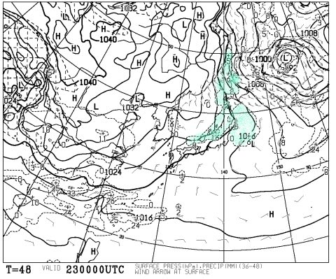
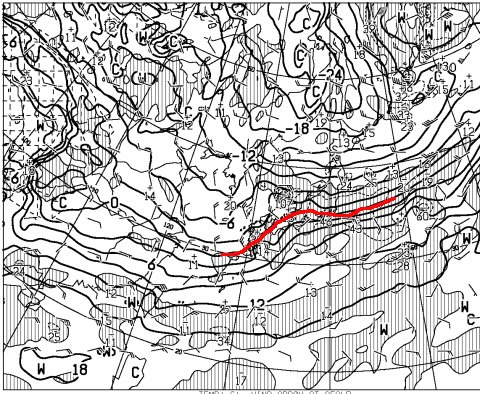

# 11月23日祭日の天気は？そして，雪が積もるのか？今週末までのスキー場の積雪やいかに？

📅 投稿日時: 2016-11-22 02:15:19

なんだか．

ここ数日の高温のおかげで．

スキー場の雪がみるみる減っていってますね（泣）．

今から約2週間前，こんなだったかぐらも…

今日はこんな感じ…（涙）

…この時期に，これほど雪が減るって…

どういうこと？？？

…と．

悲しみを禁じ得ない今日この頃．

皆様いかがお過ごしでしょうか．

ということで．

明後日，23日の水曜は…

そう，祝日です！

休みです！

2014年の11月23日，アサマ2000はこんな感じだったのですが…

今年もこんな恵まれた祭日になるのか？←ならないことはわかっていて，あえて言ってみる

これからドサドサ奇跡の積雪があり，

シアワセな一日を過ごせる祭日になるのか？←絶対にそんなことは起きないことが分かっているけど，あえて書いてみる

いざ，天気図を見てみるのだ！

22日，火曜夜9時の850hpa気温図は…

…

…

…

（涙）

ダメです．

雪の目安の0℃線は信州まで下がっておらず．

志賀高原近辺には，+3℃線が通っているくらいなので．

22日は夜まで終日気温が高く．

もしかすると，雨もぱらつくかも…

そして，23日．

祭日当日は…

ををっ！！

0℃線が…太平洋に近いところまで下がっているっ！！

23日は冷えるよっ！

23日，朝9時の地上天気図を見ると…

降水量が予想される，水色で塗った領域．

日本海側に掛かっているので．

朝は，日本海側は雪が降りそう！

…だけど．雪は短時間で止みそうで．

天然雪はそんなに積もらなさそう…

でも．

23日は終日冷えるので．

一日中ガンガン人工雪を打てるのだっ！！

＃でも，23日に人工雪が打てても．

＃23日にオープンできないから，一日遅い…（涙）．

で．

祭日の翌日，24日の850hpa気温図を見ると…

うむ．この日も，0℃線は太平洋側に近いところまで

下がってます！

それどころか．

500hpa気温図を見ると…

ををっ！！

大雪の目安，30℃線が…

今シーズン初めて，日本の近くまで下がってきてます！！

…ただ．

まだ信州に掛かってないので．

それほどドサドサとした雪にはならない感じ．

そして，地上天気図は…

南岸低気圧だなぁ…

だもんで．

志賀高原に降る雪も，風で飛ばされるような

乾いた雪でなく，湿った雪になりそうですね．

シーズン初めの下地には，いい雪かも…

で．

続く金曜，25日．

この日も，850hpaの0℃線は信州より南．

天気は晴れそうで，全く降雪は期待できないけど…

…でも．

水，木，金と．3日続けて冷え込んでくれるので．

天然雪でゲレンデオープンできるほどの

たっぷりの降雪にはならないとはいえ．

そこそこの天然雪と．

冷え込みでガンガン人工降雪を打てるので．

26，27日の週末は期待できるか！？？

…26，27日は…

…

…

…

…

なんじゃ，こりゃぁ（屍）．

せっかく，金曜まで冷え込むというのに．

土曜，26日は，850hpaの0℃線は青森近辺．

そして，27日も0℃線は北海道の北まで上がり．

27日は，強烈な南風が吹きそう…

地上天気図を見てみると…

…

…

…うぎゃーーーーっ！！！

ダメだ．

このままじゃ，ダメだ．

現在の予想では．

27日に，降水を示す網掛けが…

日本全国を覆ってます（涙）．

この気温で降れば…スキー場でも，雨．

絶対に，雨．

27日，強烈な南風＆暖かい雨で．

激烈に雪が融けます…（涙）．

ダメだ，この週末…（泣）．

うーむ．

まだ，27日の予想は変化する可能性が大きいですが…

…80％予想範囲（矢印で示した，27日のばらつき範囲のうちの太線部分）で

平年比+4℃から8℃高い範囲に入ることが予想されていて．

うーーむ．

この週末，冷え冷えになる期待は

持たない方がいいのかな…（涙）．

とりあえず．

まとめると．

22日（火）

気温は上がり，曇り．

かぐら・白馬方面は時折雨がぱらつくかも？

終日人工降雪機の稼働は期待できず．

積雪積み増し全く無し（むしろ融ける（泣））

23日（祭）

かぐらや志賀は，前夜降り始めた雨が，深夜に雪になり．

朝にかけて積もる！…けど，朝には雪は止む．

でも，終日冷えるので，昼間もガンガン人工雪が打てる．

Yetiは…曇り時折晴れ間も．運が悪いと霧雨が降ったり

する可能性もあり

…という感じでしょうか．

週末の詳細予想はまた後日やりますが．

うーむ．

27日が雨にならないことを祈るばかり…
