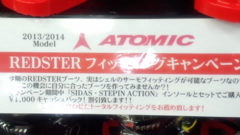

# スキーヤーの物欲を刺激する街，神田に来て，Skier_Sは何も買わずにいられるのか？…第2回

📅 投稿日時: 2014-03-28 01:07:57

🏷️ カテゴリ: [スキー雑談](c1f9d2cb7478308da16419928ea3945e9.md)

えー．

スキー板の試乗レポート早くやらんかい！

…って声が聞こえてきそうですが．

先日，神田に行ってしまったので．

そう．あのネタ．

第2回目開催です…

第1回（[その1](ebea1e9e359cc665d9cc2929e08045177.md)，[その2](e9a16d9757c2d52b7254fe8a802071c63.md)）を見てない人は，そちらを読んでおくことをおすすめ．

----

アナウンサー「えー．本日は，第2回 スキーヤーの物欲を刺激する街

神田に来て，物欲にまみれたスキーヤーが買い物をせずに

我慢できるか選手権をお送りします．

本日も，解説は板尾買蔵さんにお越しいただきました」

解説「…まさか，この選手権．第2回があろうとは…」

アナウンサー「今回も，参加選手はSkier_S選手です」

解説「…またですか．この人は．

　懲りませんね～…

　なんでまた，この危険な街にやってきたんですかね？」

アナウンサー「今回は，都内に出張に出たついでに，

　神田に…ということでやってきたようです．」

解説「…相変わらず，命知らずですね…」

アナウンサー「仕事が終わったのが遅く，時間ももう夜7時半だし，

　スキー店の営業も残り30分しかなく，何も買う時間はないだろう…

　ということで，何も買わない，見るだけだ…と，

　強く心に誓ってやってきたとのことです．」

解説「強く心に誓おうが，この街にやってきている時点で．

　すでに何かの勝負に負けてるんですけど…．

　…っていうかですね．そんな風に誓っても，この勝負．

　Skier_Sが負けるのはわかってるんですよ．もう．」

アナウンサー「え？」

解説「もう，Skier_Sの負けは決まってますから」

アナウンサー「と，言いますと？」

解説「物欲大魔王のSkier_Sが，神田に来て何も買わないで

　我慢できるわけがないじゃないですか．

　それに，すでに，ほとんどの読者は気づいてるんですよ．

　先週の志賀高原レポートの雪質チェックの写真でですね．

　何かが変わってるってことに…

　読者にそこまでの観察力がないとでも？」

アナウンサー「…」

解説「なので，負けは決まってます．ええ，負けるに決まってるんですよ．

　Skier_Sが，勝てるわけがないじゃないですか．」

アナウンサー「…」

解説「…ということで，この勝負．

　負けるにしても，何ラウンド目…つまり，何店舗目まで

　『強い意志』とやらがもつのか．

　そこを見るのが，この勝負のたった唯一の見所ですね」

アナウンサー「…では，7時半からの残り30分．

　Skier_Sは何件目まで，何も買わずに耐えられるのか？

　まず，1ラウンド目は…ICI神田コンペカンからのようです」

解説「神保町の駅から一番近いですからね」

アナウンサー「まずは1店目に入りました．最初はブーツから

　見に行ってますね～」

解説「Skier_Sは足の形がおかしくて，熱成型ができる

　ブーツじゃないと手間がかかりすぎて履けないらしいんですね．

　で，[来シーズンはATOMICのブーツが熱成型になる](http://compe104.snow2.net/?p=2020)という話で，

　来シーズンモデルの熱成型が可能になるATOMICブーツを

　狙っているということなんですが」

アナウンサー「なるほど～．まだ来シーズンモデルは出ていないので，

　まぁ，今シーズンはまだ様子見ということですね．」

解説「あれ？なんだかいきなり，様子が変ですよ？」

アナウンサー「…何か，店内の掲示に驚いている様子ですね」

解説「ATOMICブーツ，今シーズンモデルも熱成型可能だったんですか…

　おっと．Skier_S．即座に店員を呼びましたよ」

アナウンサー「Skier_S選手，店員に確認しています．確認しています．

　…店員曰く，ATOMICは公表していないけど，今シーズンモデルから

　熱成型が可能になっている…と説明しています」

解説「…Skier_S，ブーツを手に取って…5秒ほど考えましたが…

　…あ，あ，あ～．

　店員さんに成型をお願いしちゃいましたよ～っ！」

アナウンサー「え，あ，あーっ！

　なんと～っ！

　なんということか！！

　Skier_S．

　1店舗目，それもわずか入店3分という驚きの速さで，

　物欲に完敗しました～っ！！！

　強い意志がいとも簡単に崩れ去りました～！

　それも．

　それも板に次ぐ大物，ブーツに行ってしまうとは～っ！！！！」

解説「こ…これは…私の想定をはるかに超える意志の弱さですね…

　まさか，ここまで意志が弱いとは…」

アナウンサー「ということで．1ラウンド3分にして，想定外のブーツ

　購入という，予想を大きく超えるSkier_Sの大敗という結果で終わった

　第2回 スキーヤーの物欲を刺激する街

　神田に来て，物欲にまみれたスキーヤーが

　買い物をせずに我慢できるか選手権，

　これにてお別れです．

　さようなら～」

解説「…あ，あの，先週のレポートで写っていた，新しいグローブは…？」

アナウンサー「あ，あれですか．シーズンイン前に，もう買っていたようですよ…」

ということで．

ホントは熱成型の来シーズンモデルを買うつもりだったのに．

全く計画外に．

買ってしまいました…

このブーツのインプレッションは，また後日…

## 💬 コメント一覧

### 💬 コメント by (komu)
**タイトル**: ここにもいます
**投稿日**: 2014-03-28 07:45:28

先週、仕事抜け出し神田に行って鳥マークの黄色いブーツを買ってしまった終息人間がここにもいます。今週はアサマで試乗会ですが絶対予約なんかしないですよ。

今シーズンまだまだ滑りますよ～

### 💬 コメント by (ひろりん)
**タイトル**: Unknown
**投稿日**: 2014-03-28 17:02:17

ぶはｗｗ

神田が遠くてよかったです（違）

熱成型ってシェル出しですよね？

私も日本製のブーツでシェル出しとシダス他などをしてるんですが、

足のサイズ25弱（小さい・・・身長は177cm）なのに

お店の人、4シェル（24～24.5)で作成してくれました。

5シェルで作るより4シェルで作ったほうがいいとかで。

バックルが開放してても気付かないくらいフィットしています。

確かに良くて快適なんですが、ソールサイズが283cm！

女の子ですね、完全にｗ

試乗会で金具調整時に「は？」って良く聞かれます。

### 💬 コメント by (Skier_S)
**タイトル**: 物欲に負けた…
**投稿日**: 2014-03-28 22:36:02

>komuさま

をを！

先週神田でブーツ購入って…

全く同じパターンですね．

終わってますね（笑）．

絶対予約なんてしない，という固い決心も，

はたして持つかな～（笑）．

私も今シーズンはまだまだ滑りますので．

また志賀高原でお会いしましょう～

>ひろりんさま

そうです．

熱を加えて，ブーツ履いてシェルを成型

するタイプのやつです．

ATOMICは，メモリーフィットって呼ぶようですが…

私は足の幅でブーツを合わせると27以上，

長さで合わせると25.5という不思議な足なので，

幅を広げられないと足首とかががばがばの

ブーツを履くことになるんです．

でも，身長１７７ｃｍでブーツサイズ24ですか．

これはかなりの小顔…ならぬ，小足ですね．

### 💬 コメント by (ひろりん)
**タイトル**: Unknown
**投稿日**: 2014-03-28 23:25:09

ああ、サーモインナーのシェル版みたいな感じですか。

自分のは、自分の木の足型をブーツに入れて加熱成型なので、

成型時に熱い思いをしないからちょっと違いますね（汗）

宿とかにある、ブーツ乾燥機に載せたまま朝を迎えると形が変わってたりして（まさかｗ）

しかし、凄い足の形だ（＠＠

### 💬 コメント by (いか)
**タイトル**: Unknown
**投稿日**: 2014-03-29 18:42:36

やはり物欲の街はよくないですね。

かくいう私も、先日、今年のSXをシーズン終わりのこの時期に…(笑)

昨日今日と履きましたが、トップスピードに入っても全く違和感なく、谷回りからとんでもない傾きができますね(^O^)／

### 💬 コメント by (Skier_S)
**タイトル**: 物欲の街は危険です…
**投稿日**: 2014-03-30 02:17:49

＞ひろりんさま

そうですね．

サーモインナーのシェル版でしょうか…．

SALOMONやFISCHERなどが対応してて，

私がこれまで履いていたSALOMONの

X3-RCも熱成型でした…

＞いかさま

いや．

神田．

危険すぎますよ．あの街は…

しかし．

買っちゃいましたか，SX…

いい板でしょ．

ATOMICブーツとの組み合わせで，さらに

共謀になります（笑）．

### 💬 コメント by (miu)
**タイトル**: Unknown
**投稿日**: 2016-01-25 21:03:19

初めまして！

Blog拝見させて貰っております。

今回、この日記を参考にさせて貰いました！!

私も13-14モデルです。

温めて部分的にシェル出しを数回やって

みましたが苦痛緩和他、良くはなりましたが

満足していませんでした。

（1日ブーツ履いていられない）

この日記を見て、ダメ元で自分で

サーモフィッティングをやってみました！

（自己責任です）

良かったです！！

滑っている時の痛さが無いです！

しかし、バックル外して歩く時の土踏まずの

痛さは変わっていなかったですがね…

SHOPではないのでパッド貼りなんて出来ない

から、次は靴下2枚履きでトライしたいと思います。

情報提供、ありがとうございました！

### 💬 コメント by (Skier_S)
**タイトル**: miuさま
**投稿日**: 2016-01-26 01:03:24

初コメント，ありがとうございます！

ようこそ，わが駄文置き場へ…

おぉ！

まさか，自分でサーモフィッティングやっちゃうとは…

さすがの私もそこまで考えたことはなかったです（笑）．

このBlogが役だったようで，良かったです～．

熱成型の際，ホームセンターで安いウレタン板

みたいなものを買ってきて，テーピングテープで

張り付けると安く上がるかも…

私はブーツボリューム調整に，

ホームセンターでカーペット買ってきて

使ったりしてますし．

http://blog.goo.ne.jp/tsakamot2001/e/44589e80c529cb933f9dd83722343d1e

ホームセンターは，スクレイパーがわりに

使えるアクリル板とか，安くていろいろ

使えるものが見つかりますよ！

