# 12月30日の志賀高原のコンディションは…今日も晴天っ！！

📅 投稿日時: 2013-12-30 21:57:04

🏷️ カテゴリ: [2014スキー滑走日記](c992167609b6415052179ee69ea1ea7d8.md)

ってことで．

志賀高原滞在2日目です～．

本日も…

朝から超晴天！

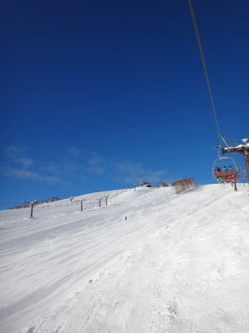

そして…

今日も，ゲレンデはシマシマっ！

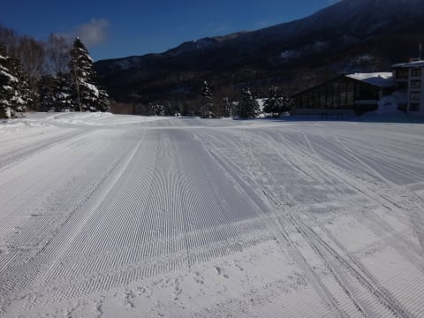

昨日はふかふかのやわらかい圧雪だったけど…

今日は新しい積雪がなく．

さらに気温もマイナス8度とそこそこ冷え込んだので…．

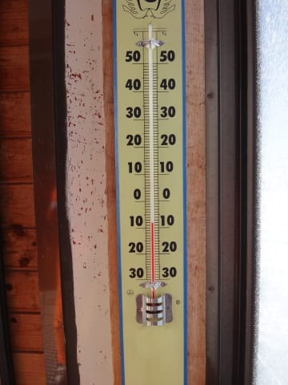

ゲレンデは，昨日より締まり気味の，冷え冷え超快感大回りバーンっ！

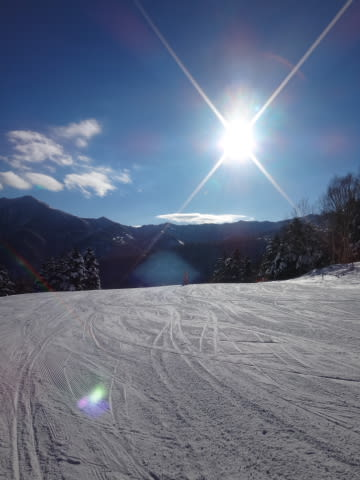

こーゆーコンディションでは当然，大回り板・Volkl Platinum CD 出動だっ！

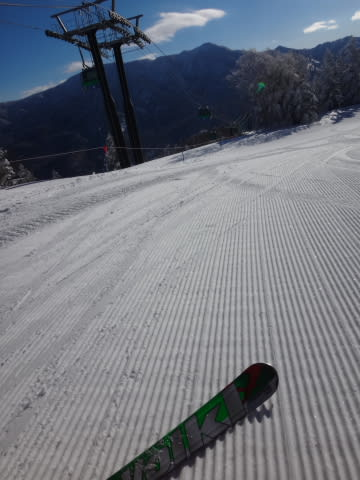

大回り板の性能を思いっきり使えるうひょひょひょバーンです．

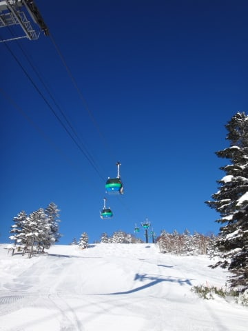

…しかし．

しかし，だ．

さすが年末年始休み．

10時近くになると…

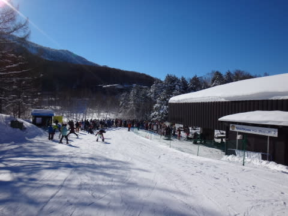

うむ．第2高速リフトがすごい待ちになってますな…．

そして，第1ゴンドラが5分待ちを超えて，駅舎の外まで長い列が…(涙)

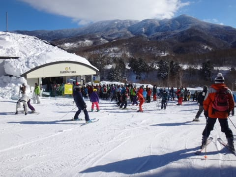

ゲレンデも，朝9時を過ぎたあたりから人口密度が高め(悲)

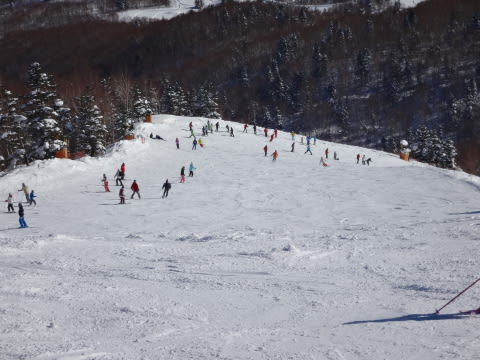

そして．

人が多い日の定番として．

午後はちょっとゲレンデが荒れ気味に…

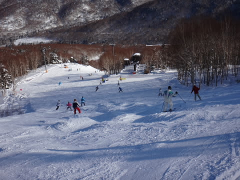

ちょっと快適度が落ちてきたかな～．

でも．

快適度が落ちてきた午後は，

滑る人が減るのか．

ゲレンデ上の人も減り，リフト待ちもなくなり．

12時前からは，リフト待ちは完全に0，

第1ゴンドラの待ち時間も1-2分程度と，

ほとんどなくなったのが救いですね～．

で．

ちょっとゲレンデは荒れてきたというものの．

今日も，午後まで一日中ずっと天気がよく．

気温も冷えひえで雪質もよく．

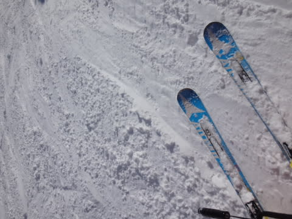

やっぱり，スキーは晴天の下でやるものだな！

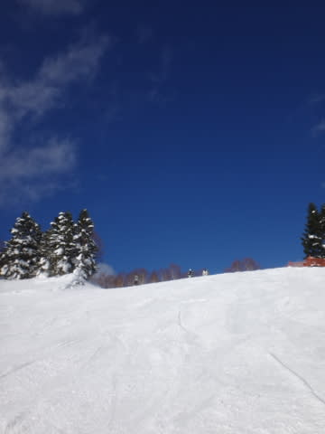

と．

ナイター照明がつくまで滑り続けたのでした…

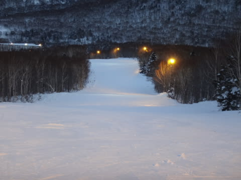

年末年始休みも中盤に入り．

ゲレンデは混雑してきましたね～．

志賀高原ののぼりの道路も混んでるみたいです．

でも．

午前中の多少の混雑＆ゴンドラ待ちを除けば．

気温が冷えているのに，天気がよく，雪もたっぷりと．

ここ2日間の状況は，きわめて良いなっ！

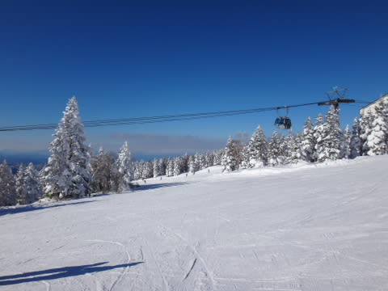

PS,そういえば，焼額のHPには営業終了が16:00ってなってて

悲しんだけど，実際はリフトは16:30以降まで営業してくれてて

感激…今日は16:45まで高速リフトが営業してましたよっ！

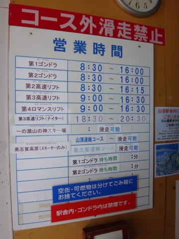

## 💬 コメント一覧

### 💬 コメント by (Goku)
**タイトル**: Unknown
**投稿日**: 2013-12-30 23:08:44

今日もお会いできましたね～！

私はあの後ジャイアントまで遠征に。

思いのほか西館山ＦＩＳコースがイイ感じでしたよ。

そうそう、早めに上がると言いつつ、結局３時近くまで滑ってしまいました。

明日からも楽しんでくださいね！

### 💬 コメント by (Skier_S)
**タイトル**: Gokuさま
**投稿日**: 2013-12-31 21:11:46

やっぱり夕方まで滑ってらっしゃいましたか(笑)

西舘，良かったですか…

私は今日は珍しく寺子屋まで遠征しましたよ～．

2年ぶりかな～．

＃焼額でシーズン50日以上滑ってるのに…

今年もお世話になりました～．

2014年もよろしくお願いします～

