# 4月19日の志賀高原は…4月下旬の晴天としてはGoodな一日！

📅 投稿日時: 2014-04-19 23:54:08

あー．

本日は．

天気予想通り．

雲は多めだったけど，晴れで．

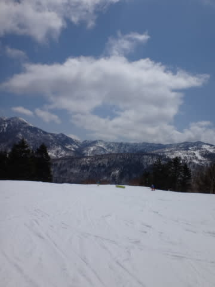

気温は低めで，4月下旬の晴れというのに

雪がドボドボにならず．

結構いい感じのコンディションでしたね～．

朝の気温は0度をちょっと上回ったものの…

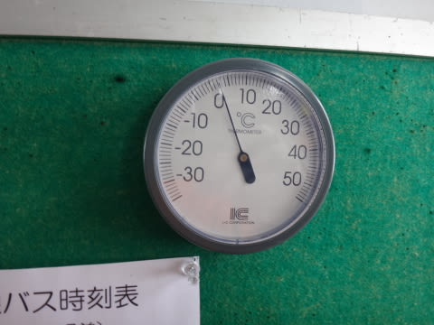

昨日の雨が固まった，結構固めのバーンでスタート．

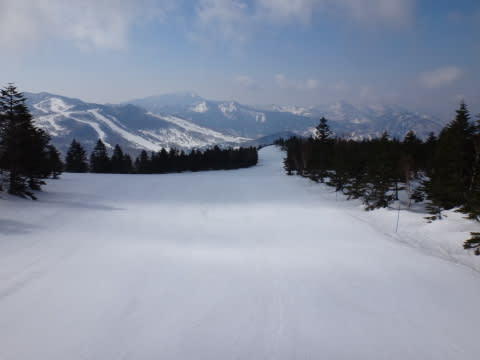

固めだけど，しっかりフラットなバーンで．

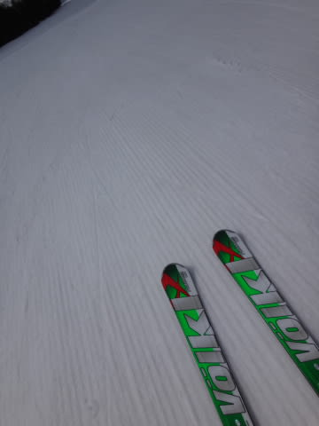

朝のうちは．

かなーり快適な大回りバーンっ！！！

午前中は晴れたり…

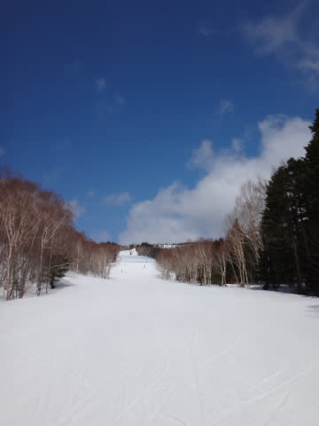

曇ったりで．

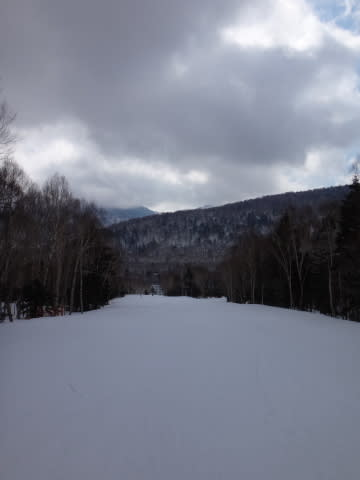

ずーっと日が射し続けたわけではないので，

日射で雪がそんなに解けず．

さらに人はがらがらで．

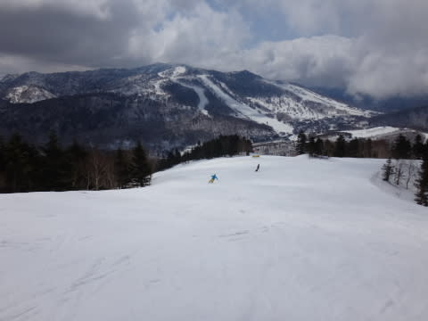

驚くことに．

この時期の12時近くまで，大回り板を履いて

滑れるフラットバーン！

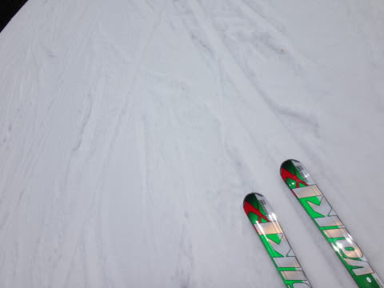

いやー．

午前中は，結構良かった！！！

さすがに昼ごろには，日差しで雪は

緩み始めたものの…

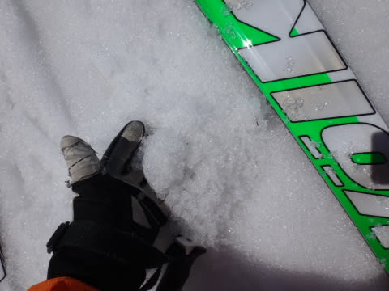

でも，ザラメって程度で．

板に張り付いてしまう雪ではなく．

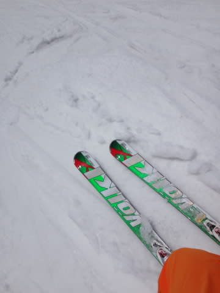

これなら，3月下旬程度の雪質では？？

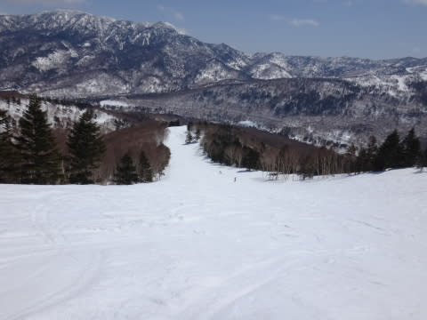

昼ごろには完全晴天になったので…

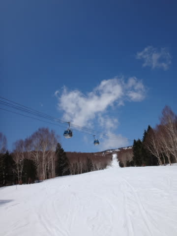

ちょっと雪はやわらかくなって，荒れてきたけど．

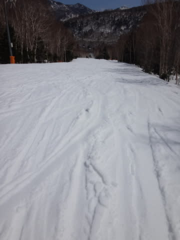

でも，人が少ないので，そんなにひどい

凸凹にはならず．

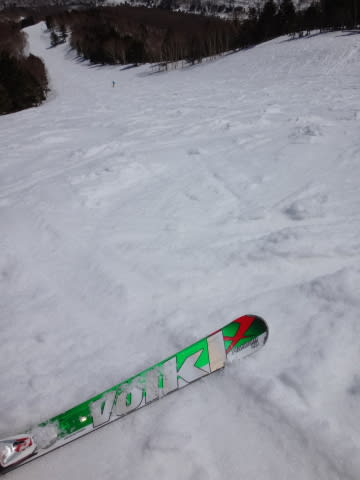

夕方になっても，人が全く滑っていないので，

そんなにひどくは雪が荒れず．

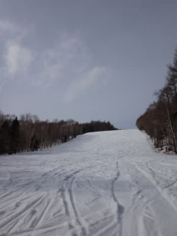

うむ．

これは．

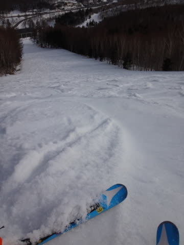

荒れてはいるけど．

4月の夕方としては，かなり恵まれているのでは？？

この時期の晴れで，水が浮いたり，汚れが浮いたり，

板が張り付いたり…ってことが，全くない雪ってのは．

それだけで，十分恵まれているのでは？？

…って感じで．

夕方のリフトストップまで，晴天の中，

滑り続けたのでした…

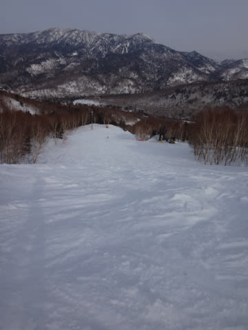

どーでも良いけど，GW直前のこの週末．

ホントにゲレンデに人がいなくて．

寂しいほどですよ～！

## 💬 コメント一覧

### 💬 コメント by (Sora)
**タイトル**: きのう土曜日は
**投稿日**: 2014-04-20 10:01:01

私は、八ヶ岳麓・サンメドウズで滑っていましたが、お天気はよく似たものですね。昼過ぎから、もっと晴れてきて。

雪質は、さすがに志賀高原の方がいいですが。くずれようが、とにかく真っ白のまま残っているのがいい。

しかし、人は来ないですね。GWでも、人が増えるということはないんじゃないですか？GWには行ったことがないのですが。

### 💬 コメント by (Skier_S)
**タイトル**: Soraさま
**投稿日**: 2014-04-20 18:24:39

今日も志賀は真っ白でしたよ～

志賀でもこの時期まで真っ白

なのは珍しいです！

志賀はGWは結構込むんです…

この時期コンディションが良く、

まともに滑れるかず少ないスキ一場

なので…

