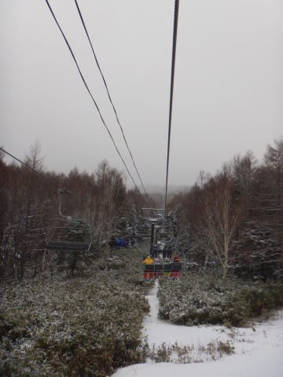
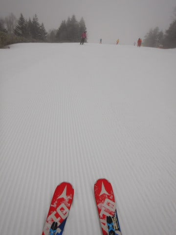
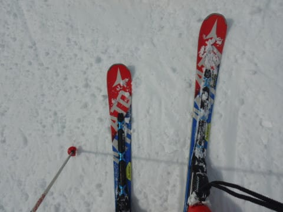
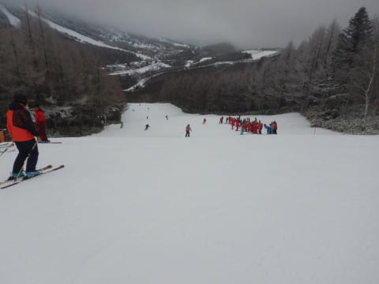
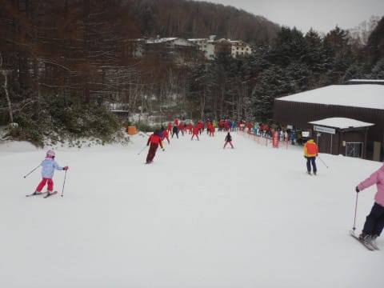
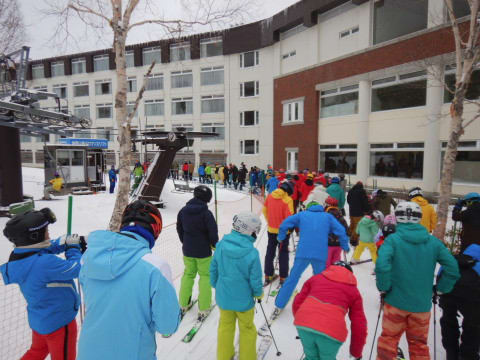
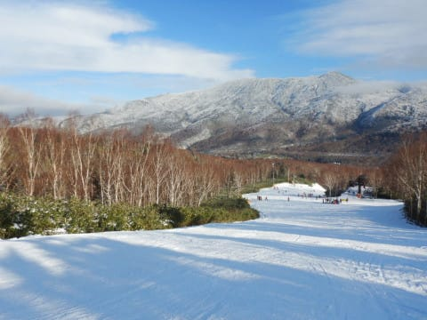
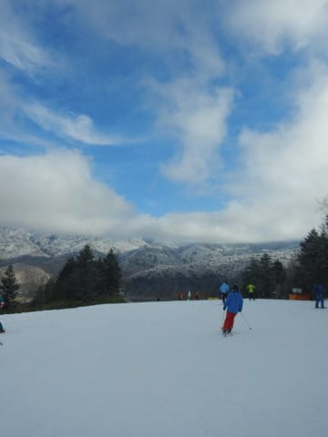
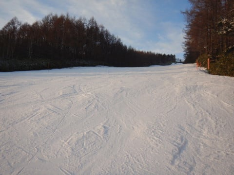
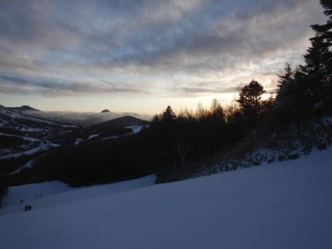

# 2019/12/15(日)の志賀高原，焼額山スキー場速報レポート！…朝の積雪は思ったより少な目（涙）．ゲレンデ状況ほぼ変わらず．午前は混んでたけど午後は空いたよ！

📅 投稿日時: 2019-12-16 07:08:27

🏷️ カテゴリ: [2020スキー滑走日記](c282e9230de179e245c7334eabeb0a3b3.md)

えー．

日曜の志賀高原の速報レポート！

まず．

土曜の夜から雪が降って．

「これは，日曜朝までにかなり積もるか…？？」

と期待したけど．

日曜朝までの積雪は10cm程度．

土曜深夜に止んでしまい，

朝はほとんど積雪が無かった

ようで．

あさイチのシマシマは，天然雪の

柔らかさは無く，人工雪の硬めの

シマシマ（ちょい涙）

シマシマは楽しいけど…

人工降雪の硬めのバーンなので．

数本滑ると，殺人コロコロが

コース全面を覆いだしてきました（涙）

やっぱり，天然雪の柔らかいシマシマを

滑りたかった…（泣）

本日の焼額は，3某都道府県連の

指導員研修会が実施されていて．

300人ほどの団体さんが来ていたので，

リフトもこの団体さんと重なると

ちょっと混むタイミングもあり．

特に輸送力のないペアリフト側は，

こんな待ち時間になったりしたけど．

この団体さんの研修会は午前中で

終わったので，午後になると

コースは結構空いてきました…

そして．

午前中は曇り空だったけど．

昼過ぎからは，予想した通り

青空が広がってきましたよ！

夕方近くになると．

コースは所々，人工雪が磨かれた

硬い斜面になってきたものの．

人がほとんどいなくなり．

いつも通り，日が暮れかける

16時のリフトストップまで，

たっぷり滑ってきたのでした…

てな感じの焼額でしたが．

また明日，詳細レポートやります～！

## 💬 コメント一覧

### 💬 コメント by (大阪のS)
**タイトル**: Unknown
**投稿日**: 2019-12-17 00:01:57

日帰り志賀高原を目論みましたが、前日までの疲れもあり、片道７時間の志賀高原は断念。片道５時間の開田高原マイアの日帰りで妥協してしまいました。ヤケビも良い感じとお見受けしましたが、マイアもコース１本ながらゲレンデコンディションは上々で、距離も2km弱あり、お天気も良く、この時期としては極上だったと思います。

結局志賀高原は成人の日の3連休までお預けです(年末年始は妙高6連チャン！)。またその時は探しますね！

### 💬 コメント by (Skier_S)
**タイトル**: ＞大阪のSさま
**投稿日**: 2019-12-17 01:15:13

あら．

やはり志賀高原日帰りは厳しかったですか…

焼額も良かったですが，リフトがせいぜい2本なので

ちょっと寂しい感じです．

1月3連休に志賀にお越しになるのですね．

その時にお会いしましょう！

