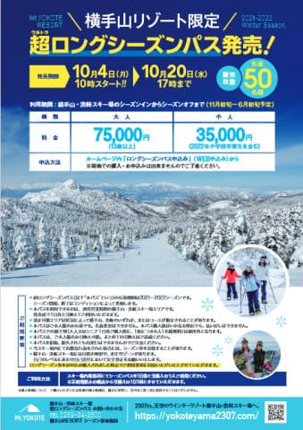
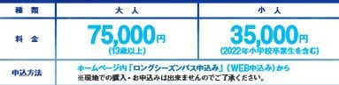

# なぬ？横手山限定シーズン券？それも11月から6月まで利用可能？？

📅 投稿日時: 2021-10-04 00:18:30

🏷️ カテゴリ: [スキー雑談](c1f9d2cb7478308da16419928ea3945e9.md)

えー．

志賀高原の全山共通シーズン券が，

[今シーズンより利用期間が短くなり
悲しくなった](e0e7ac88985b198a5e204a35a1a1389d8.md)と，お知らせしたばかり

ですが．

今度は11月6日オープンを狙っている

志賀高原の横手山スキー場が，

「横手山限定シーズン券」

を出すようです！

（[横手山ホームページ](https://yokoteyama2307.com/wp/wp-content/uploads/2021/10/seasonpass_2021_22.pdf)より，以下同）

いや…

昨シーズンまでなかった，横手山限定の

シーズン券を出すのもニュースですが．

さらに超ロングシーズンが売りの横手山．

11月オープンから6月の終了まで利用可能

というところがすごい…！

ホントに11月6日からオープンして，

6月第1週の週末，6月5日まで使えれば…

ほぼ7か月使えるシーズン券

ですよ！！！

すごい…

でも．

お値段は，全山共通シーズン券の77000円と

遜色がない，75000円！！

ちと高いです…

まぁ，

全山共通券より使える期間が

2か月長い

ってのを考えないといけませんが．

でも，高い…

そして．

このリフト券．

50枚限定

のようです…！

これ，50枚を巡る，激しい争いになるのか．

あるいはそれほど売れずに，ゆっくり買っても

余裕で買えるのか…

よく分かりませんが．

とりあえず，おそらく日本で一番長い期間

使えるスキー場のシーズン券であることは

間違いないです．

しかし．

全山共通券が使えない，11月限定券とか

5，6月限定券を出せば，もっと売れる

気がするんだけどなぁ…

## 💬 コメント一覧

### 💬 コメント by (かず)
**タイトル**: Unknown
**投稿日**: 2021-10-04 13:16:25

ヤケオクか志賀野沢か検討中です 雪雲が志賀まで来なくて野沢大雪って結構ありそうな地形なんですか？

### 💬 コメント by (Skier_S)
**タイトル**: ＞かずさま
**投稿日**: 2021-10-05 00:50:54

野沢と志賀だと，西風が強くて志賀は降らない時でも，野沢なら降ってる時があります…

やはり日本海にわずかでも近い分，野沢の方が志賀より積雪量は多いですから．

### 💬 コメント by (ikkun)
**タイトル**: Unknown
**投稿日**: 2021-10-06 10:49:15

高いですね(・・;) アカカンは年を重ねると25000円ってありますので？志賀高原って高いですの……規模が違うねと云われたら(笑)

### 💬 コメント by (Skier_S)
**タイトル**: ＞ikkunさま
**投稿日**: 2021-10-07 01:19:49

25000円は安い…！

### 💬 コメント by (ikkun)
**タイトル**: Unknown
**投稿日**: 2021-10-09 19:36:23

ちなみに8人揃えば22000円なはずですので(笑)

### 💬 コメント by (ozuriski)
**タイトル**: 不人気？
**投稿日**: 2021-10-09 21:47:13

横手山のシーズン券、まだ買えるようですね。

買う人は発売と同時に飛びつきそうだから、こうなると10/20までの販売期間中に売り切れるのかどうか…。

「50枚限定」は少なすぎないかと思ったけど、見込みは正しかったのかも。

ちなみに、10/1発売開始の「ニセコ全山1日券3枚セット」限定早割（通常8200円*3のところ5200*3+カード代500円の大幅割引）は、333セットが10/5の朝には売り切れてました。

ホームページでの告知しかしてないだろうにえらい人気。またヤフオクやメルカリで転売されるのかな。

### 💬 コメント by (Skier_S)
**タイトル**: ＞ozuriskiさま
**投稿日**: 2021-10-10 01:25:34

さすがに横手限定券に75000円の大枚をはたく人が

そんなにいなかったようですね…

せめて，横手・熊共通シーズン券だったらもう少し人気が出た気がするのですが…

### 💬 コメント by (Skier_S)
**タイトル**: ＞ikkunさま
**投稿日**: 2021-10-10 01:26:18

え？8人揃うと22000円？

団体割引か何かですか…？

### 💬 コメント by (ikkun)
**タイトル**: Unknown
**投稿日**: 2021-10-10 11:08:15

おはよーございます❗はい🎵昨年からスノーナビという会社の扱いになったような?10月末までならば22000円だとか？私しは仲間に入れませんでした😢

### 💬 コメント by (Skier_S)
**タイトル**: ＞ikkunさま
**投稿日**: 2021-10-12 01:25:38

22000円は安いですね…！

志賀高原だと，4~5日分のリフト券しか買えないです（涙）

