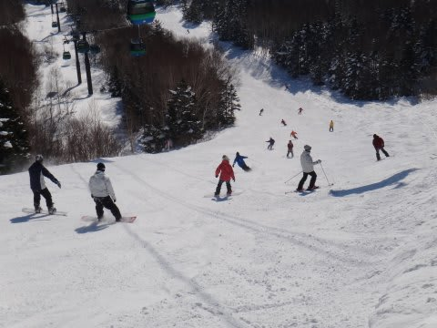

# 1月13日，3連休中日の志賀高原は…激混み(涙)

📅 投稿日時: 2013-01-13 23:21:37

🏷️ カテゴリ: [2013スキー滑走日記](c91dbe557f9a69230b1600e48622fdd61.md)

今日も志賀高原なわけですが．

なんと．

私の日ごろの行いがよかったからか．

2日連続の晴天でした！！

朝からすっきりドピーカンの晴天ですっ！

そしてシマシマバーン，最高っ！

朝は気温はそこそこ冷え込んだので，しっかり締まった固めの圧雪．

かなりスピードを出せる気持ちよいバーンで…

うひょひょひょひょ！

って感じの，快感バーン！！！

昼間はマイナス3度程度まで気温が上がり，ここ数日

なかった暖かさですが，雪は融けるほどではなく．

…でも．

しばらく晴れて，積雪がないと，下のアイスバーンが出てくるんですね～．

朝のきれいな圧雪が削れてくると，急斜面では結構下地の固いのが

出てくるようになりました．

うーん．

全面つるつるってわけではないけど．

ところどころ硬いので，丸いエッジでは厳しいだろうバーンコンディション．

んで．

今日は3連休中日とあって．

ゲレンデの人口密度も高く…

そして，焼額第2ゴンドラは30分待ち，第1ゴンドラが15分待ち(泣）．

ものすごい列でした…

焼額ゴンドラ，8人乗りになってからこんなに混むのは初めてじゃなかろうか？？

さらに，今日はリフトも待ち時間が発生する始末…

まぁ，天気のいい3連休中日だし．

仕方ないか…

と，一の瀬へ脱出．

こっちは，意外にリフト待ちほぼ0．

下半分は，修学旅行の団体さんが多かったけど．

あー．

一の瀬メインバーン，結構固い下地が出てきてます．

うーん．

やっぱり12月30日の雨が効いてるなぁ…（涙)

もう一降り欲しいところ…．

で．

夕方になると．

緩斜面以外は，大体アイスバーンとコブが入り乱れた，難しいコンディションに…(涙)

うーん．

やっぱり，もう一降り欲しい！

でも．

圧雪したてのナイターは気持ちよかったですよ．

あー．

明日は終日雪のようですが…

南岸低気圧の雪なので，重いし，そんなに積もらないだろうなぁ．

とりあえず．

明日も焼額をすべり倒している予定です．
