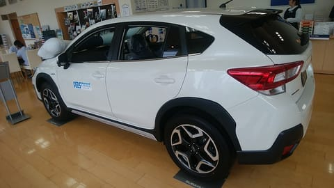
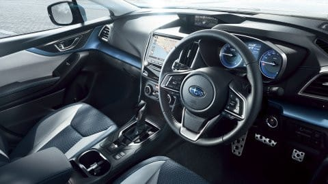

# スバルXV e-Boxerに試乗してみた

📅 投稿日時: 2019-07-23 01:38:02

🏷️ カテゴリ: [車試乗](c07dec5709d34bd74e1f6cb9c8291061b.md)

ってなわけで．

しばらく前に，LEVORGの1年点検で

スバルディーラーに行ってきたわけですが．

点検の待ち時間の間に，ちょいと試乗を

してきたので，そのレポートをば…

今回乗ったのは，XVのハイブリッド車，

e-Boxerです！

なぜかインプレッサには設定されず，

XVのみに設定されている，ハイブリッド仕様．

この車，税込み280万越えと，

かなりいいお値段の車ですね…

…内装を見てみると．

パネルとシート地以外は，インプレッサと

全く共通の内装ですが…

パネルにブルーメタリックが効いていて，

インプレッサとは違った印象を受けます．

好き嫌いがあるかもしれませんが，

私は嫌いじゃないです…

（[SUBARUホームページ](https://www.subaru.jp/xv/xv/special/photo.html)より引用）

とりあえず，走り出すと…

スタートから一瞬モーターで走り出しますが，

その後すぐにエンジンが始動して，

その後はエンジン回転数がググッと上がって

エンジンで引っ張っていく感じ．

モーターアシスト感が，ちと弱いかな…？

その後も，定常走行ではエンジンがほぼ

かかりっぱなしで，減速に入った時に

のみ，エンジンが停止する感じ．

エンジン停止・再始動の振動は，

かすかに感じる程度です．

で．

加速時，アクセルを踏み込んだ

瞬間はクッとモーターが効いて，

ピックアップはいいですが．

そこからリニアトロニックの

変速が入って，エンジン回転数が

ぐっと上がっていくので，

モーターのトルクというより，

エンジンが頑張って加速して

いくように感じます…

モーターがついたハイブリッド車なので，

エンジン＋モーターのトルクで，

純粋エンジン車より低回転で加速していく…

という，トルク感を期待してしまう

ところですが，

アクセルを踏んでから，エンジン

回転数が上がるまでのレスポンスを

モーターでカバーして，ピックアップの

良さを出している感じ．

通常エンジンモデルより，120kgほど

重量が増してるので．

モータートルクによる加速感が，

そこで相殺されてるのかな…？

でも，そのせいで，ハイブリッド車というより，

エンジン車を運転している感覚で，

車を運転している感にはあふれています．

そして，減速のブレーキフィーリングは，

ハイブリッドとしてはすごくいい感じ！

回生ブレーキ領域でも，まるでメカブレーキの

ようなブレーキ踏力で減速をコントロールできて，

さらに，回生ブレーキと低速のメカブレーキの

切り替えが全く分からないという，

かなりよくできたブレーキでした…

で，もう一つの特筆が，サスペンション．

この足回り…よくできてる！

A型GTインプレッサに乗った時も，

そこそこ良くできた足だと思ってましたが．

2016年のGTインプレッサでデビューした，

SGP登場から早くも3年．

かなり熟成が進んだのか，街乗りレベルでの

乗り心地，ステアリングに対するボディの

反応の早さ，タイヤに対するいろんな方向の

入力に対する剛性とダンピング感…

結構いいよ！！

強い横Gをかけた時の動きなどは

確かめてないので，限界の高さなどは

分かりませんが．

普通の街乗りでの乗り心地，操作性で

言えば．

悔しいけど，これは．

私の乗っているD型LEVORG 2.0GT-Sより

完成度は高いですね…

やはり，ベースのSGP．

かなりポテンシャルが高いのかな．

ってな感じで．

モーターアシスト感による，

車重に負けない軽快な加速感や，

ハイブリッドの燃費の良さを期待すると，

ちょっと違う感じを受けますが．

通常エンジン車と違和感のない

加速感・ブレーキフィールと，

かなり出来のいい足回りなど．

そこそこのワインディングロード

なんかは楽しめそうだし．

高い最低地上高と4WDで，雪道にも

強そうだし．

スキー用には，いい車かも…

## 💬 コメント一覧

### 💬 コメント by (musi)
**タイトル**: Unknown
**投稿日**: 2019-07-23 16:28:28

なかなか、暑くもならず、風邪をひいてしまい、すっかりご無沙汰の徒然スキーを見に来たら、家のチャイムが鳴りました。書留で吉報が届きました！！NAGANO SNOWLOVE.NETで、長野共通シーズン券購入権利の抽選をしているのは、sさんならご存知かと思いますが、初めて当選しました。

ただ、うちの相方だけ。

私も息子も外れましたが。次のシーズンは、長野限定だなぁ。早く雪降らないかな〜

### 💬 コメント by (Skier_S)
**タイトル**: >musiさま
**投稿日**: 2019-07-24 05:00:04

長野共通シーズン券，当たりましたか！

良かったですね～！！

…でも，確かにそのかわりに長野にしか行けなくなりますね（笑）．

私は，3月31日までしか使えないシーズン券だと，結局

他のシーズン券を買わなくてはならないため，長野共通

シーズン券は申し込んだことが無いのですが（笑）．

でも，早くシーズンが来てほしいですね！

### 💬 コメント by (musi)
**タイトル**: Unknown
**投稿日**: 2019-07-24 09:40:49

そうですよね、一年の3分の2シーズン中ですもんね。

でも自分達も四月は普通に滑ってる事を思い出しました。私は普通に、泳いだり、潜って貝探したりはするレベルなのですが、そろそろ海にも遊びに行きたいぁ。

### 💬 コメント by (Skier_S)
**タイトル**: ＞musiさま
**投稿日**: 2019-07-25 01:21:15

そうなんですよ…

長野共通シーズン券だと，4月は別にリフト券を買わなくては

ならないのです…（涙）

で．

そろそろ夏休み．

私は例年定番の，モアルボアルと座間味に行ってきます．

