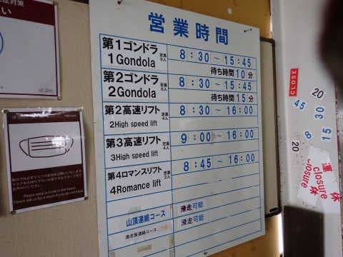

# 2022/12/30(金)の志賀高原焼額山スキー場速報レポート！…

📅 投稿日時: 2022-12-31 02:23:29

🏷️ カテゴリ: [2023スキー滑走日記](cd943df30cfcc3d0896469e2ff98720cd.md)

ってなことで．

今日も志賀高原で滑ってましたが…

今シーズンは例年のように正月休みに

ずっとスキーに行っていられる状況では

ないので．

泣く泣く本日，志賀高原から帰宅しました…

で．

本日の志賀高原ですが．

朝イチは雪降りで始まったものの…

昨晩からの積雪は，わずか2-3cm(涙)

まだちょっと積雪が足りない感じ…（泣）

今日も天気は積もらない程度に雪が

降ったり止んだり，時々日が射したり

という天気で，積雪は無く．

そのせいで，午後になると人工降雪を

打ってないGSコースや白樺コースは，

ちょっと土が出始めているところも…（激泣）

とはいえ．

焼額山は，ヤケビウォール以外の全コース

オープン！！

ゴンドラ・リフトも全運転！！

雪の量は多くは無いものの，気温は

冷え冷えで，雪質はかなり良かったです…！

しかし．

さすが年末休みとなると…

ゲレンデ上の人は多かった（泣）．

午前9:30~11:30頃のピーク時は，

ゴンドラ待ちもちょっとあったし…

第2高速，第3高速もゲートの外まで

並ぶほどの混雑（涙）

さすが年末休みの時期になると．

人が増えてきますね…

午後にはゴンドラやリフト待ちは減って

来ましたが．

それでもコース上の人は多いままで…

そのせいで．

午後には，バーンのところどころに

凸凹が出てきました…

とはいえ．

新雪が積もったわけではないので，

それほど深いコブコブにならずに，

ある程度は飛ばせるバーン状況だった

ので，まだ良かったかな…

ただ．

昼間はコース上に人が多くて気持ちよく

滑ることができず．

ちょっとフラストレーションがたまる感じ

だったのが残念…

…

残念…

このまま帰ると，心残りが…

…というときは．

そうです！

こんな日は．

ナイターに行くに限る！！

本日は，焼額第3高速のナイターに参戦！

人のいない，最高雪質のシマシマバーンを，

好き放題2時間かっ飛ばし続けることが

できて．

昼間の欲求不満をすっきり解消

することができたのでした…

ってなことで．

本日帰宅するというのに．

ナイターラストまで滑ってしまい…

そこから300km運転して帰ったので，

帰宅は深夜1時過ぎ（涙）

これからシャワー浴びて寝ます…

詳細レポートは明日！！

おやすみなさい…

PS.真美子さま

探したけど，みつけられませんでした…

## 💬 コメント一覧

### 💬 コメント by (ゆうさん)
**タイトル**: Unknown
**投稿日**: 2023-01-01 11:25:17

新年半ばに志賀高原目指す広島人です。　１日滑って疲れたのにナイター滑って300キロって凄い根性あるから尊敬しました!　私は800キロ…　自信ないです（涙）

### 💬 コメント by (Skier_S)
**タイトル**: ＞ゆうさんさま
**投稿日**: 2023-01-02 02:50:04

まぁ，私は往復1000km運転して月山に日帰りで滑りに行っちゃう人ですので…

しかし，片道800kmは遠いですね！！！

気を付けて志賀高原までお越しください…！

### 💬 コメント by (ゆうさん)
**タイトル**: Unknown
**投稿日**: 2023-01-02 11:22:43

え？！日帰り1000キロ!?　凄過ぎる!!　ちなみにホンダフィット（2駆）　タイヤ2シーズン目　ブリジストンスタッドレスタイヤでも、志賀高原ダイヤモンドまで上れますでしょうかね（汗）

### 💬 コメント by (Skier_S)
**タイトル**: ＞ゆうさんさま
**投稿日**: 2023-01-04 05:44:36

日帰り1000km運転してリフトスタートからストップまで滑って帰ります…

活動時間24時間越えます（笑）．

FFで志賀高原は…

行けなくはないですが，登り坂の途中で止まるとヤバいかも．

チェーンを持っていくことをお勧めします…

