# 2022/3/19(土)の志賀高原焼額山スキー場は…曇り時々雪．雨の後の冷え込みでゴンドラ・リフトが凍結ですごいことに

📅 投稿日時: 2022-03-20 00:10:36

🏷️ カテゴリ: [2022スキー滑走日記](cc9cb73e4320f6a97af6fccc37587a61a.md)

ってなことで．

今日も睡眠不足の中，無事志賀高原へ到着しましたが…

なんということか…

昨晩の雨…というかミゾレで濡れた

ゴンドラ設備が凍りまくったらしく．

朝イチの営業開始時に，

焼額第1ゴンドラ，第2ゴンドラ，奥志賀ゴンドラが

「営業開始時期未定」

という状況(涙)

だもんで．

今日は第2高速リフトでスタートです！

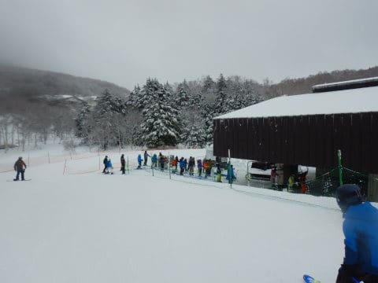

昨晩から，雪が降ったあとミゾレっぽい

雨っぽいのが降って，さらに明け方

雪が降った感じで…

コース脇は，湿った雪が降った後に

クラストした微妙な雪の感じ…

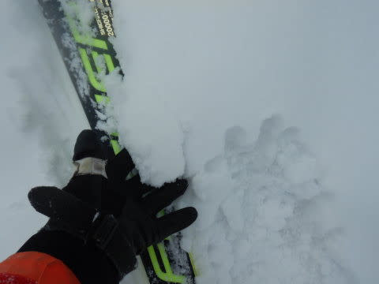

でも，圧雪がかかったコース内部は，

結構固めながらいい感じ！

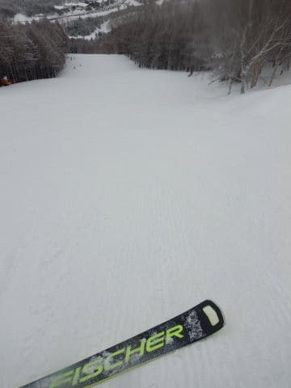

硬めながらも，朝イチシマシマを楽しめて…

あさイチはまだコースの人も少なく，

楽しい感じでした！

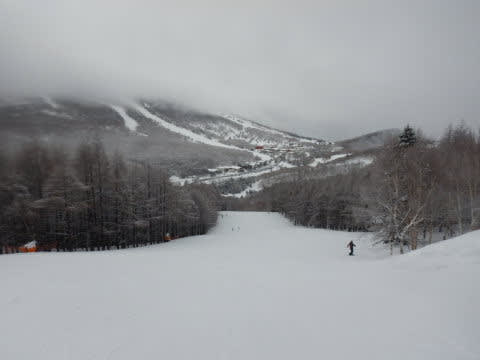

しかし，朝のうちは，

「設備凍結で，ゴンドラはちょっと営業開始が遅れるかな…」

という程度だったのが．

予想以上に凍結がひどかったようで，

じきに，

「1ゴン，2ゴン，3高とも，営業開始は昼頃になりそうです」

という案内に変わり…

3連休初日にも関わらず，焼額では滑れるのが

2高だけという状態に（泣）

唯一運転している第2高速が，9時ごろには

すごい混雑になっちゃいました(涙)

…ってか，これ…

第2高速リフトで記録級の待ち時間ですね（泣）

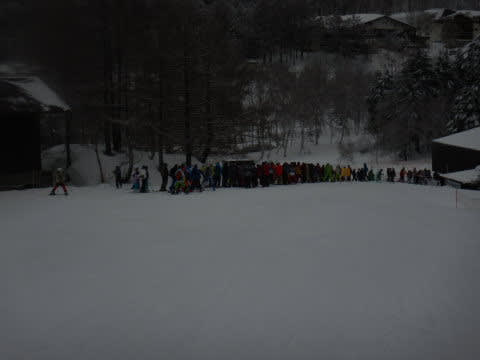

一の瀬山の神も営業開始が遅れ，

9時20分ごろまで一の瀬に脱出することも

出来ず．

唯一滑れる唐松コースの人口密度もすごい

ことになってきました…(泣）

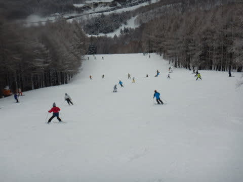

ただ，一の瀬に脱出する山の神が動き出しても，

山の神リフトもすごい待ちだったし…

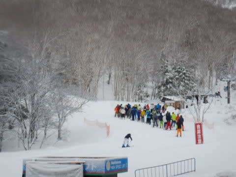

とりあえず，ここは雪もそんなに悪くなく，

気温が上がって雪が緩み始めたものの，

ガチガチバーンが緩んでむしろ滑りやすく

なった程度で結構楽しめたので．

ゴンドラ運転開始するまで，

ガマンして第2高速リフトで粘っていると…

11時ちょい前に，第1ゴンドラがやっと動き

出しました！！

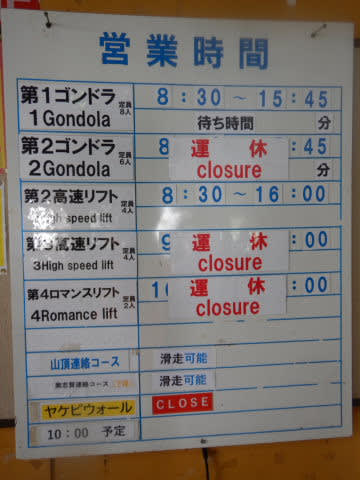

…が．

営業開始後の一番最初は15分以上の

すごい列…(涙)

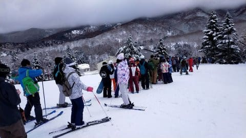

とりあえず．

15分待って，ようやく今日の初めての

第1ゴンドラ山頂へ！！

昼近い11:30になっちゃってるので，

気温は+2℃と高めながらも…

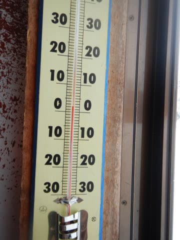

まだ誰も滑ってないゴンドラのコースは，

シマシマ！！

そして，ちょいと表面がしっとりしているけど．

硬いバーンの表面がいい感じで融けた感じの，

滑りいいフラットバーン！

いや…

待った甲斐があった，今日最高のバーン！！

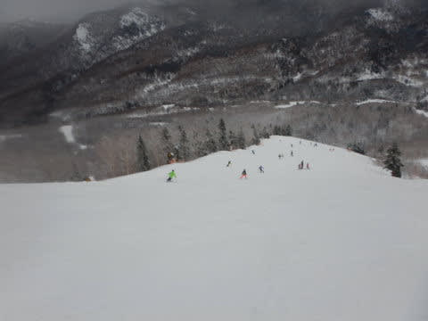

2本目以降は，ゴンドラの待ち時間は

5分程度と短くなり…

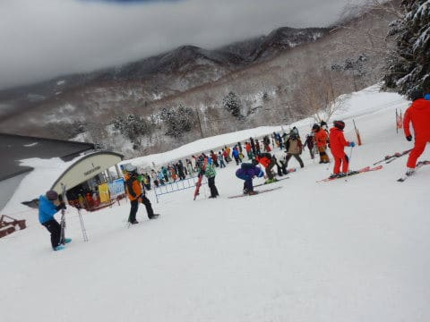

そして，1時ごろには第2ゴンドラも

動き出したのもあって，ガラガラになりました！

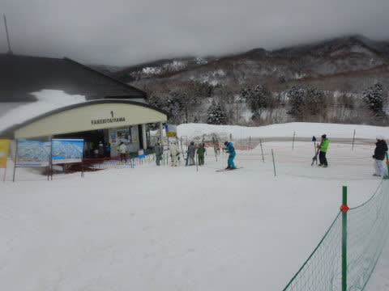

第2ゴンドラ営業開始直後は第2ゴンドラも

待ち時間なく，快適にグルグルできました！！

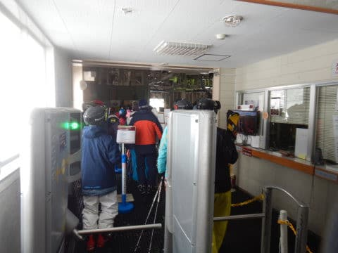

ただ…

昼休み時間を過ぎて，1時半ごろには…

さすが3連休．

2ゴンは10分待ち，1ゴンも5分待ちになり．

コース上の人口密度も上がってきました…（涙）

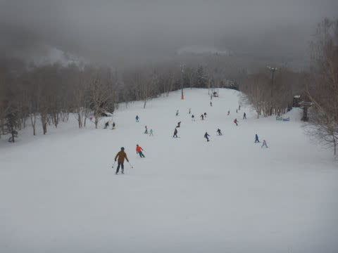

さらに，夕方になるにつれ気温も下がり，

雪がぱらつくような天気になってきましたが…

気温が下がったせいで，重く湿った感じの雪が

固まっていき，ザラメ状になって…

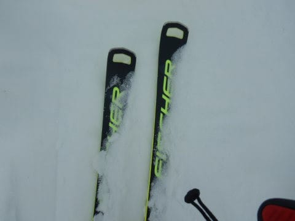

そのザラメがところどころで盛り上がっていき，

場所によっては，金井荒れた凸凹斜面に

なっていきました（涙）

うーん…残念…

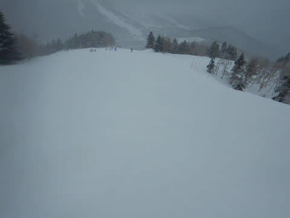

でも．

朝ゴンドラが動かなかったお詫びなのか，

15:45で終わる第1，第2ゴンドラが16時まで，

16時で終わる第2，第3高速リフトが16:15までと，

15分営業時間が伸びたのは良かったかな…

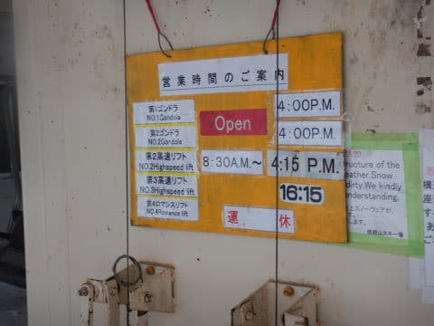

ってな感じで．

今日もラストまで滑り倒しましたが．

…今日は午前は凍結の影響でゴンドラが動かず

リフトもかなり混雑したし．

午後は気温は冷えたものの，バーンはザラメの

荒れ気味になっていき．

ちょっと残念な感じの一日でした（涙）

明日はガチガチバーンの上に5～10㎝の雪かな…

朝は雪，昼間は曇り空で，気温は低そう．

午後は下地の硬いのが出て来そうだけど，

冷え冷えの真冬の一日に戻りそう！

…でも，混まなきゃいいなぁ…

## 💬 コメント一覧

### 💬 コメント by (アツシ)
**タイトル**: Unknown
**投稿日**: 2022-03-20 06:21:27

私は朝のゴンドラ運休を見て、ダイヤに変更しましたが、こちらも朝のリフト営業開始は20分ほど遅れ、営業開始待ちのクワッドの列が見たことないくらい長くなってましたよ。一ノ瀬スタートにすると夕方4:30まで滑れるのでお得感がありますね。

### 💬 コメント by (モイストシルバー)
**タイトル**: Unknown
**投稿日**: 2022-03-20 16:25:45

12月の第3週以来、久しぶりに焼額に来ました。昨日は大変だったようですね。連休の中日で混雑は覚悟していましたが、どのゴンドラ・リフトもなかなかの混雑で、比較的待ちが少なかった三高回していました。ファーストトラックは参加者も少なく良かったです。やはり焼額の雪質はいいですね。明日も参戦予定です。

### 💬 コメント by (レインボー74)
**タイトル**: Unknown
**投稿日**: 2022-03-20 17:13:05

日曜日の志賀高原情報

朝の上林0℃　蓮池-6℃　ニゴン上-8℃。

道路はシーズン最悪のツルツル。スケートリンクみたいで、13台のスタックを目撃。

朝のニゴンは長蛇の列。気力は一気に！

駐車場は6~7cm新雪。

白樺は硬め。

どこへ行っても渋滞。頼みの三高までもが！

結局２時間で終了しました。帰りは道路は大丈夫になっていました。

### 💬 コメント by (ノーザンレインボー)
**タイトル**: Unknown
**投稿日**: 2022-03-20 19:23:58

ご無沙汰しています.

私の趣味を知っている上司からコロナ禍明けまで理不尽なゴンドラ禁止令が出てしまい、なかなかsさんにお会いできずにいますが、ブログは毎日楽しませてもらっています.

先日の試乗記事に刺激されて戸隠までハイスペックレンタルしに行ってきました.私には優しいFISCHER RC4 Worldcup RC M-track 165cmがドンピシャでしたが、色が好みではないのでまだ物欲に負けずに耐えています.が、帰宅後にもう一度sさんの記事を読んでいると、気持ちが揺らぎますね.なんて罪作りなブログ…

またお会い出来る日を楽しみにしています.

### 💬 コメント by (Skier_S)
**タイトル**: 今日は混んだよ…
**投稿日**: 2022-03-20 22:30:29

＞アツシさま

ダイヤも朝はすごい並んだみたいですね…

営業開始後，一気にヤケビに人が流れてきました．

今日は一の瀬ファミリーペア16:50までなので，確かにお得感は強いかも…？？

＞モイストシルバーさま

今日はかなり混みましたね（涙）

この時期としては雪質も良く良かったと思います！

明日は天気も良くなっていいと思いますよ～！

＞レインボー74さま

今日は激混みでしたね…

明日は混まないといいんですが…

＞ノーザンレインボーさま

ええ？ゴンドラ禁止ですか…

上司が指示する事項かどうか微妙ですね…

FISCHER RCはいい板ですよ！！

もう，物欲刺激されまくってください！

志賀高原，ゴンドラ以外もありますから，またお越しください…

