# 2022/2/12(土)の志賀高原スキー場は…晴れ～うす曇り，雪は良かったけど，すごい混んだよ(泣)

📅 投稿日時: 2022-02-13 00:11:05

🏷️ カテゴリ: [2022スキー滑走日記](cc9cb73e4320f6a97af6fccc37587a61a.md)

えー．

本日，3連休中日の志賀高原ですが…

天気は良かったものの，かなり混みました(涙)

とりあえず．

かなり混みそうだったので，今日もファーストトラック

から参加です！！

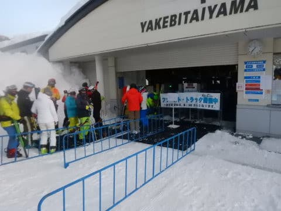

さすが，3連休中日だったからか，

通常営業じゃなく，ファーストトラックの

待ちがこれほどの長さで待ってます…

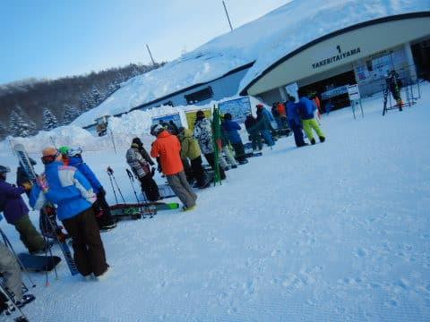

で．

今日のファーストトラック．

晴天シマシマっ！！

…すごい…

焼額の圧雪クオリティーは最高でした！！

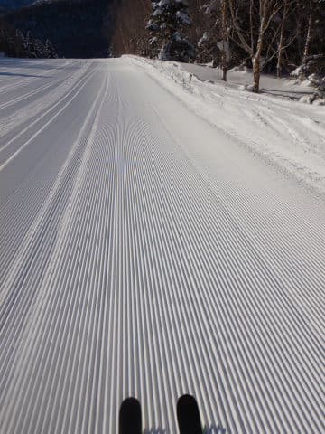

で．

8:30から通常営業スタートですが…

通常営業開始時の気温は－9℃と，

ほぼ－8℃の予想通り…！

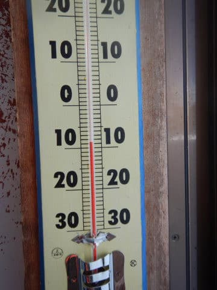

そして，天気も最高の青空！！

3連休の中日で，これは最高ぅｔ！！

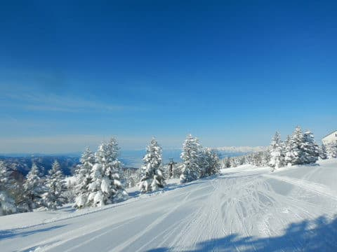

だけど…

さすがに天気のいい3連休中日．

通常営業開始30分経った9時には…

かなりの列が(激涙）

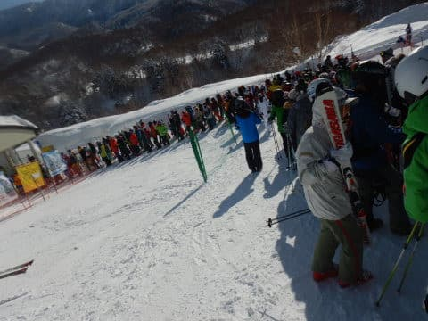

焼額1ゴンの待ち時間が10分を越えると，

焼額の呪いが解けるという設定の私．

今日は奥志賀へ脱出！！

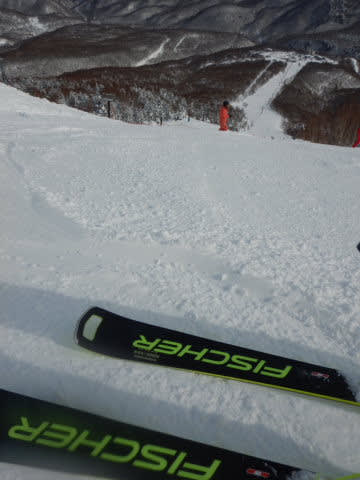

奥志賀は，雪も良かったけど…

奥志賀も10時を過ぎると，かなりの混雑に(泣）

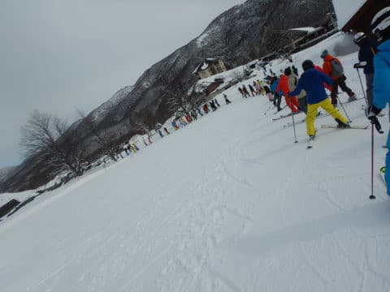

奥志賀も混んできたから，焼額に戻ってきましたが…

公式アナウンスでは，1ゴン30分，2ゴン60分待ち(涙)

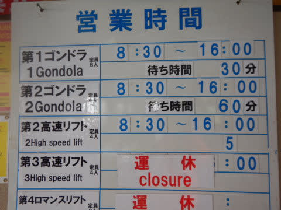

確かにコースは，この時期としてはかなりの

人口密度…

最近，ここまでコースに人がいたことは

あんまりないよな…という混み具合．

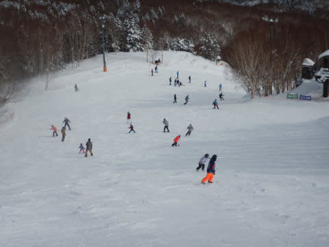

普段は混まない第2高速ですら，

かなり混んだものの…

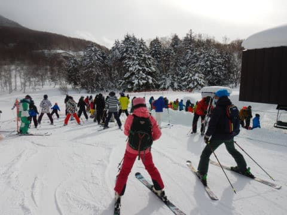

でも，1ゴン，2ゴンともに．

お昼ご飯タイムの昼休みは

待ち時間が無くなったものの…

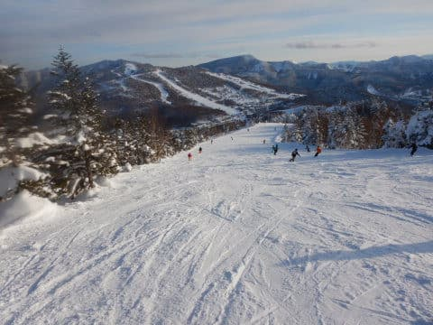

午後はまたちょっと混んできました(涙)

でも，午前は最大30分待ちだった

第1ゴンドラも，午後はせいぜい10分待ちで．

天気も雪もそれほど悪くなく…

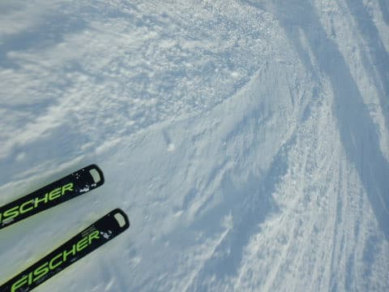

さらに，夕方になってくると，

人口密度も低くなり…

今日もラストの16時まで滑り倒して

来たのでした…

今日は，昼間はかなり混んで，

「さすが3連休，午後も激混みでダメか…」

と思ったところ．

午後はそれ程混まずに済み，

そして終日いい天気で．

いい一日を過ごせたのでした…！！

…今日はいろいろあってナイターは滑れず．

さらにレポートもちょっとショートバージョンでしたが．

また明日，焼額滑ってます～！

## 💬 コメント一覧

### 💬 コメント by (ikkun)
**タイトル**: Unknown
**投稿日**: 2022-02-15 02:25:47

我がゲレンデも久しぶりに朝イチ長いリフト待ち お天気も良くて嬉しい    がまんも限界かもですね？

### 💬 コメント by (Skier_S)
**タイトル**: ＞ikkunさま
**投稿日**: 2022-02-16 01:46:29

この3連休，スキー場はどこも結構混んだようですね．

まぁ，天気よかったですからね…

