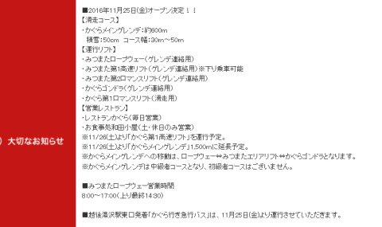
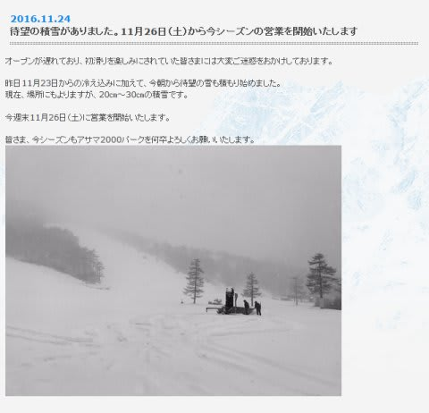
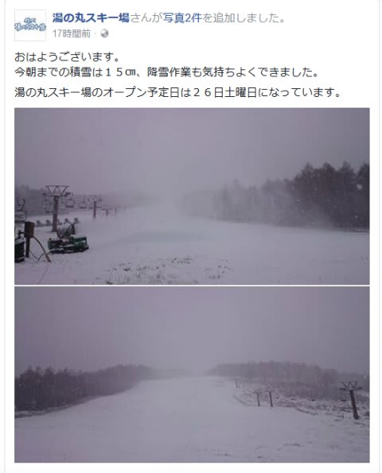
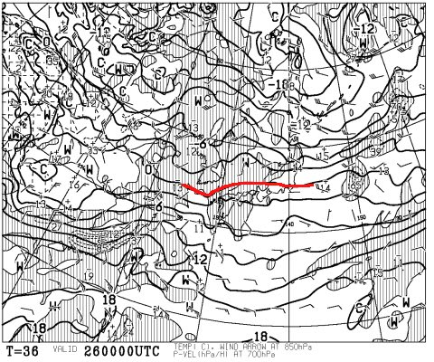
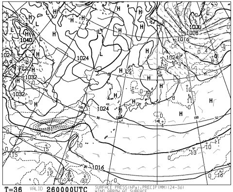
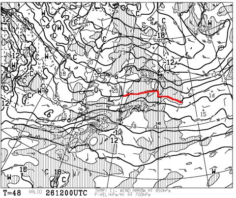
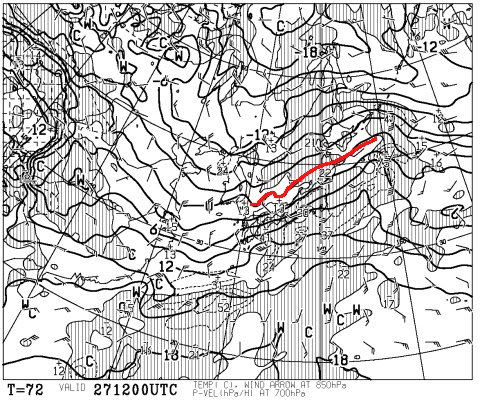
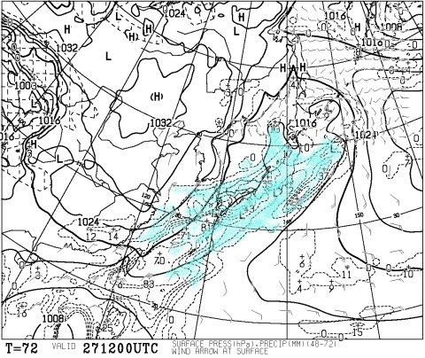
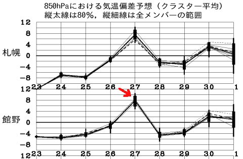

# 今週末，11月26，27日のスキー場の天気＆積雪は？…土曜は良さそうだけど，日曜は雨（涙）．

📅 投稿日時: 2016-11-25 03:13:37

🏷️ カテゴリ: [スキー天気予想](c6554f5c3c106093b511a8daae23757e8.md)

えー．

昨日からの雪のおかげで．

本日，熊の湯がオープンしましたが．

ついにかぐらも，明日オープン決定っ！（ぱちぱちぱち）

金曜はペアリフトのみですが．

土曜はクワッドが動くようです…

…明日は，みつまたエリアの移動は．

ピスラボの上にうっすら天然雪という，

微妙なコースを滑って降りることになるのかな…

そして．

アサマ2000も，公式に26日（土）のオープン確定のようです！

やったー！！

このほか，湯の丸も26日オープン予定みたいですが…

…白馬方面は，まだ今週末にオープンできる

スキー場はなさそうですが．

とりあえず，この雪のおかげで，

何とかいつくかのスキー場がオープンに

こぎつけられたようで…ちょっと一安心．

ということで．

今週末のスキー場の天気を予想してみましょうか…

まず，26日の土曜日，朝9時の850hpa

気温を見ると…

うむ．

まだ，0℃線は信州より南にありますね…

そして，地上天気図は．

ふーむ．

この日は，早朝にチラチラと雪が舞う可能性も

あるけど．結構冷えた，いいコンディションの

朝になりそう！

ただ．

26日土曜日，夜9時の850hpa気温は．

うーむ．

0℃線は，東北方面まで上がっちゃいますね…

26日は，昼頃までは冷えていい感じでしょうけど．

午後は日差しがあるし．

ちょっと気温が上がっていくかな…

でも，アサマ2000くらいの標高なら，

意外と気温が上がらずに済みそう．

この日は，終日いいコンディションで

楽しめそうです！

で．

問題の，27日の日曜だ．

850hpa気温図は…

あうーーん．

やっぱりダメか…

0℃線は青森近辺まで上がってます…（涙）．

信州には，+3℃線がかかってます．

そして，地上天気図を見ると．

…

…

…

…だめだ．

やっぱり，ダメか（泣）．

水色で塗った降水域．

本州全域を覆ってます…（涙）．

南風が入り，850hpaの気温も+3℃くらいなので．

降ればほぼ間違いなく雨です．

ただ．せめてもの救いは．

アサマ2000は，午前中はそれほどひどい雨に

ならなさそう．

そう．

昨日に引き続き，繰り返しますが．

皆さんの日ごろの行いが良ければ．

昼ごろまで雨は降らないでしょう．

…しかし．

これを見ると…

28日以降，また冷えそうなので．

この矢印で示した27日の高温＆雨が，

惜しい！

惜しすぎる！

…

ってことで．

まとめると．

土曜

朝は冷え冷え！かぐらは曇が多いかな…アサマは晴天で始まる朝．

ゲレンデはしっかり圧雪された人工雪でスタート．

午前中は気温が冷えたままだけど，昼ごろは気温が上がり，

日差しもあるのでちょっと雪が緩むか…

夕方に向かって気温が上がっていくが，表面は緩んでも，

下地の固い人工雪が緩むほどではないかな．

昼からちょっと気温は高めだけど，

終日天気も良く，割といいコンディションの一日．

日曜

かぐらは朝から雨の可能性…

アサマは午前中は降らずにもつか，あるいは霧雨っぽい

弱い雨が時折降るか…

アサマが朝に雨が降ってなければ，朝イチはまだぎりぎり

楽しめるかも．

午後は全国的に雨．

ザーザーぶりになるほどではないけど，パラパラと

雨が降り続ける．

この日はリフトストップまで雨が降り続けるでしょう…

って感じでしょうか．

とりあえず．

土曜は良さそうです！

…でも．

また，日曜に狙ったように雨が降るとは…

なんだか．

昨シーズンの

「毎週末，狙ったように雨」

のパターンを思い出すのですが…

まさか…また今シーズンも…！？？

いや．そんなことは起きないはず．

起きてはいけない．

無いはずだっ！！！
