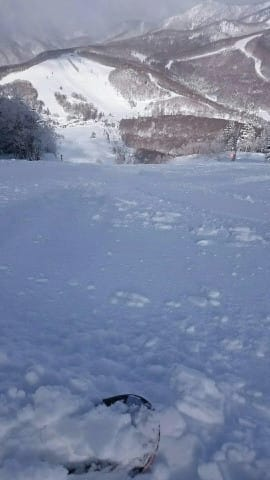
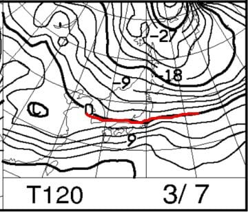

# 3月6，7日の週末の志賀高原スキー場の天気は…土曜は曇り，日曜は曇り時々湿った雪かな．気温は高め．

📅 投稿日時: 2021-03-04 05:28:14

えー．

昨日昼間は雨＆強風に襲われた志賀高原．

その後，昼過ぎから雪に変わり，

夕方にはかなりの冷え冷えになり，

雪が降り積もり始めたわけですが…

果たして，3日（水）の志賀高原や如何に？

パフパフ冷え冷え大量新雪でゲレンデは

回復したのか？？

今日も非常に優秀な，志賀高原特派員

からの情報です！

…えー．

そうそう．

今日は，おこみんオーナーの特派員が，

久しぶりに志賀高原に戻ってきました！

久しぶりのおこみんにホッコリ(笑)．

…積雪量は，駐車場で10cmくらいでしょうか…

あさイチの奥志賀の気温は-10℃で．

ゲレンデは圧雪の上に5cm，

非圧雪部分では10～20cmちょい程度，

冷え冷えの新雪が乗っていたようです…！

下地は結構固かったようで…

3日（水）：朝までに10~20cm積もってるか？

　この日は朝は-10℃クラスの冷え冷え！

　ガチガチ硬い雪の上に新雪．

という予想，今日も予言レベルで

当たっていたようです…

ただ，焼額は下地は硬かったものの，

上に乗った新雪がサラサラで気持ち

良かったみたいで．

そして，朝のうちは雲が残っていたものの．

リフト営業開始直後から，

すっきり晴れていったようです…！

いや…見事に晴れてますね．

　午前中に雪は止む．

　午後は晴れていくかも…

という予想より早い時間に

晴れたようですね…！

ただ，昼間の気温は予想以上に上がり，

午後には最高気温が0℃近くになったようで…

さらに，この日差しなので．

昼ごろには，ゲレンデの雪が

ボソボソし始め…

奥志賀エキスパートコースはちょっと

引っかかるような雪になっていき…

GSコースなんかは，ちょっとしっとり

した感じの雪になっちゃったようです．

とはいえ，雲もないすっきり晴天の中，

誰もいない貸し切りバーンを滑れた

ようで…

人が少ないので，一の瀬正面バーンも

最後までフラットだったようですね…

で．

優秀な特派員は，この日もリフトストップ

まで滑り続けたようです…

さすが，志賀高原の特派員は違う．

ってなことで．

新雪は積もったものの，下地は

予想通りガチガチバーンだった

わけですが．

昼間は予想以上に気温が上がって，

ガチガチバーンを覆って積もった

新雪が融けて，ネットリ重くなって

いくという状況だったようです…

うーん．

今日，気温が上がって雪が緩んだから，

明日はコロコロバーンかな…（涙）

ってなことで．

3月に入った最初の週末になる

この6，7日．

それまでに雪は良くなるのか？

あるいはもっとひどくなるのか…？

水曜深夜恒例の天気予想，行って

みましょう…！

えー．

まず，4日(木)の850hpa気温を見てみますが．

うーむ．

まぁ，この日は赤い0℃線は太平洋側まで

下がってくれているので．

志賀高原はそこそこ冷えてくれそうですね…

朝は-5℃，昼間はギリギリ0℃前後くらいかな？

そして，この日の地上天気図は高気圧に

覆われるので，おそらくすっきり晴れ！

日差しがあたるバーンは午後は雪が

緩むかもしれないけど，晴天の中

滑れる一日になりそうですね…

そして，翌5日(金)の850hpa気温図は．

うーーーむ．

赤い0℃線がギリギリ志賀にかかる程度…

これは，昼間の気温はちょっと上がるかな？

焼額山頂で+3℃くらいまでに上がりそう…

でも，この日は西から低気圧が近づき．

水色の降水域は志賀にかかっていないながら，

雲は多そうなので．

日差しがあたらないバーンは

それほど緩まないかな…

で．

週末の土曜，6日の850hpa気温を見ると．

うーーーむむむ…

この日は，+3℃線が志賀高原にかかる程度

なので．

朝からギリギリ0℃程度．

午前中に+5℃程度まで上がりそうだけど，

午後は気温が冷えていく．

そして，地上天気図ではギリギリ

降水域が志賀高原にかかるかどうか…

という程度なので，リフト営業時間の

間は降らないでいてくれそう…

午後にパラパラ雪が舞うかも．

そして，日曜の7日の850hpa図は．

赤い0℃線は志賀高原よりわずかに

南に下がってくれてるかな．

で，志賀高原に網掛けの降水域が

かかっているので…

この日は午後から雪がぱらつきそう．

ってなことで．

まとめると．

4日(木)：朝から晴れ！

　朝は-5℃．昼間は0℃を超えてくるか…

　朝のバーンは硬め圧雪．

　前日緩んだバーンは殺人コロコロ出現．

　昼前にはバーンは緩み始める．

　日差しがあたる南～西斜面バーンは

　雪が重くなりそう．

5日(金)：終日曇り空．

　朝は0℃をちょっと下回る程度．

　昼間は+5℃くらいまで上がりそう…

　朝は硬めの圧雪．ところによりコロコロ．

　ただ，日差しは無いので雪はそんなに

　ひどく緩まないが，全体的に

　雪がしっとりしていきそう．

6日(土)：終日曇り空．

　朝は0℃程度，午前は気温が上がる．

　最高+5℃くらいまで行くかも？

　あさイチは硬めで，表面が崩れていくような

　コロコロ圧雪だけど，じき緩む．

　ただ，午後に向かって気温は冷え始め，

　午後はマイナス気温に下がり，

　もしかしたら雪がぱらつきだすかも？

　午前中にバーンが緩んじゃったら，

　午後はカリカリした感じに…

7日(日)：曇り～湿雪．

　朝は-3～5℃程度と意外と冷えて，

　バーンは硬めの圧雪．

　もしかすると，その上にうっすら湿った

　重めの雪が乗っているかも…

　志賀高原は昼間もギリギリ0℃を超えるか

　どうか．

　終日バーンは硬めをキープしそう．

　

という感じでしょうか…

これから週末に向けて，ほとんど積雪は

なさそうです（涙）．

そして，気温が上がる日もあるので…

バーンコンディションは硬め．

土曜はちょっと緩むかも…

という感じ．

うーん…

信じたくないけど．

もう，春ですねぇ…

緊急事態宣言が出ているうちに，

トップシーズンが終わってしまった

感じなんですけど…（涙）

## 💬 コメント一覧

### 💬 コメント by (オオスギ)
**タイトル**: Unknown
**投稿日**: 2021-03-04 08:43:51

愚報です…

宣言解除が、我が千葉県のせいで延長になる模様です…

誠に持って申し訳ありません。

不甲斐ない知事を選んだ県民を代表して、お詫び申し上げます"笑"

もう、一人でしたら、スキーに行っても大丈夫じゃないでしょうかね‼️

(ちなみに、わたしの近所の学校は、普通に卒業式を行い、在校生含め家族全員の参加もOKです。まわりも、皆さんそんな雰囲気だしてますし…)

### 💬 コメント by (レインボー73)
**タイトル**: Unknown
**投稿日**: 2021-03-04 14:06:42

木曜日の志賀高原情報

あーあ、ぜーんぶ消えた。ゴンドラで書き溜めた速報が全部。これからはラインのkeepメモで書きます。

朝一のパノラマ、カラマツは、シマシマ快適食い込みバーン。オリンピックも然り。ＧＳは小さなコロコロが。

今日は久々に奥志賀だ。バスで戻ればいい。

ダウンヒルは快適だけど、エキスパートは非圧雪。最近の奥志賀は、『圧雪車故障』を理由に頻度が高すぎる。

一昨日の嵐の日にも唯一最後まで滑り続けた優秀な特派員が、シマシマ三高から高速でエキスパに飛び込んだら、想定外の非圧雪でコロリン。危うく優秀な特派員を亡くすところでした。

### 💬 コメント by (レインボー73)
**タイトル**: Unknown
**投稿日**: 2021-03-04 15:58:41

木曜日の志賀高原情報２

10時06分の奥ゴンからのバスで１ゴンに戻り、少し滑って一の瀬へ。

先日故障したファミリーＢ線の大滑車を取り外してましたよ。ファミリーは真っ平らで食い込む要介護者用のバーン。

久々にタンネのチウホテルに行くも11時を過ぎても気配がない。結局は薬局で郵便局、いつもの高天の銀嶺でザルソバ。

ポールのあとのパーフェクタがいいと聞いていたので、駆けつけると、ここが本日のベスト。浮気せずひたすらパーフェクタ回し。

腰痛なのに、とうとうレインボーまでお勤めを果たしてしまいました。案外できるぞ！

なお、チウホテルは昼前には営業してました。

### 💬 コメント by (Skier_S)
**タイトル**: 明日は液体が降らないよう祈るばかり
**投稿日**: 2021-03-05 01:52:41

＞オオスギさま

宣言解除，伸びそうですね…（涙）

早く収まってほしいんですが．

まさかここまで伸びるとは思ってなかった…（泣）

＞レインボー73さま

エキスパート，また圧雪車こわれたんですね…

気温が上がった今日も，パーフェクターは良かったようですね．

うらやましい…

明日は微妙な天気になりそうですが，レインボーまでなら曇り空で問題なさそうです．

