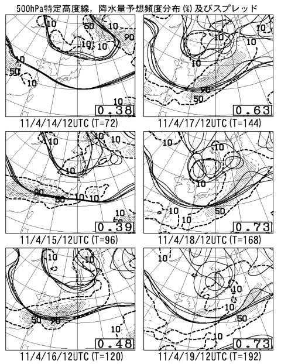
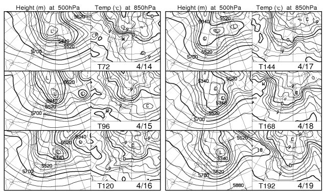
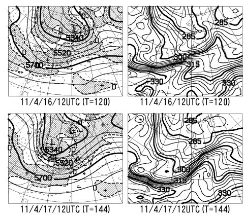

# この週末も雨っぽい…

📅 投稿日時: 2011-04-13 00:44:05

先週は．

土曜日，雨だったわけで．

この週末は，晴れるといいな～

と，願いながら天気図を見るわけですな．

…

…

これは．

今度の週末．

土日とも．

雨かも…

[専門天気図のページから](http://n-kishou.com/ee/exp/exp.html)，FZCX50をみてみると…

うーーーーむ．

降水量予想頻度分布の16，17日のところ．

見事に，本州全域に網掛け部分がかぶってますね…

これは，降りそうですね．

16日のスプレッドが0.48と比較的小さく，5700mの特定高度線

のクラスター平均がばらついてないので，これからの予報が

大きく変化することは少なそう．

うーん．土曜の午後から日曜にかけての雨は不可避っぽい．

で，FXXN519をみてみると．

16，17日の850hpa気温の0度線は，はるか北の津軽海峡のあたり．

…標高2000m以上でも，雪になる可能性は0ですね．

降れば雨．

さらに．

FZCX50で，850hpa等温位線を見てみると．

（この図の右側）

等温位300度付近の，線の密度の高い部分が，どんぴしゃ

本州にかかっています．

この密度の高い部分は前線を示すので，概ね雨が降るエリア．

うーーーーん．

この週末はだめかっ！

悔しいのは，18日の月曜以降，晴れて冷えそうなこと．

とりあえず．

16日，前線の位置があと数100km南下してくれれば

降らずに済みそうなので．

これからの予想で，低気圧の通過位置が南にずれる

ことを祈りましょう…
