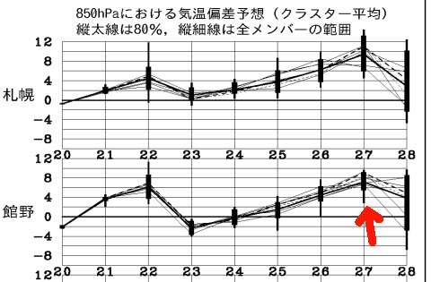
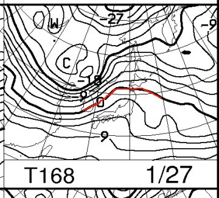
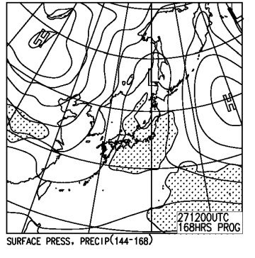

# うーむ．22日は雨だったのかな…？

📅 投稿日時: 2015-01-23 05:14:16

🏷️ カテゴリ: [日記](cc4b5682fb7b8b144980957a978653fb0.md)

…し，仕事がご無体だ…

今日もこんな時間に帰宅…

明日仕事に行けるのかな…？？

＃というより，今週末，スキーに行けない危険性が…

＃それでもBlogを書いている自分，偉い！←とりあえず自分で誉めておく

んで．

22日はやっぱり志賀高原もかなり気温が上がったようで，

昼間はプラス3℃くらいになってみたいで．

で．雨が降ったっぽいけど．

…雪質はやっぱり悪化しちゃったのかな…（涙）

とりあえず．

23日は結構冷えた雪がガンガン積もってくれるので．

この週末までに，雪質は改善するかな～．

＃下地はアイスバーンだろうけど…（泣）．

うーん．

今週末，無事スキーに行けるといいなぁ…

でも．

でも．

ふむ？？

うむむ？？

なぬ？？

…みなさま．

27日も雨になる危険性がありますので．

くれぐれもご注意ください…←なんに注意するんだ？？

＃1月だというのに，雨降りすぎ（悲）

## 💬 コメント一覧

### 💬 コメント by (はなげ親分)
**タイトル**: 祈ります
**投稿日**: 2015-01-23 22:30:24

ただひたすらに祈ります。

人の悪口も言いません。

ご飯も腹八分目にしておきます。

だから、もう雨はご勘弁ください！

### 💬 コメント by (Skier_S)
**タイトル**: はなげ親分さま
**投稿日**: 2015-01-24 00:22:33

22日は幸い雨が降らなかったみたいで，

やはり，私の祈りのおかげでしょうか（違う）．

来週は気温が高い日が続くようで（涙）．

26日が一番危険ですが…

雨雲が通過するのが気温の低い夜ならば

雨にならずに済みそう…

とりあえず，これからの行いで

天気が決まりますよ～！！

