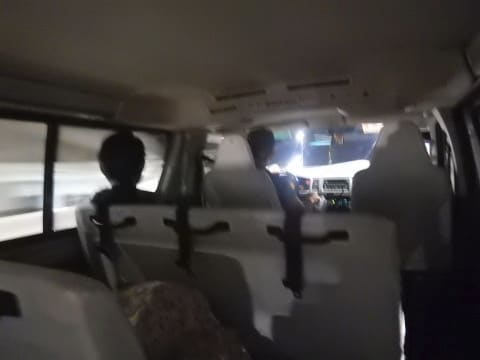

# 2018年8月，モアルボアルで小5の娘をダイバー化！その24…そして帰国だけど…空港での過酷な9時間待ち（涙）

📅 投稿日時: 2019-08-15 01:24:01

🏷️ カテゴリ: [ダイビング日記](ce3a7a8d424d112fce83ee85c81a0e344.md)

ってなわけで．

モアルボアル滞在最終日．

（ようやっと旅行記が最終日まで来たよ…）

空港への移動のピックアップは

朝3時という無謀な時間．

2時ごろに起きて，器材を

パッキングしますが…

うーむ．

雨が降ってたので，器材が乾ききってない（涙）

で．

まだ乾ききってない器材を

パッキングした後は，

3時にピックアップの車に乗って…

空港まで，3時間ほどの移動です．

…しかし．

早朝で眠いので，車の中では爆睡

してしまい…

気づいたら，空港に到着してました．

うん．

ホテルから一瞬で着いたような感じ．

…しかし．

セブ空港．

ホントにきれいになりましたね～…

で．

今日搭乗する飛行機は，15:10発．

なのに，空港に到着したのは，朝6時前…

これから出発まで9時間以上，

この空港で時間をつぶさなくてはなりません（涙）

なぜ，飛行機出発の9時間も前に

空港に連れてこられてしまったのか？

…というと．

本日，大きなマラソン大会があるらしく．

空港周辺の道路が，一日通行止めになる

という…

成田空港でそんなことやったら，

大パニックが起こるぞ？？

という，ありえないことが，

このセブ空港では実施されるらしく．

大会で通行止めになる前の早朝に，

空港へ送りこまれたのでした…（涙）

なぜ…

なぜ，私の帰る日を狙ったように

そんな大会をやるのか…（泣）

そして，マラソン大会で空港周辺を

完全通行止めにするって…

少なくともいくつかのルートで

アクセスできるようにしておこうよ（激涙）

と，嘆いても仕方がない．

運悪く，そういう日に帰国日が重なったので，

なんとか空港で9時間過ごそう…

これだけピカピカのきれいな空港なら，

9時間くらい時間が潰せるところ，

あるよね．

…と，思ったら．

なんと．

この空港．

セキュリティーをくぐった

先にしか，お店や食堂は無く．

セキュリティー外のエリアには，

チェックインカウンター以外，

何もありません…（涙）

座れるベンチもほとんどなければ，

有料ラウンジすらないという，

非常に悲しい状態なんですが（泣）

チェックインも，出発2時間前じゃないと

カウンターが開かないので，

早めにチェックインして

セキュリティーエリアに入ることも

できないんですが…（激涙）

なんてこった…

だもんで，

もう，こんな感じで．

空港の空きスペースで時間を

つぶすしかないよね…

まさか，小学生の子連れで，

こんなサバイバルな海外旅行を

することになろうとは…（涙）

ってなことで．

我が家も空港の一角で，

場所を確保．

すでに12時間のフライトやら，

乗り継ぎ7時間待ちなどを経験し，

異常に旅行に対する経験値が高い，

我が娘．

「こんなこともあるんだな…」

ってな感じで．

ログブックの書き足しとか，

いろいろやってます…

もう，落ち着いたものです．

で．

朝食付きの宿泊だったのに，

出発時間の都合で朝食を

食べれなかった我々のために，

ホテルがサンドイッチを

準備してくれてましたが．

レストランもないので，

こいつがないと

死んでましたね…

果たして．

これから9時間の待ち時間．

小学生の子供と一緒に，

空港の冷たくて硬い床に座って，

無事過ごすことができるのか…？？
