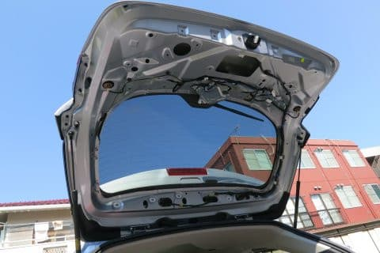
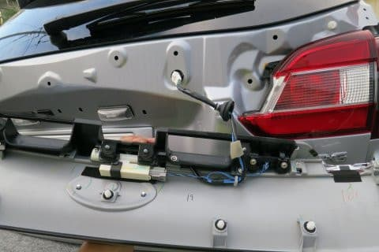

# プロジェクトX2…LEVORG E型 2.0GT-S納車されたけど…

📅 投稿日時: 2018-07-17 05:45:01

ということで．

この3連休．

ついに.

E型 LEVORG納車されました～！

(ぱちぱちぱち）

まだ，20kmほどしか走ってませんが．

…さすがの2L．

パワー感はなかなかだし．

足回りもD型以降，かなり熟成が

進んだ感じを受けます…

もう少し走ったら，また詳細レポートします．

で．

基本的にオプションなしで購入したこの車．

当然，ナビすらついてないわけです（笑）．

だもんで．

私が車を買った後に．

ほぼ毎回行う儀式．

車を乗って帰ったその日に，すぐ．

内装をバラすというイベントを

行ってます…

で．

ナビやらETCやらバックカメラやら．

いろいろ取り付けようとしたのですが…

いろいろ想定外のトラブルにより．

2日近くかけて，ナビの取り付けが

まだ完了していません（涙）

いやーーー．

LEVORGの車両側コネクタ．

C型とD型以降で，こんなに変わっていたとは（泣）．

だもんで．

いろいろ工作しています．

さらに，追加購入した

いくつかの部品待ちです．

とりあえず．

購入後の儀式（?）については．

また詳細レポートやります…

お楽しみに！←自分がかなりいろんな意味でお楽しみだったけど…

## 💬 コメント一覧

### 💬 コメント by (ほっぽ)
**タイトル**: いきなりバラバラ
**投稿日**: 2018-07-17 06:53:59

Ｓさん

レヴォーグ納車おめでとうございます。

新車購入、平成１５年春以来、縁遠いイベントです。

羨ましいです。

電装品、全部ＤＩＹで取り付けされるんですね。

私も大体同じですが、この時期の作業は暑くて大変でしょう。

体調に気を付けて早く完成するといいですね。

しかし、メーターまで脱着しているとは、何を取り付けるのでしょうか？

### 💬 コメント by (Hide)
**タイトル**: 盛大にバラバラで・・・
**投稿日**: 2018-07-17 07:25:26

S 様

LEVORG 納車おめでとうございます。

車種選定から納車までが一番楽しいですよね。

納車されて自分仕様になった時からテンションがフツーになるのは私だけでしょうか？（笑）

しかし見事にバラしてますね（汗）

メーター奥は・・・GPSかETCのアンテナでも隠すのでしょうか？

ETC2.0だと思いますので圏央道の割引受けられますね。それ以外は・・・自己主張がうるさいです（爆）

### 💬 コメント by (かつてのオデッセイ乗り)
**タイトル**: おぉ～ついに！
**投稿日**: 2018-07-17 10:53:18

いろんな車に試乗していて、どうなるのかな？と読んでました。それでも、きっとレヴォーグにするんだろうなと思っていました。

グレードは何にするのかな？と思っていましたが、Sさんらしい選択となりましたね！

うちの1.6GT-Sは、もう、56,000kmで、もうすぐ車検です。

### 💬 コメント by (michi)
**タイトル**: Unknown
**投稿日**: 2018-07-17 21:36:56

納車おめでとうございます🎊

いきなりバラしてすごいですね。

自分も少しは自分でやりますが納車直後にこれだけバラす勇気はありません（汗）

まぁ、傷つけるのが怖いだけですが。

とはいえ、やりたいことはあってフォグのLED化やドラレコの取り付けを検討中です。今は金欠なので暫くはやれませんが、、、

### 💬 コメント by (しんちゃん)
**タイトル**: すごい・・・
**投稿日**: 2018-07-17 22:57:16

納車、おめでとうございます。

買っていきなりいろんなところがバラバラ・・・

凄いですね。

今乗っている車は、買ったときから何もかも標準で着いてたので手間いらずでした。（ナビ、オーディオ、ＥＴＣ、バックモニタ）

自分でセッティングするから愛着湧くんでしょうね(^^♪

セッティング詳細レポート、楽しみにしております。

ドライビングレポートもお願いします。（車とお出かけ先と）

### 💬 コメント by (新潟のスキーヤー)
**タイトル**: Unknown
**投稿日**: 2018-07-18 00:15:38

ご納車おめでとうございます！

私もかつては自宅前でよくバラバラに分解して用品取り付けやら整備をしていましたが、最近は洗車すら面倒臭くなってきて…(^^;

ちなみに、作業終了後にスバルさんで自己診断してもら事をオススメします！

電装系バラバラにすると、思わぬ所で故障コード拾ってたりする事がありますよ！

 

熱中症に気を付けて、楽しんでください！(^^)

### 💬 コメント by (いか)
**タイトル**: Unknown
**投稿日**: 2018-07-18 00:26:15

ついにやってきましたね！早速のバラシは、もはや組み上げずにバラバラのまま納車でもよいのでは(笑)

私も先日、バックドアの内張りを勇気を出してバラしてみました、、、社外品のラゲッジルームランプを増設しましたが、暗いうちから準備をする釣り人には重宝しております(^^) 冬には最近流行りの早朝営業にも活躍してくれるはずです…！

### 💬 コメント by (Skier_S)
**タイトル**: まだ語れるほど新車に乗ってない
**投稿日**: 2018-07-18 02:53:25

＞ほっぽさま

いきなりバラバラです．

我が家の車の宿命です．

…とはいえ．

前回のレガシィは，一部ばらし方が分からず

ナビは業者さんに取り付けてもらったんですが…（汗）．

メーターは，メーターナセル内側にETCアンテナを

取り付けるために外しました～！

＞Hideさま

納車されるまで，ナビの購入やら必要な配線キットやら，

取り付け方の調査やらがめんどくさかったです…

でも．

貧乏金無しなので，安売り通販のナビを買って

自分で取りつけしないと…

メーターは，ご察しの通りETCアンテナ取り付けです！

ETCは2.0にするメリットを感じなかったので，

（圏央道割引も，我が家から志賀高原往復の場合

　ほとんど無しなんです…）

### 💬 コメント by (いか)
**タイトル**: Unknown
**投稿日**: 2018-07-18 07:35:11

私のはすでに加工されたものを調達しましたが、バックランプとバックフォグランプにアクセスする小窓みたいなパネルに穴を開けてつけたものです。電源は純正のラゲッジルームランプのところから分岐させています。

### 💬 コメント by (Skier_S)
**タイトル**: いかさま
**投稿日**: 2018-07-19 02:03:09

あ，そんな加工済みのモノが売ってるんですね…

でも，純正のラゲッジルームランプの配線は，

テールゲートに来ていましたっけ？？？

もしかしたら，トランク内部から引っ張ってくるんでしょうか…

だとすると，かなり大変そうですね…

### 💬 コメント by (いか)
**タイトル**: ばりばり〜
**投稿日**: 2018-07-21 00:11:26

はい、テールゲートには来ていません、、、

テールゲートをはがして、バックカメラなどと同様に黒いパイプの中を通して、車室内左上から、純正ラゲッジルームランプのところまでひっぱります。キットになっているので、場所と勇気があればできました。荷物の積み下ろしがほぼ夜の私には大変便利です。 ルームランプもLEDに全交換してますので、ずいぶん明るい車になってます(笑)

### 💬 コメント by (Skier_S)
**タイトル**: いかさま
**投稿日**: 2018-07-21 01:32:19

やっぱり，トランク内部から引っ張るのですね…

これって，Dピラーを剥がして，トランクのモール

外して天井内張りの後ろ側を広げて…

ってやらないといけないから，結構大変だったのでは

無いでしょうか…

でも，LEVORGのトランク照明はちょいと暗いので，

明るくしたいですよね．

私もなにか改造しようかなぁ…

LEVORGのカーゴランプ，天井に着けてほしかった…

