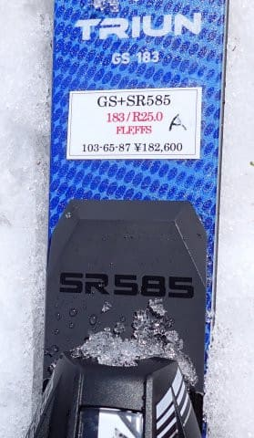

# 2025シーズンモデルのスキー板，試乗レポートその28…OGASAKA TRIUN GS +SR585

📅 投稿日時: 2024-07-13 02:58:43

先日，職場の健康診断を兼ねる，

半日人間ドックを受けてきて．

最後に結果を聞きながらの生活習慣指導

みたいなのがあったのですが…

やはり今回も，いつもの定型パターンを

繰り返してきたのでした…

医師「えー．血液も胃カメラもレントゲンも

　特に大きな異常はないですね」

私「はぁ」

医師「胃カメラの結果も，きれいな胃ですね～！」

私（あれだけのストレスフルな職場なのに…

　　なぜか負けた感…）

医師「体重もBMI規定値内だし，

　生活習慣病の問題もなさそうです．

　体脂肪率11％とかなり筋肉質

　ですが，何か運動してますよね．

　今やってる運動を維持してもら

　えればいいかなと思います．

　定期的にジムに通っているとか

　ですか？」

私「いや…週末に趣味のスキーに

　行く程度です」

医師「スキーだけ？走るとか何か

　トレーニングとかして，本格的に

　やってる感じですか？」

私「いや…週末にレジャースキー

　してるだけです」

医師「スキーって冬だけですよね…

　夏もなにかやってますよね？」

私「夏はあまり運動してなくて…

　年間5-6回山に登りに行く

　程度です」

医師「普段からジムに通ってるとか，

　ランニングしているとかじゃなく？」

私「冬の週末レジャースキーと，

　年に数回，午前中に下山しちゃう程度の

　山登りをするくらいです」

医師「…？」

という感じで．

いつもと全く同じ，定型文のような

やり取りで，いつも通り相手を謎の世界へ

落とし込んだのでした…

ってな感じの前フリの後は本題へ．

今日も2025シーズンモデルのスキーの試乗レポート．

本日は，オガサカ編です！

〇OGASAKA TRIUN GS +SR585 185cm

GS競技用

長さ183cm，R=25のFIS非準拠のGS競技用

板です．

プレートは競技用として標準となる，強めの

SRプレートがついてます．

一部締まっているところはわずかに残って

いるものの，バーンのほとんどの部分が

春のザブザブ雪になってしまっているという

コンディションで履いてみましたが…

いや．

やっぱり結構しっかり強い板ですね…

R=25ということですが，これの前に履いた

同じR=25のHEAD WCR GSより結構

硬めの板に感じます…

HEADは私が滑ったスピード域でも

気持ちよくたわんでくれた板でしたが，

こっちのTriun GSの方は，私の普段

スピードよりもっとスピードを出して，

強い横Gをかけないとたわんでくれない感じ．

フラットで硬い斜面で実力を発揮する板で，

このようなザブザブの春雪で履くのは

ちょっと間違っているよ…とでも言いたげな

感じの板です．

板はしっかり硬く，グリップは強めで，

ザブザブ雪で私のスピードで板なりに滑ると

全然たわまずまっすぐ走ります．

しかし，そこはオガサカらしく，ずらしの

コントロール性は良いので，

ずらして滑ることはできますが…

この板でひたすらずらして滑っていくのは

板の使い方として間違ってる（涙）

この板の実力を発揮するスピードに

持っていくのは，この日のゲレンデ

コンディションではちょっと無理っぽい感じ．

とりあえず，普通のゲレンデスピードで

履いて楽しめる板ではなく，ガッツリ

競技用に作りこみ，硬い斜面をかなりの

ハイスピードで滑るための板だということが

感じ取れました．

板の強さ，求めるスピードの高さゆえ，

春のザブザブ雪で滑る板ではなく．

ゲレンデで普段使うような大回り用として

向かないです…

もしかしたら．

私が朝イチ焼額用に履いているR=27の板

みたいに，普段ほとんど使うことないけど，

もう人がいなくてガラガラで雪がいい時

専用のかっ飛ばし板としては行けるのかも？

どっちにしろ，もう少し硬くてフラットな

斜面を滑らないとこの板の本当の性能は

分からないな…

と思わせる，レベルの高い板でした．

## 💬 コメント一覧

### 💬 コメント by (副院長)
**タイトル**: Unknown
**投稿日**: 2024-07-13 12:48:48

S様健康で何よりです。検診をしてる小生にとって、問診で「日頃しているスポーツ」の欄に、すきー、ゴルフ、自転車、筋トレなど書いてあると、ついつい深く、質問（どこに、いつ、何回？など。それが志賀なんかだと、延々深堀してしまいます。）して、長くなり、看護師はどこかに行ってしまします（また、話が長くなると）。S様ほどの体力削って、スキーに行く人には会いませんね。ケガには注意して、ご自愛くださいませ。

### 💬 コメント by (Skier_S)
**タイトル**: >副院長さま
**投稿日**: 2024-07-13 23:16:35

とりあえず，睡眠時間は短いけど一見健康なようです…

しかし，検診する側の先生がついつい深掘りしちゃうって，聞かれた側もノリノリで答えちゃいそうですね．

でも，ケガには注意しないとですね．お互いに(笑)

